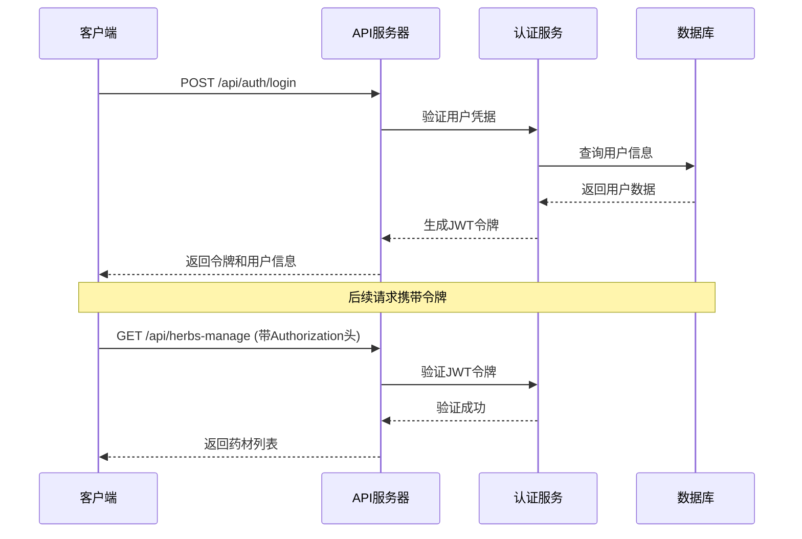

# 中医草药系统API文档

<cite>
**本文档引用的文件**
- [backend/src/app.js](file://backend/src/app.js)
- [backend/src/routes/herbs-manage.js](file://backend/src/routes/herbs-manage.js)
- [backend/src/routes/knowledge.js](file://backend/src/routes/knowledge.js)
- [backend/src/routes/ai-engine.js](file://backend/src/routes/ai-engine.js)
- [backend/src/routes/conversations.js](file://backend/src/routes/conversations.js)
- [backend/src/routes/auth.js](file://backend/src/routes/auth.js)
- [backend/src/routes/herb-categories.js](file://backend/src/routes/herb-categories.js)
- [backend/src/routes/herb-images.js](file://backend/src/routes/herb-images.js)
- [backend/src/routes/herb-recognition.js](file://backend/src/routes/herb-recognition.js)
- [backend/src/routes/herb-regions.js](file://backend/src/routes/herb-regions.js)
- [backend/src/routes/herb-sources.js](file://backend/src/routes/herb-sources.js)
- [backend/src/routes/formulas.js](file://backend/src/routes/formulas.js)
- [backend/src/routes/recommendations.js](file://backend/src/routes/recommendations.js)
</cite>

## 更新摘要
**变更内容**
- 完全重写API文档以适配中医草药系统
- 新增 /api/herbs-manage/* 端点用于药材管理
- 新增 /api/knowledge/* 端点用于知识图谱查询
- 新增 /api/ai-engine/* 端点用于AI智能问答
- 新增 /api/conversations/* 端点用于对话历史管理
- 移除了所有武器相关的API端点
- 更新了认证系统和错误处理机制

## 目录
1. [简介](#简介)
2. [API基础信息](#api基础信息)
3. [认证系统](#认证系统)
4. [药材管理API](#药材管理api)
5. [知识图谱API](#知识图谱api)
6. [AI引擎API](#ai引擎api)
7. [对话管理API](#对话管理api)
8. [用户认证API](#用户认证api)
9. [图片管理API](#图片管理api)
10. [分类和来源管理API](#分类和来源管理api)
11. [方剂管理API](#方剂管理api)
12. [推荐系统API](#推荐系统api)
13. [错误处理](#错误处理)
14. [速率限制](#速率限制)
15. [API测试示例](#api测试示例)

## 简介

中医草药系统是一个专业的中医药知识管理平台，提供完整的RESTful API接口，支持药材信息管理、知识图谱查询、AI智能问答、对话历史管理等功能。系统采用现代化架构设计，集成Neo4j图数据库和AI大模型能力，为中医药学习和研究提供智能化服务。

## API基础信息

### 基础URL
```
http://localhost:3001/api
```

### 内容类型
- **请求**: `application/json`
- **响应**: `application/json`

### 认证方式
- **JWT Token**: `Authorization: Bearer <token>`
- **可选认证**: 部分接口支持匿名访问

### 分页参数
- `page`: 当前页码（默认：1）
- `limit`: 每页条目数（默认：20，最大：100）

## 认证系统

### JWT令牌管理



**图表来源**
- [backend/src/routes/auth.js:17-42](file://backend/src/routes/auth.js#L17-L42)
- [backend/src/middleware/auth.js](file://backend/src/middleware/auth.js)

**节来源**
- [backend/src/routes/auth.js:17-42](file://backend/src/routes/auth.js#L17-L42)

## 药材管理API

### 获取下拉框数据

**端点**: `GET /api/herbs-manage/dropdowns`

**认证**: 无需认证

**功能**: 一次性返回所有下拉框数据（分类、产地、性味、归经、功效）

**响应格式**:
```json
{
  "success": true,
  "data": {
    "categories": ["解表药", "清热药", "补虚药"],
    "regions": ["云南", "四川", "贵州"],
    "properties_qi": ["寒", "热", "温", "凉", "平"],
    "properties_flavor": ["辛", "甘", "酸", "苦", "咸"],
    "meridians": ["肺经", "心经", "肝经"],
    "efficacies": ["清热解毒", "补气养血"]
  }
}
```

**节来源**
- [backend/src/routes/herbs-manage.js:46-74](file://backend/src/routes/herbs-manage.js#L46-L74)

### 获取药材列表

**端点**: `GET /api/herbs-manage`

**认证**: 无需认证

**查询参数**:
- `search` (可选): 搜索关键词
- `category` (可选): 药材分类过滤
- `region` (可选): 产地过滤
- `is_common` (可选): 是否常用药材 (1/0)
- `page` (可选): 页码，默认1
- `limit` (可选): 每页数量，默认20

**响应格式**:
```json
{
  "success": true,
  "data": {
    "herbs": [
      {
        "id": "1",
        "name": "人参",
        "pinyin": "ren shen",
        "latin_name": "Panax ginseng",
        "alias": "棒槌",
        "description": "大补元气...",
        "efficacy": "大补元气，复脉固脱",
        "usage_dosage": "3-9g",
        "caution": "实热证忌用",
        "is_common": 1,
        "quality": "{}",
        "category_name": "补虚药",
        "region_name": "吉林"
      }
    ],
    "pagination": {
      "page": 1,
      "limit": 20,
      "total": 100,
      "totalPages": 5
    }
  }
}
```

**节来源**
- [backend/src/routes/herbs-manage.js:80-153](file://backend/src/routes/herbs-manage.js#L80-L153)

### 获取药材详情

**端点**: `GET /api/herbs-manage/:name`

**认证**: 无需认证

**路径参数**:
- `name` (必需): 药材名称

**响应包含**:
- 药材基本信息
- 性味属性
- 归经信息
- 功效说明
- 相关方剂

**节来源**
- [backend/src/routes/herbs-manage.js:159-196](file://backend/src/routes/herbs-manage.js#L159-L196)

### 创建药材

**端点**: `POST /api/herbs-manage`

**认证**: 无需认证

**请求格式**:
```json
{
  "name": "黄芪",
  "pinyin": "huang qi",
  "latin_name": "Astragalus membranaceus",
  "alias": "绵黄芪",
  "description": "补气升阳...",
  "usage_dosage": "9-30g",
  "caution": "表实邪盛忌用",
  "is_common": 1,
  "category": "补虚药",
  "region": "内蒙古",
  "properties_qi": ["微温"],
  "properties_flavor": ["甘"],
  "meridians": ["脾经", "肺经"],
  "efficacies": ["补气升阳", "固表止汗"]
}
```

**节来源**
- [backend/src/routes/herbs-manage.js:202-309](file://backend/src/routes/herbs-manage.js#L202-L309)

### 更新药材

**端点**: `PUT /api/herbs-manage/:name`

**认证**: 无需认证

**路径参数**:
- `name` (必需): 原药材名称

**请求格式**: 同创建药材

**节来源**
- [backend/src/routes/herbs-manage.js:315-432](file://backend/src/routes/herbs-manage.js#L315-L432)

### 删除药材

**端点**: `DELETE /api/herbs-manage/:name`

**认证**: 无需认证

**路径参数**:
- `name` (必需): 药材名称

**注意**: 如果药材被方剂引用，将无法删除

**节来源**
- [backend/src/routes/herbs-manage.js:438-484](file://backend/src/routes/herbs-manage.js#L438-L484)

### 获取药材知识图谱

**端点**: `GET /api/herbs-manage/:name/graph`

**认证**: 无需认证

**路径参数**:
- `name` (必需): 药材名称

**功能**: 获取药材的知识图谱子图数据，用于D3力导向图展示

**节来源**
- [backend/src/routes/herbs-manage.js:491-606](file://backend/src/routes/herbs-manage.js#L491-L606)

## 知识图谱API

### 获取知识图谱概览

**端点**: `GET /api/knowledge/overview`

**认证**: 无需认证

**功能**: 获取整个知识图谱的统计信息和概览数据

**节来源**
- [backend/src/routes/knowledge.js:9-20](file://backend/src/routes/knowledge.js#L9-L20)

### 搜索知识图谱

**端点**: `GET /api/knowledge/search`

**认证**: 无需认证

**查询参数**:
- `q` (必需): 搜索关键词
- `types` (可选): 节点类型过滤（逗号分隔）
- `limit` (可选): 结果数量限制，默认20

**节来源**
- [backend/src/routes/knowledge.js:47-70](file://backend/src/routes/knowledge.js#L47-L70)

### 获取节点邻居

**端点**: `GET /api/knowledge/node/:id/neighbors`

**认证**: 无需认证

**查询参数**:
- `types` (可选): 关系类型过滤
- `limit` (可选): 邻居数量限制，默认10

**节来源**
- [backend/src/routes/knowledge.js:73-88](file://backend/src/routes/knowledge.js#L73-L88)

### 查找路径

**端点**: `GET /api/knowledge/path`

**认证**: 无需认证

**查询参数**:
- `start` (必需): 起始节点ID
- `end` (必需): 结束节点ID
- `maxDepth` (可选): 最大深度，默认5，最大10

**节来源**
- [backend/src/routes/knowledge.js:91-120](file://backend/src/routes/knowledge.js#L91-L120)

### 执行自定义Cypher查询

**端点**: `POST /api/knowledge/query`

**认证**: 无需认证

**安全限制**: 禁止危险操作（DELETE, REMOVE, DROP等）

**请求格式**:
```json
{
  "query": "MATCH (h:Herb) WHERE h.name CONTAINS $name RETURN h",
  "parameters": {
    "name": "人"
  }
}
```

**节来源**
- [backend/src/routes/knowledge.js:123-149](file://backend/src/routes/knowledge.js#L123-L149)

### 获取统计信息

**端点**: `GET /api/knowledge/statistics`

**认证**: 无需认证

**功能**: 获取知识图谱的统计信息

**节来源**
- [backend/src/routes/knowledge.js:169-180](file://backend/src/routes/knowledge.js#L169-L180)

## AI引擎API

### RAG智能问答

**端点**: `POST /api/ai-engine/rag`

**认证**: 无需认证

**请求格式**:
```json
{
  "question": "人参的功效是什么？",
  "useChain": true,
  "forceRefresh": false
}
```

**响应包含**:
- 问题答案
- 参考来源
- 相关方剂
- 执行的Cypher查询
- 搜索统计信息

**节来源**
- [backend/src/routes/ai-engine.js:136-174](file://backend/src/routes/ai-engine.js#L136-L174)

### RAG流式问答

**端点**: `POST /api/ai-engine/rag-stream`

**认证**: 无需认证

**功能**: 使用SSE技术实现流式问答，实时显示AI回答过程

**请求格式**:
```json
{
  "question": "请解释中药配伍禁忌"
}
```

**节来源**
- [backend/src/routes/ai-engine.js:179-315](file://backend/src/routes/ai-engine.js#L179-L315)

### 配伍冲突检测

**端点**: `POST /api/ai-engine/compatibility`

**认证**: 无需认证

**请求格式**:
```json
{
  "herbs": ["人参", "五灵脂", "甘草"]
}
```

**功能**: 检测药材配伍禁忌，包括十八反十九畏规则

**节来源**
- [backend/src/routes/ai-engine.js:320-444](file://backend/src/routes/ai-engine.js#L320-L444)

### 古籍知识抽取

**端点**: `POST /api/ai-engine/extract`

**认证**: 无需认证

**请求格式**:
```json
{
  "text": "人参味甘微苦，性温，归脾肺心经，大补元气，复脉固脱。"
}
```

**功能**: 从古籍文本中自动提取知识三元组并写入Neo4j

**节来源**
- [backend/src/routes/ai-engine.js:449-593](file://backend/src/routes/ai-engine.js#L449-L593)

### 药材详情补全

**端点**: `POST /api/ai-engine/herb-enrich`

**认证**: 无需认证

**请求格式**:
```json
{
  "herbName": "人参",
  "herbContext": {
    "category_name": "补虚药",
    "properties": [{"name": "甘", "type": "flavor"}]
  }
}
```

**功能**: 使用AI补全药材详细信息，包含缓存机制

**节来源**
- [backend/src/routes/ai-engine.js:662-785](file://backend/src/routes/ai-engine.js#L662-L785)

### 获取药材详情

**端点**: `GET /api/ai-engine/herb-detail/:name`

**认证**: 无需认证

**功能**: 获取药材详情和图谱数据

**节来源**
- [backend/src/routes/ai-engine.js:792-881](file://backend/src/routes/ai-engine.js#L792-L881)

### 引擎健康检查

**端点**: `GET /api/ai-engine/health`

**认证**: 无需认证

**功能**: 检查AI引擎状态和依赖服务连接情况

**节来源**
- [backend/src/routes/ai-engine.js:598-622](file://backend/src/routes/ai-engine.js#L598-L622)

### 引擎状态

**端点**: `GET /api/ai-engine/status`

**认证**: 无需认证

**功能**: 获取AI引擎的详细状态信息

**节来源**
- [backend/src/routes/ai-engine.js:627-650](file://backend/src/routes/ai-engine.js#L627-L650)

## 对话管理API

### 获取对话列表

**端点**: `GET /api/conversations`

**认证**: 必需（JWT）

**查询参数**:
- `page` (可选): 页码，默认1
- `limit` (可选): 每页数量，默认20

**功能**: 获取当前用户的对话历史列表

**节来源**
- [backend/src/routes/conversations.js:41-85](file://backend/src/routes/conversations.js#L41-L85)

### 创建对话

**端点**: `POST /api/conversations`

**认证**: 必需（JWT）

**请求格式**:
```json
{
  "title": "人参功效咨询"
}
```

**功能**: 创建新的对话会话

**节来源**
- [backend/src/routes/conversations.js:90-118](file://backend/src/routes/conversations.js#L90-L118)

### 获取对话详情

**端点**: `GET /api/conversations/:id`

**认证**: 必需（JWT）

**路径参数**:
- `id` (必需): 对话ID

**功能**: 获取指定对话的所有消息记录

**节来源**
- [backend/src/routes/conversations.js:123-167](file://backend/src/routes/conversations.js#L123-L167)

### 添加消息

**端点**: `POST /api/conversations/:id/messages`

**认证**: 必需（JWT）

**请求格式**:
```json
{
  "role": "user",
  "content": "请问人参有哪些功效？",
  "sources": [],
  "mode": "rag"
}
```

**功能**: 在对话中添加新消息

**节来源**
- [backend/src/routes/conversations.js:172-248](file://backend/src/routes/conversations.js#L172-L248)

### 删除对话

**端点**: `DELETE /api/conversations/:id`

**认证**: 必需（JWT）

**路径参数**:
- `id` (必需): 对话ID

**功能**: 删除指定对话及其所有消息

**节来源**
- [backend/src/routes/conversations.js:253-289](file://backend/src/routes/conversations.js#L253-L289)

### 更新对话标题

**端点**: `PUT /api/conversations/:id`

**认证**: 必需（JWT）

**请求格式**:
```json
{
  "title": "新的对话标题"
}
```

**功能**: 更新对话标题

**节来源**
- [backend/src/routes/conversations.js:294-335](file://backend/src/routes/conversations.js#L294-L335)

## 用户认证API

### 用户注册

**端点**: `POST /api/auth/register`

**认证**: 无需认证

**请求格式**:
```json
{
  "username": "testuser",
  "email": "test@example.com",
  "password": "securepassword123",
  "name": "测试用户"
}
```

**验证规则**:
- `username`: 3-30字符，字母数字组合
- `email`: 有效邮箱地址
- `password`: 6-128字符
- `name`: 2-50字符（可选）

**节来源**
- [backend/src/routes/auth.js:17-28](file://backend/src/routes/auth.js#L17-L28)

### 用户登录

**端点**: `POST /api/auth/login`

**认证**: 无需认证

**请求格式**:
```json
{
  "username": "testuser",
  "password": "securepassword123"
}
```

**节来源**
- [backend/src/routes/auth.js:31-42](file://backend/src/routes/auth.js#L31-L42)

### 获取用户信息

**端点**: `GET /api/auth/profile`

**认证**: 必需（JWT）

**功能**: 获取当前登录用户的详细信息

**节来源**
- [backend/src/routes/auth.js:45-56](file://backend/src/routes/auth.js#L45-L56)

### 更新用户资料

**端点**: `PUT /api/auth/profile`

**认证**: 必需（JWT）

**请求格式**:
```json
{
  "name": "新名字",
  "phone": "13800138000",
  "bio": "个人简介",
  "preferences": {"language": "zh-CN"},
  "avatar": "data:image/png;base64,..."
}
```

**节来源**
- [backend/src/routes/auth.js:59-78](file://backend/src/routes/auth.js#L59-L78)

### 修改密码

**端点**: `PUT /api/auth/change-password`

**认证**: 必需（JWT）

**请求格式**:
```json
{
  "oldPassword": "old_secure_password",
  "newPassword": "new_secure_password123"
}
```

**节来源**
- [backend/src/routes/auth.js:81-108](file://backend/src/routes/auth.js#L81-L108)

### 刷新令牌

**端点**: `POST /api/auth/refresh`

**认证**: 必需（JWT）

**功能**: 刷新JWT令牌

**节来源**
- [backend/src/routes/auth.js:111-135](file://backend/src/routes/auth.js#L111-L135)

### 退出登录

**端点**: `POST /api/auth/logout`

**认证**: 必需（JWT）

**功能**: 退出当前用户登录

**节来源**
- [backend/src/routes/auth.js:138-153](file://backend/src/routes/auth.js#L138-L153)

## 图片管理API

### 获取药材图片

**端点**: `GET /api/herb-images/:herbId`

**认证**: 无需认证

**路径参数**:
- `herbId` (必需): 药材ID

**功能**: 获取指定药材的所有图片

**节来源**
- [backend/src/routes/herb-images.js:58-84](file://backend/src/routes/herb-images.js#L58-L84)

### 上传药材图片

**端点**: `POST /api/herb-images/:herbId`

**认证**: 必需（JWT + 管理员权限）

**请求格式**: multipart/form-data
- `image` (必需): 图片文件
- `description` (可选): 图片描述

**文件限制**:
- 类型: jpeg, jpg, png, gif, webp
- 大小: 最大5MB

**节来源**
- [backend/src/routes/herb-images.js:87-137](file://backend/src/routes/herb-images.js#L87-L137)

### 删除药材图片

**端点**: `DELETE /api/herb-images/:herbId/:imageId`

**认证**: 必需（JWT + 管理员权限）

**路径参数**:
- `herbId`: 药材ID
- `imageId`: 图片ID

**节来源**
- [backend/src/routes/herb-images.js:140-180](file://backend/src/routes/herb-images.js#L140-L180)

### 更新图片描述

**端点**: `PUT /api/herb-images/:herbId/:imageId`

**认证**: 必需（JWT + 管理员权限）

**请求格式**:
```json
{
  "description": "更新后的图片描述"
}
```

**节来源**
- [backend/src/routes/herb-images.js:183-220](file://backend/src/routes/herb-images.js#L183-L220)

## 分类和来源管理API

### 药材分类管理

**端点**: `/api/herb-categories/*`

**功能**: 管理药材的分类体系

**主要接口**:
- `GET /api/herb-categories` - 获取分类列表
- `POST /api/herb-categories` - 创建分类
- `PUT /api/herb-categories/:id` - 更新分类
- `DELETE /api/herb-categories/:id` - 删除分类

**节来源**
- [backend/src/routes/herb-categories.js:8-160](file://backend/src/routes/herb-categories.js#L8-L160)

### 药材产地管理

**端点**: `/api/herb-regions/*`

**功能**: 管理药材的产地信息

**主要接口**:
- `GET /api/herb-regions` - 获取产地列表
- `POST /api/herb-regions` - 创建产地
- `PUT /api/herb-regions/:id` - 更新产地
- `DELETE /api/herb-regions/:id` - 删除产地

**节来源**
- [backend/src/routes/herb-regions.js:8-160](file://backend/src/routes/herb-regions.js#L8-L160)

### 药材来源管理

**端点**: `/api/herb-sources/*`

**功能**: 管理药材的来源信息

**主要接口**:
- `GET /api/herb-sources` - 获取来源列表
- `POST /api/herb-sources` - 创建来源
- `PUT /api/herb-sources/:id` - 更新来源（管理员）
- `DELETE /api/herb-sources/:id` - 删除来源（管理员）

**节来源**
- [backend/src/routes/herb-sources.js:8-160](file://backend/src/routes/herb-sources.js#L8-L160)

## 方剂管理API

### 获取方剂列表

**端点**: `GET /api/formulas`

**认证**: 无需认证

**查询参数**:
- `page` (可选): 页码，默认1
- `limit` (可选): 每页数量，默认20

**节来源**
- [backend/src/routes/formulas.js:8-49](file://backend/src/routes/formulas.js#L8-L49)

### 获取方剂详情

**端点**: `GET /api/formulas/:id`

**认证**: 无需认证

**路径参数**:
- `id` (必需): 方剂ID

**功能**: 获取方剂详情及组成药材

**节来源**
- [backend/src/routes/formulas.js:52-86](file://backend/src/routes/formulas.js#L52-L86)

### 创建方剂

**端点**: `POST /api/formulas`

**认证**: 必需（JWT + 管理员权限）

**请求格式**:
```json
{
  "name": "四君子汤",
  "pinyin": "si jun zi tang",
  "category": "补益剂",
  "description": "益气健脾",
  "usage": "水煎服",
  "caution": "阴虚火旺者慎用",
  "source": "《太平惠民和剂局方》",
  "herbs": [
    {"herb_id": 1, "dosage": "9g", "role": "君药"},
    {"herb_id": 2, "dosage": "9g", "role": "臣药"}
  ]
}
```

**节来源**
- [backend/src/routes/formulas.js:89-134](file://backend/src/routes/formulas.js#L89-L134)

### 更新方剂

**端点**: `PUT /api/formulas/:id`

**认证**: 必需（JWT + 管理员权限）

**请求格式**: 同创建方剂

**节来源**
- [backend/src/routes/formulas.js:137-190](file://backend/src/routes/formulas.js#L137-L190)

### 删除方剂

**端点**: `DELETE /api/formulas/:id`

**认证**: 必需（JWT + 管理员权限）

**路径参数**:
- `id` (必需): 方剂ID

**节来源**
- [backend/src/routes/formulas.js:193-210](file://backend/src/routes/formulas.js#L193-L210)

## 推荐系统API

### 获取推荐内容

**端点**: `GET /api/recommendations`

**认证**: 无需认证

**查询参数**:
- `q` (可选): 搜索关键词
- `category_id` (可选): 分类ID
- `region_id` (可选): 产地ID
- `limit` (可选): 结果数量，默认12，最大50

**功能**: 基于多种因素推荐药材和方剂

**节来源**
- [backend/src/routes/recommendations.js:52-119](file://backend/src/routes/recommendations.js#L52-L119)

## 错误处理

### 标准错误响应格式

```json
{
  "success": false,
  "message": "错误描述",
  "error": {
    "code": "ERROR_CODE",
    "details": "详细错误信息"
  }
}
```

### HTTP状态码

| 状态码 | 描述 | 场景 |
|--------|------|------|
| 200 | 成功 | 请求成功处理 |
| 201 | 创建成功 | 资源创建成功 |
| 400 | 请求错误 | 参数验证失败、格式错误 |
| 401 | 未授权 | 令牌缺失或无效 |
| 403 | 权限不足 | 需要管理员权限 |
| 404 | 资源不存在 | 请求的资源不存在 |
| 409 | 冲突 | 重复资源或关联冲突 |
| 429 | 请求过于频繁 | 超出速率限制 |
| 500 | 服务器内部错误 | 服务器处理错误 |
| 503 | 服务不可用 | 依赖服务不可用 |

### 常见错误类型

**认证错误**:
```json
{
  "success": false,
  "message": "请先登录后再保存对话记录"
}
```

**验证错误**:
```json
{
  "success": false,
  "message": "数据验证失败",
  "errors": [
    {
      "field": "username",
      "message": "用户名至少需要3个字符"
    }
  ]
}
```

**节来源**
- [backend/src/app.js:157-201](file://backend/src/app.js#L157-L201)

## 速率限制

### 限制配置

系统采用基于IP的速率限制机制，防止API滥用。

**默认配置**:
- **时间窗口**: 15分钟（900,000毫秒）
- **最大请求数**: 1000个请求
- **响应头**: `X-RateLimit-Limit`, `X-RateLimit-Remaining`, `X-RateLimit-Reset`

**节来源**
- [backend/src/app.js:91-101](file://backend/src/app.js#L91-L101)

## API测试示例

### 健康检查

```bash
curl -X GET "http://localhost:3001/health"
```

**响应**:
```json
{
  "success": true,
  "message": "服务运行正常",
  "timestamp": "2024-01-01T00:00:00.000Z",
  "uptime": 3600
}
```

### 获取药材列表

```bash
curl -X GET "http://localhost:3001/api/herbs-manage?page=1&limit=10"
```

### 用户注册

```bash
curl -X POST "http://localhost:3001/api/auth/register" \
  -H "Content-Type: application/json" \
  -d '{
    "username": "testuser",
    "email": "test@example.com",
    "password": "securepassword123"
  }'
```

### AI问答

```bash
curl -X POST "http://localhost:3001/api/ai-engine/rag" \
  -H "Content-Type: application/json" \
  -d '{
    "question": "人参的主要功效是什么？"
  }'
```

### 药材识别

```bash
curl -X POST "http://localhost:3001/api/herb-recognition" \
  -F "file=@herb.jpg"
```

**节来源**
- [backend/src/app.js:104-111](file://backend/src/app.js#L104-L111)

## 批量操作

### 批量创建药材

```bash
curl -X POST "http://localhost:3001/api/herbs-manage" \
  -H "Content-Type: application/json" \
  -d '{
    "name": "黄芪",
    "pinyin": "huang qi",
    "category": "补虚药",
    "efficacies": ["补气升阳"]
  }'
```

### 批量删除图片

```bash
curl -X DELETE "http://localhost:3001/api/herb-images/1/123"
```

## 文件上传处理

### Multer配置

系统使用Multer中间件处理文件上传，支持：

**图片上传**:
- 存储路径: `./uploads/herbs/`
- 文件大小限制: 5MB
- 允许格式: jpeg, jpg, png, gif, webp

**药材识别**:
- 内存存储模式
- 文件大小限制: 10MB（可配置）
- 仅支持图片文件

**节来源**
- [backend/src/routes/herb-images.js:31-55](file://backend/src/routes/herb-images.js#L31-L55)
- [backend/src/routes/herb-recognition.js:14-32](file://backend/src/routes/herb-recognition.js#L14-L32)

## 分页查询

### 标准分页参数

```javascript
const pagination = {
  page: parseInt(req.query.page) || 1,
  limit: Math.min(parseInt(req.query.limit) || 20, 100)
};
```

### 分页响应格式

```json
{
  "success": true,
  "data": {
    "items": [...],
    "pagination": {
      "current_page": 1,
      "total_pages": 10,
      "total_items": 200,
      "items_per_page": 20
    }
  }
}
```

## 性能优化

### 缓存策略

- **AI问答**: 使用Redis缓存搜索结果
- **药材详情**: 24小时缓存
- **知识图谱**: TTL 2小时
- **用户数据**: TTL 30分钟

### 数据库优化

- **Neo4j**: 使用索引和查询优化
- **SQLite**: 事务管理和连接池
- **连接复用**: 数据库连接池管理

## 安全措施

### 输入验证

所有API请求都经过严格的数据验证：

```javascript
const herbSchema = Joi.object({
  name: Joi.string().min(2).max(100).required(),
  category: Joi.string().valid(...herbCategories).required(),
  efficacy: Joi.array().items(Joi.string()).required()
});
```

### SQL注入防护

- 使用参数化查询
- 数据库连接池管理
- 查询结果安全输出

### XSS防护

- 输入内容HTML转义
- 输出内容安全编码
- 内容安全策略(CSP)

**节来源**
- [backend/src/middleware/validation.js](file://backend/src/middleware/validation.js)

## 总结

中医草药系统API提供了完整的中医药知识管理解决方案，支持：

- **全面的药材信息管理**：增删改查、批量操作、知识图谱
- **智能知识图谱**：关系查询、路径发现、推荐系统
- **AI智能问答**：RAG检索增强生成、流式响应、配伍检测
- **多媒体资源管理**：图片上传、药材识别、文件存储
- **用户认证体系**：JWT令牌、权限控制、会话管理
- **对话历史管理**：多轮对话、消息持久化、历史记录
- **高性能架构**：速率限制、缓存策略、数据库优化

API设计遵循RESTful原则，提供清晰的错误处理和详细的文档说明，便于开发者集成和使用。系统集成了现代AI技术和传统中医药知识，为中医药学习和研究提供了强大的技术支持。