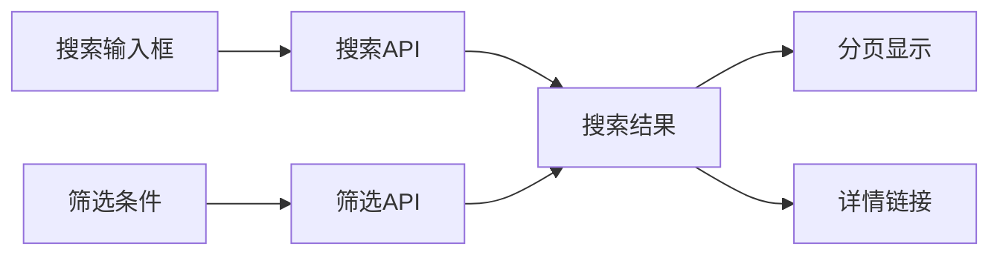
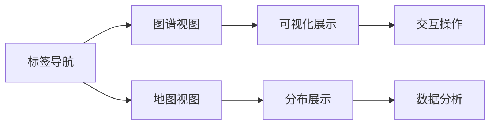
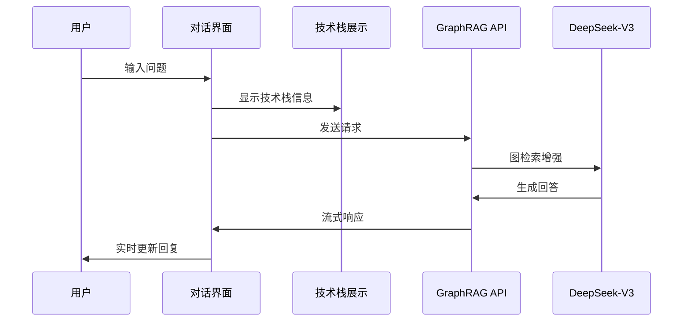
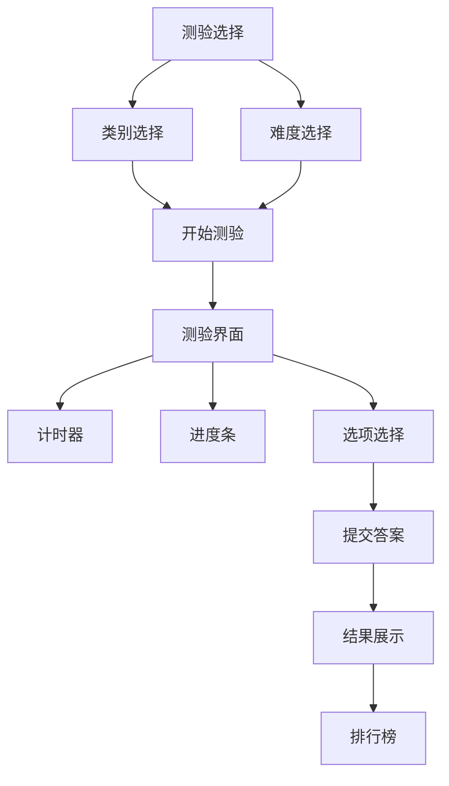
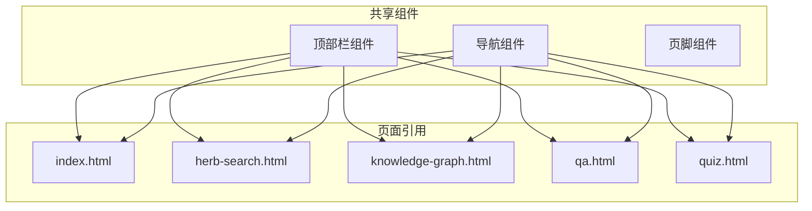
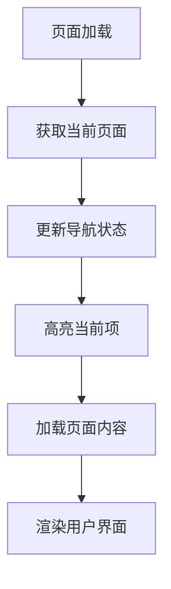
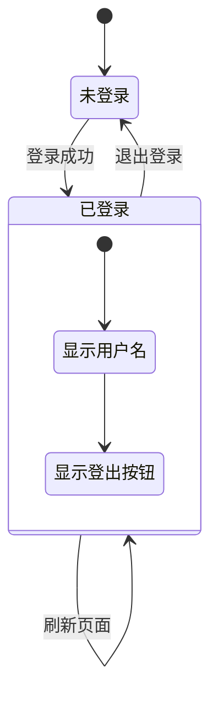
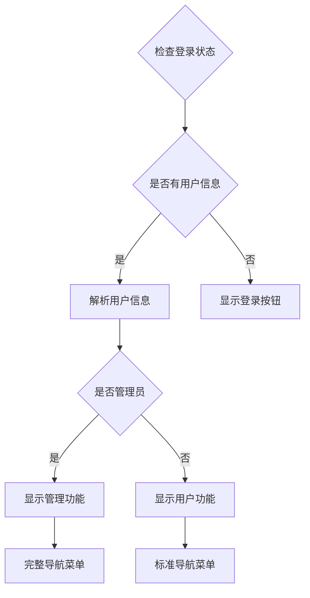
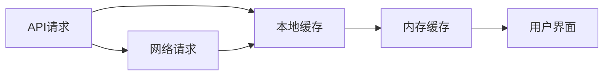

# 前端UI结构

<cite>
**本文引用的文件**
- [index.html](file://index.html)
- [herb-search.html](file://herb-search.html)
- [herb-detail.html](file://herb-detail.html)
- [knowledge-graph.html](file://knowledge-graph.html)
- [qa.html](file://qa.html)
- [quiz.html](file://quiz.html)
- [recommendation.html](file://recommendation.html)
- [templates/header.html](file://templates/header.html)
- [templates/footer.html](file://templates/footer.html)
- [styles/herb-app.css](file://styles/herb-app.css)
- [styles/quiz.css](file://styles/quiz.css)
- [scripts/herb-data.js](file://scripts/herb-data.js)
- [scripts/herb-pages.js](file://scripts/herb-pages.js)
- [scripts/quiz.js](file://scripts/quiz.js)
- [scripts/auth.js](file://scripts/auth.js)
- [scripts/common.js](file://scripts/common.js)
</cite>

## 更新摘要
**变更内容**
- 新增草药搜索页面（herb-search.html）和草药详情页面（herb-detail.html）
- 全新知识测评功能页面（quiz.html），包含测验、排行榜等功能
- 增强的问答界面（qa.html），集成GraphRAG技术栈展示
- 重构的知识图谱页面，采用标签式导航
- 统一的设计系统和响应式布局

## 目录
1. [项目概述](#项目概述)
2. [页面架构设计](#页面架构设计)
3. [核心页面分析](#核心页面分析)
4. [模板系统](#模板系统)
5. [导航与状态管理](#导航与状态管理)
6. [用户角色与UI差异](#用户角色与ui差异)
7. [响应式设计](#响应式设计)
8. [可访问性考虑](#可访问性考虑)
9. [性能优化建议](#性能优化建议)
10. [总结](#总结)

## 项目概述

神农AI前端采用现代化的模块化HTML页面架构，结合统一的CSS设计系统和JavaScript交互功能，构建了一个完整的中药药材知识图谱智能平台。系统围绕八个核心页面展开：主页面、草药搜索、草药详情、知识图谱、AI问答、知识测评、方剂库和推荐页，每个页面都具有独特的功能定位和视觉风格。

**节来源**
- [index.html:1-17](file://index.html#L1-L17)
- [herb-search.html:1-17](file://herb-search.html#L1-L17)
- [herb-detail.html:1-17](file://herb-detail.html#L1-L17)
- [quiz.html:1-241](file://quiz.html#L1-L241)

## 页面架构设计

### 整体架构模式

系统采用统一的页面框架设计，所有页面都遵循相同的结构模式，通过数据属性标识不同页面类型：

```mermaid
graph TB
subgraph "页面基础结构"
Header[顶部栏 - 品牌 + 用户状态]
Nav[导航栏 - 功能入口]
Main[主要内容区域]
Footer[页脚 - 版权信息]
end
subgraph "动态加载机制"
AppDiv[id="app"]
PageData[data-page属性]
Scripts[脚本加载器]
end
Header --> Nav
Nav --> Main
Main --> AppDiv
AppDiv --> Scripts
PageData --> Scripts
```

**图表来源**
- [index.html:11-15](file://index.html#L11-L15)
- [herb-search.html:11-15](file://herb-search.html#L11-L15)
- [herb-pages.js:1-15](file://scripts/herb-pages.js#L1-L15)

### 页面布局层次

每个页面都采用语义化HTML标签组织内容，确保良好的可读性和SEO优化：

```mermaid
flowchart TD
HTML[HTML文档] --> Head[Head部分]
HTML --> Body[Body部分]
Head --> Meta[元数据 + 样式表]
Head --> Title[页面标题]
Body --> Container[容器div]
Container --> Header[顶部栏区域]
Container --> Navigation[导航栏]
Container --> MainContent[主要内容]
Container --> Footer[页脚]
MainContent --> AppDiv[id="app"]
AppDiv --> DynamicContent[动态内容渲染]
DynamicContent --> Components[组件化内容]
```

**节来源**
- [quiz.html:13-42](file://quiz.html#L13-L42)
- [qa.html:14-44](file://qa.html#L14-L44)
- [herb-pages.js:18-59](file://scripts/herb-pages.js#L18-L59)

## 核心页面分析

### 主页面（index.html）

主页面作为系统的入口页面，采用现代化的卡片布局和轮播展示：

#### 页面特色功能

1. **动态内容加载**：通过herb-pages.js实现内容动态渲染
2. **响应式设计**：适配各种设备屏幕尺寸
3. **统一导航**：与其他页面保持一致的导航体验

#### 技术实现要点

- **SPA架构**：单页面应用模式，通过JavaScript动态加载内容
- **API集成**：与后端RESTful API进行数据交互
- **缓存机制**：图片数据和API响应的本地缓存

**节来源**
- [index.html:1-17](file://index.html#L1-L17)
- [herb-pages.js:100-123](file://scripts/herb-pages.js#L100-L123)

### 草药搜索页面（herb-search.html）

草药搜索页面提供强大的药材查询功能，支持多维度筛选和搜索：

#### 核心功能模块



**图表来源**
- [herb-search.html:11-15](file://herb-search.html#L11-L15)
- [herb-pages.js:125-175](file://scripts/herb-pages.js#L125-L175)

#### 技术架构特点

- **实时搜索**：支持关键词实时搜索和模糊匹配
- **多条件筛选**：按分类、产地、功效等多维度筛选
- **结果分页**：大数据量下的分页显示优化

**节来源**
- [herb-search.html:1-17](file://herb-search.html#L1-L17)
- [herb-pages.js:125-175](file://scripts/herb-pages.js#L125-L175)

### 草药详情页面（herb-detail.html）

草药详情页面展示单个药材的完整信息，包括基本信息、性味归经、功效等：

#### 详细信息展示

页面采用卡片式布局展示药材的各个方面：
- 基本信息：名称、别名、来源、产地
- 药性信息：性味、归经、功效
- 使用信息：用法用量、注意事项
- 关联信息：同类药材、相关方剂

**节来源**
- [herb-detail.html:1-17](file://herb-detail.html#L1-L17)
- [herb-pages.js:177-200](file://scripts/herb-pages.js#L177-L200)

### 知识图谱页（knowledge-graph.html）

知识图谱页是系统的核心功能页面，专注于中药材知识的关联展示：

#### 核心功能模块



**图表来源**
- [knowledge-graph.html:12-18](file://knowledge-graph.html#L12-L18)
- [herb-pages.js:116-118](file://scripts/herb-pages.js#L116-L118)

#### 技术架构特点

- **双视图切换**：支持图谱视图和地图视图的无缝切换
- **ECharts集成**：使用ECharts进行数据可视化
- **Neo4j集成**：通过Neo4j驱动程序连接知识图谱数据库

**节来源**
- [knowledge-graph.html:1-20](file://knowledge-graph.html#L1-L20)
- [herb-pages.js:116-118](file://scripts/herb-pages.js#L116-L118)

### 问答页（qa.html）

问答页提供智能对话功能，集成GraphRAG技术栈实现AI问答：

#### 增强的对话界面



**图表来源**
- [qa.html:54-95](file://qa.html#L54-L95)
- [qa.html:97-130](file://qa.html#L97-L130)

#### 功能特性

- **GraphRAG技术栈**：展示Neo4j、LangChain.js、GraphCypherQAChain等技术组件
- **流式响应**：模拟真实的对话体验
- **历史对话**：支持对话历史记录和管理
- **侧边面板**：集成药材详情查看功能

**节来源**
- [qa.html:1-157](file://qa.html#L1-L157)

### 知识测评页（quiz.html）

知识测评页提供中医药知识测试功能，包含多种题型和难度级别：

#### 测验功能模块



**图表来源**
- [quiz.html:49-114](file://quiz.html#L49-L114)
- [quiz.html:116-162](file://quiz.html#L116-L162)

#### 技术实现要点

- **多类别支持**：中药材、方剂学、性味归经、道地产区
- **难度分级**：入门、进阶、专业三个难度级别
- **实时反馈**：答题过程中的即时反馈和提示
- **排行榜系统**：成绩记录和排名展示

**节来源**
- [quiz.html:1-241](file://quiz.html#L1-L241)
- [scripts/quiz.js:1-200](file://scripts/quiz.js#L1-L200)

### 推荐页（recommendation.html）

推荐页展示基于用户兴趣的个性化内容推荐：

#### 内容卡片设计

页面采用卡片式布局展示推荐内容，每张卡片包含：
- 标题和标签分类
- 简短描述和评分信息
- 阅读人数统计
- "阅读全文"链接

**节来源**
- [recommendation.html:1-119](file://recommendation.html#L1-L119)

## 模板系统

### 复用机制设计

系统采用统一的顶部栏和导航组件，通过JavaScript动态加载：



**图表来源**
- [templates/header.html:1-18](file://templates/header.html#L1-L18)
- [templates/footer.html:1-2](file://templates/footer.html#L1-L2)
- [scripts/herb-data.js:4-13](file://scripts/herb-data.js#L4-L13)

### 动态加载机制

系统通过herb-pages.js实现页面的动态加载和内容渲染：

```javascript
// 页面映射配置
const PAGE_MAP = {
    'index.html': 'home',
    'herb-search.html': 'search',
    'herb-detail.html': 'detail',
    'knowledge-graph.html': 'graph',
    'qa.html': 'qa',
    // ... 其他页面映射
};

// 动态初始化流程
async function init() {
    render(); // 初始渲染
    await hydrateBaseData(); // 基础数据加载
    await hydratePageData(); // 页面特定数据加载
    state.loading = false;
    render(); // 最终渲染
}
```

**节来源**
- [scripts/herb-pages.js:1-74](file://scripts/herb-pages.js#L1-L74)

## 导航与状态管理

### 导航激活机制

系统通过JavaScript实现导航链接的动态激活和数据驱动的状态管理：



**图表来源**
- [scripts/herb-pages.js:18-59](file://scripts/herb-pages.js#L18-L59)
- [scripts/common.js:1-17](file://scripts/common.js#L1-L17)

### 用户状态管理

通过localStorage实现用户状态的持久化管理：



**图表来源**
- [scripts/auth.js:1-62](file://scripts/auth.js#L1-L62)

**节来源**
- [scripts/common.js:1-17](file://scripts/common.js#L1-L17)
- [scripts/auth.js:1-62](file://scripts/auth.js#L1-L62)

## 用户角色与UI差异

### 角色识别机制

系统通过用户状态判断用户角色，并相应调整UI呈现：

#### 普通用户界面
- 基础功能访问权限
- 标准导航菜单
- 通用内容展示

#### 管理员界面
- 数据管理功能可见
- 高级操作权限
- 管理工具可用

### 权限控制实现



**图表来源**
- [scripts/auth.js:15-45](file://scripts/auth.js#L15-L45)

**节来源**
- [scripts/auth.js:15-62](file://scripts/auth.js#L15-L62)

## 响应式设计

### 断点策略

系统采用移动优先的设计理念，通过CSS变量和媒体查询实现响应式布局：

| 设备类型 | 断点范围 | 布局调整 |
|---------|---------|---------|
| 桌面端 | ≥1024px | 完整网格布局 |
| 平板端 | 768px-1023px | 垂直导航菜单 |
| 移动端 | ≤767px | 折叠导航菜单 |

### 关键响应式特性

- **弹性容器**：使用CSS Grid和Flexbox实现自适应布局
- **流体排版**：基于CSS变量的字体大小和间距调整
- **触摸优化**：为移动设备优化的触摸目标大小
- **性能优化**：懒加载和按需加载资源

**节来源**
- [styles/herb-app.css:1-200](file://styles/herb-app.css#L1-L200)

## 可访问性考虑

### 语义化标记

所有页面都采用语义化HTML标签，提升可访问性：

```html
<!-- 主要内容区域 -->
<main>
    <h1>页面标题</h1>
    <section>
        <h2>功能标题</h2>
        <article>
            <h3>内容标题</h3>
            <p>段落内容</p>
        </article>
    </section>
</main>
```

### 键盘导航支持

- **Tab键导航**：所有交互元素均可通过Tab键访问
- **快捷键支持**：问答页面支持Ctrl+Enter发送消息
- **焦点指示**：清晰的键盘焦点指示器
- **ARIA标签**：重要交互元素添加ARIA属性

### 屏幕阅读器友好

- **语义标题**：合理的标题层级结构
- **替代文本**：所有图片都有适当的alt属性
- **实时反馈**：使用aria-live属性提供动态内容更新

## 性能优化建议

### 资源加载优化

1. **延迟加载**：非关键资源采用异步加载
2. **CDN加速**：第三方库使用CDN服务
3. **缓存策略**：合理设置HTTP缓存头
4. **代码分割**：按页面和功能模块分割JavaScript代码

### 数据优化



### 性能监控

- **加载时间监控**：跟踪关键资源加载时间
- **交互延迟测量**：监控用户操作响应时间
- **内存使用优化**：及时清理不需要的DOM元素

## 总结

神农AI的前端UI结构展现了现代Web应用的最佳实践：

### 设计优势

1. **模块化架构**：清晰的页面分离和组件复用
2. **用户体验**：流畅的交互和响应式设计
3. **技术先进**：采用最新的Web技术和API集成
4. **可维护性**：良好的代码组织和注释规范
5. **可扩展性**：易于添加新功能和页面

### 改进建议

1. **性能优化**：进一步减少首屏加载时间
2. **可访问性增强**：完善ARIA标签和键盘导航
3. **国际化支持**：添加多语言切换功能
4. **离线功能**：考虑添加PWA特性

该前端架构为中药药材知识图谱平台提供了坚实的基础，既满足了当前的功能需求，也为未来的扩展预留了充足的空间。通过统一的設計系統和模塊化的架構，系統能夠輕鬆地適應未來的業務需求和技術發展。

**节来源**
- [scripts/herb-pages.js:1-1852](file://scripts/herb-pages.js#L1-L1852)
- [styles/herb-app.css:1-1473](file://styles/herb-app.css#L1-L1473)
- [scripts/quiz.js:1-387](file://scripts/quiz.js#L1-L387)