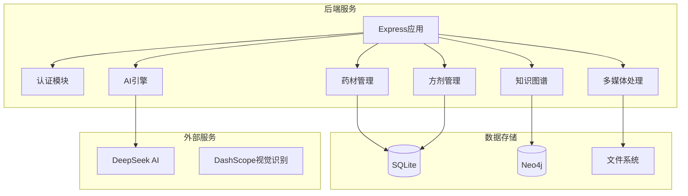
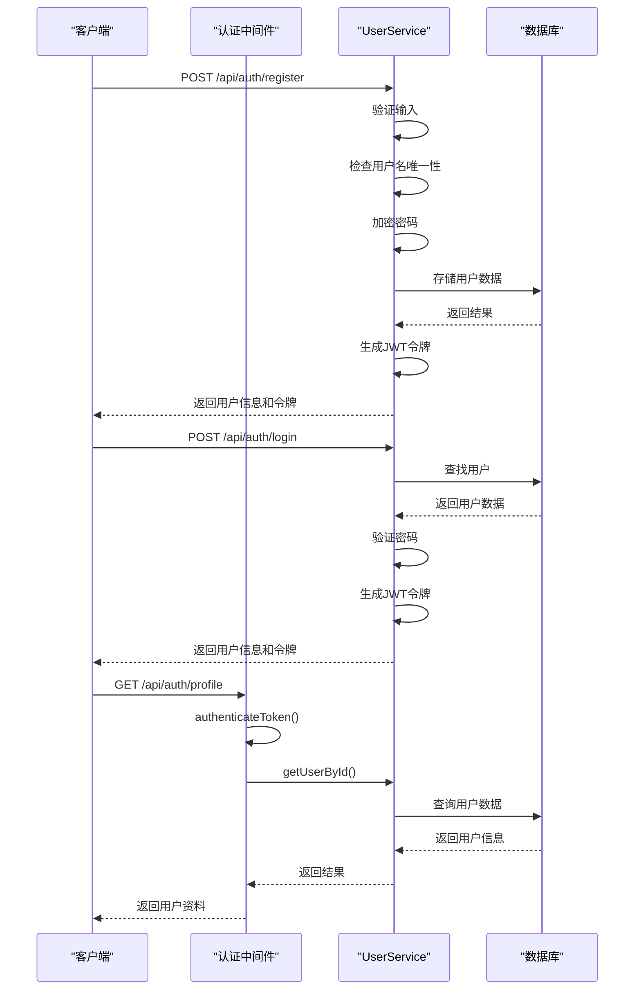
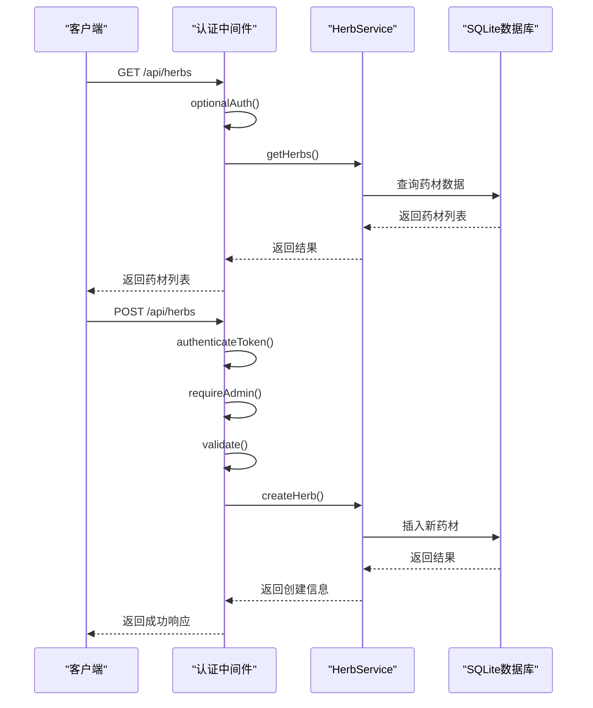
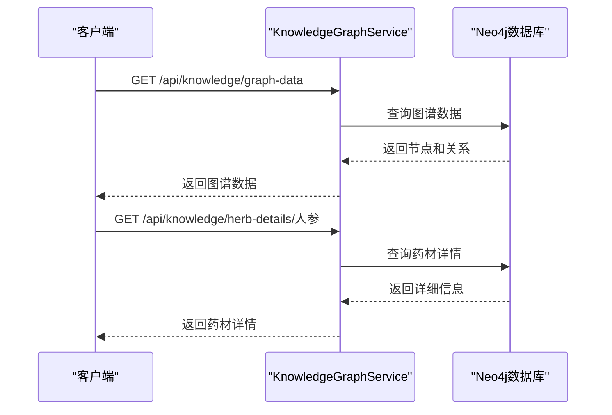
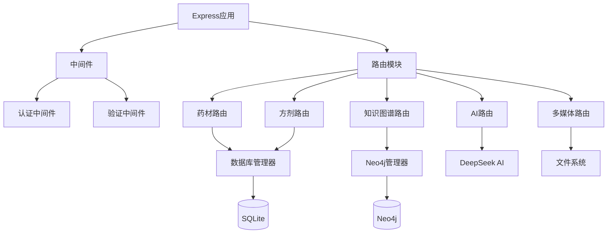

# API路由

<cite>
**本文档中引用的文件**
- [app.js](file://backend/src/app.js)
- [herbs.js](file://backend/src/routes/herbs.js)
- [formulas.js](file://backend/src/routes/formulas.js)
- [quiz.js](file://backend/src/routes/quiz.js)
- [ai-engine.js](file://backend/src/routes/ai-engine.js)
- [knowledge-graph.js](file://backend/src/routes/knowledge-graph.js)
- [herb-categories.js](file://backend/src/routes/herb-categories.js)
- [herb-regions.js](file://backend/src/routes/herb-regions.js)
- [herb-sources.js](file://backend/src/routes/herb-sources.js)
- [herb-images.js](file://backend/src/routes/herb-images.js)
- [herb-recognition.js](file://backend/src/routes/herb-recognition.js)
- [conversations.js](file://backend/src/routes/conversations.js)
- [recommendations.js](file://backend/src/routes/recommendations.js)
- [auth.js](file://backend/src/routes/auth.js)
- [middleware/auth.js](file://backend/src/middleware/auth.js)
- [validation.js](file://backend/src/middleware/validation.js)
</cite>

## 更新摘要
**变更内容**
- 将武器管理API完全重构为草药知识管理API
- 新增药材、方剂、测评、AI引擎等核心功能模块
- 移除所有武器相关端点，替换为中医药知识管理接口
- 增强知识图谱和AI智能问答能力

## 目录
1. [引言](#引言)
2. [项目结构](#项目结构)
3. [用户认证API](#用户认证api)
4. [药材管理API](#药材管理api)
5. [方剂管理API](#方剂管理api)
6. [知识图谱API](#知识图谱api)
7. [AI引擎API](#ai引擎api)
8. [多媒体管理API](#多媒体管理api)
9. [测评系统API](#测评系统api)
10. [对话历史API](#对话历史api)
11. [推荐系统API](#推荐系统api)
12. [依赖分析](#依赖分析)
13. [性能考虑](#性能考虑)
14. [故障排除指南](#故障排除指南)
15. [结论](#结论)

## 引言
本文档全面记录了兵智世界系统的API路由定义和实现。系统已从武器管理完全重构为中医药知识管理系统，提供完整的草药信息、方剂管理、知识图谱查询、AI智能问答等功能。API设计遵循现代Web服务最佳实践，采用分层架构，基于Express.js框架实现，支持JWT身份验证和细粒度权限控制。系统通过SQLite存储结构化数据，Neo4j管理知识图谱关系，并集成DeepSeek AI提供智能问答服务。

## 项目结构
系统采用模块化设计，包含多个独立的功能模块：用户认证、药材管理、方剂管理、知识图谱、AI引擎、多媒体处理等。主要技术栈包括Express.js、SQLite、Neo4j、DeepSeek AI等。

**图源**
- [app.js:14-27](file://backend/src/app.js#L14-L27)
- [app.js:131-144](file://backend/src/app.js#L131-L144)

**节源**
- [app.js:14-27](file://backend/src/app.js#L14-L27)
- [app.js:131-144](file://backend/src/app.js#L131-L144)

## 用户认证API

用户认证API提供完整的用户生命周期管理，包括注册、登录、资料管理和安全控制。系统采用JWT进行身份验证，支持密码加密存储和令牌刷新机制。

### 认证流程

#### 用户注册
- **URL**: `POST /api/auth/register`
- **权限**: 无
- **请求体**:
  - `username`: 用户名（3-30字符，字母数字）
  - `email`: 邮箱地址
  - `password`: 密码（至少6字符）
  - `name`: 姓名（可选）
- **验证**: Joi验证规则
- **响应**: 用户信息和JWT令牌

#### 用户登录
- **URL**: `POST /api/auth/login`
- **权限**: 无
- **请求体**:
  - `username`: 用户名或邮箱
  - `password`: 密码
- **响应**: 用户信息和JWT令牌（有效期7天）

#### 获取用户资料
- **URL**: `GET /api/auth/profile`
- **权限**: 认证用户
- **响应**: 当前用户完整信息

#### 更新用户资料
- **URL**: `PUT /api/auth/profile`
- **权限**: 认证用户
- **请求体**:
  - `name`: 姓名
  - `preferences`: 用户偏好
  - `avatar`: 头像URL
- **响应**: 更新成功确认

#### 修改密码
- **URL**: `PUT /api/auth/change-password`
- **权限**: 认证用户
- **请求体**:
  - `oldPassword`: 原密码
  - `newPassword`: 新密码（至少6字符）
- **响应**: 密码修改成功确认

#### 刷新令牌
- **URL**: `POST /api/auth/refresh`
- **权限**: 认证用户
- **响应**: 新的JWT令牌

#### 退出登录
- **URL**: `POST /api/auth/logout`
- **权限**: 认证用户
- **响应**: 退出成功确认

**图源**
- [auth.js](file://backend/src/routes/auth.js)
- [middleware/auth.js](file://backend/src/middleware/auth.js)

**节源**
- [auth.js](file://backend/src/routes/auth.js)
- [middleware/auth.js](file://backend/src/middleware/auth.js)

## 药材管理API

药材管理API提供完整的CRUD操作，支持药材信息的创建、读取、更新和删除。系统还提供搜索、统计、相似药材推荐等功能。

### 药材列表与详情

#### 获取药材列表
- **URL**: `GET /api/herbs`
- **权限**: 无（可选认证）
- **参数**:
  - `category_id`: 分类ID过滤
  - `region_id`: 产地ID过滤
  - `page`: 页码（默认1）
  - `limit`: 每页数量（默认20）
- **响应**: 分页的药材列表

#### 搜索药材
- **URL**: `GET /api/herbs/search`
- **权限**: 无
- **参数**:
  - `q`: 搜索关键词（必填）
- **响应**: 匹配的药材列表，包含详细信息

#### 获取药材详情
- **URL**: `GET /api/herbs/:id`
- **权限**: 无（可选认证）
- **参数**: 药材ID
- **响应**: 药材详细信息，包括性味归经功效和相关方剂

#### 获取相似药材
- **URL**: `GET /api/herbs/:id/similar`
- **权限**: 无
- **参数**:
  - `id`: 参考药材ID
  - `limit`: 返回数量（默认5）
- **响应**: 相似药材列表

### 药材管理操作

#### 创建药材
- **URL**: `POST /api/herbs`
- **权限**: 管理员
- **请求体**: 药材数据对象
- **验证**: 使用Joi进行数据验证
- **响应**: 创建的药材信息

#### 更新药材
- **URL**: `PUT /api/herbs/:id`
- **权限**: 管理员
- **参数**: 药材ID
- **请求体**: 更新的药材数据
- **响应**: 更新后的药材信息

#### 删除药材
- **URL**: `DELETE /api/herbs/:id`
- **权限**: 管理员
- **参数**: 药材ID
- **响应**: 删除确认信息

### 药材统计

#### 获取药材统计
- **URL**: `GET /api/herbs/statistics`
- **权限**: 无
- **响应**: 按分类、产地、功效的统计信息

**图源**
- [herbs.js:170-250](file://backend/src/routes/herbs.js#L170-L250)
- [herbs.js:600-689](file://backend/src/routes/herbs.js#L600-L689)

**节源**
- [herbs.js:170-250](file://backend/src/routes/herbs.js#L170-L250)
- [herbs.js:600-689](file://backend/src/routes/herbs.js#L600-L689)

## 方剂管理API

方剂管理API提供方剂的完整CRUD操作，支持方剂信息的创建、读取、更新和删除，以及与药材的关联管理。

### 方剂列表与详情

#### 获取方剂列表
- **URL**: `GET /api/formulas`
- **权限**: 无（可选认证）
- **参数**:
  - `page`: 页码（默认1）
  - `limit`: 每页数量（默认20）
- **响应**: 分页的方剂列表

#### 获取方剂详情
- **URL**: `GET /api/formulas/:id`
- **权限**: 无（可选认证）
- **参数**: 方剂ID
- **响应**: 方剂详细信息，包括组成药材

### 方剂管理操作

#### 创建方剂
- **URL**: `POST /api/formulas`
- **权限**: 管理员
- **请求体**: 方剂数据对象，包含组成药材
- **响应**: 创建的方剂信息

#### 更新方剂
- **URL**: `PUT /api/formulas/:id`
- **权限**: 管理员
- **参数**: 方剂ID
- **请求体**: 更新的方剂数据
- **响应**: 更新后的方剂信息

#### 删除方剂
- **URL**: `DELETE /api/formulas/:id`
- **权限**: 管理员
- **参数**: 方剂ID
- **响应**: 删除确认信息

**节源**
- [formulas.js:8-49](file://backend/src/routes/formulas.js#L8-L49)
- [formulas.js:52-86](file://backend/src/routes/formulas.js#L52-L86)
- [formulas.js:89-134](file://backend/src/routes/formulas.js#L89-L134)

## 知识图谱API

知识图谱API提供基于Neo4j图数据库的高级查询功能，支持中医药知识的深度探索和分析。系统实现图谱数据的查询、搜索、路径查找和推荐功能。

### 图谱查询功能

#### 获取知识图谱概览
- **URL**: `GET /api/knowledge/graph-data`
- **权限**: 无
- **参数**:
  - `common`: 是否仅获取常用药材（可选）
- **响应**: 图谱节点和关系数据

#### 获取药材详情（Neo4j版）
- **URL**: `GET /api/knowledge/herb-details/:name`
- **权限**: 无
- **参数**: 药材名称
- **响应**: 药材详细信息，包括性味归经功效和相关方剂

#### 获取产地分布
- **URL**: `GET /api/knowledge/region-distribution`
- **权限**: 无
- **响应**: 各产地的药材分布统计

**图源**
- [knowledge-graph.js:246-255](file://backend/src/routes/knowledge-graph.js#L246-L255)
- [knowledge-graph.js:258-338](file://backend/src/routes/knowledge-graph.js#L258-L338)

**节源**
- [knowledge-graph.js:246-255](file://backend/src/routes/knowledge-graph.js#L246-L255)
- [knowledge-graph.js:258-338](file://backend/src/routes/knowledge-graph.js#L258-L338)

## AI引擎API

AI引擎API提供集成的AI功能，包括RAG智能问答、配伍冲突检测、古籍知识抽取等。系统支持流式响应和缓存优化。

### RAG智能问答

#### 普通问答
- **URL**: `POST /api/ai-engine/rag`
- **权限**: 无
- **请求体**:
  - `question`: 问题内容
  - `useChain`: 是否使用链式推理（可选）
  - `forceRefresh`: 是否强制刷新缓存（可选）
- **响应**: AI回答及相关来源

#### 流式问答
- **URL**: `POST /api/ai-engine/rag-stream`
- **权限**: 无
- **请求体**:
  - `question`: 问题内容
- **响应**: SSE流式响应

### 配伍冲突检测

#### 检测配伍禁忌
- **URL**: `POST /api/ai-engine/compatibility`
- **权限**: 无
- **请求体**:
  - `herbs`: 药材数组（至少2味）
- **响应**: 冲突检测结果

### 古籍知识抽取

#### 自动抽取知识
- **URL**: `POST /api/ai-engine/extract`
- **权限**: 无
- **请求体**:
  - `text`: 古籍文本
- **响应**: 抽取的知识三元组

### 健康检查和状态

#### 健康检查
- **URL**: `GET /api/ai-engine/health`
- **权限**: 无
- **响应**: 引擎健康状态

#### 详细状态
- **URL**: `GET /api/ai-engine/status`
- **权限**: 无
- **响应**: 引擎详细状态信息

**节源**
- [ai-engine.js:136-174](file://backend/src/routes/ai-engine.js#L136-L174)
- [ai-engine.js:179-315](file://backend/src/routes/ai-engine.js#L179-L315)
- [ai-engine.js:320-444](file://backend/src/routes/ai-engine.js#L320-L444)
- [ai-engine.js:449-593](file://backend/src/routes/ai-engine.js#L449-L593)

## 多媒体管理API

多媒体管理API提供药材相关图片和视频的上传、获取和删除功能。系统实现文件上传验证、存储管理和安全访问控制。

### 药材图片管理

#### 获取药材图片
- **URL**: `GET /api/herb-images/:herbId`
- **权限**: 无
- **参数**: 药材ID
- **响应**: 药材的所有图片信息

#### 上传药材图片
- **URL**: `POST /api/herb-images/:herbId`
- **权限**: 管理员
- **参数**: 药材ID
- **请求体**: 
  - `image`: 图片文件（multipart/form-data）
  - `description`: 图片描述
- **限制**: 
  - 文件大小：5MB
  - 格式：JPEG、JPG、PNG、GIF、WebP
- **响应**: 上传的图片信息

#### 删除药材图片
- **URL**: `DELETE /api/herb-images/:herbId/:imageId`
- **权限**: 管理员
- **参数**:
  - `herbId`: 药材ID
  - `imageId`: 图片ID
- **响应**: 删除成功确认

#### 更新图片描述
- **URL**: `PUT /api/herb-images/:herbId/:imageId`
- **权限**: 管理员
- **参数**:
  - `herbId`: 药材ID
  - `imageId`: 图片ID
- **请求体**: `description`: 新的描述
- **响应**: 更新后的图片信息

### 药材识别

#### 图片识别
- **URL**: `POST /api/herb-recognition`
- **权限**: 无
- **请求体**: 图片文件
- **响应**: 识别结果和药材信息

**节源**
- [herb-images.js:58-84](file://backend/src/routes/herb-images.js#L58-L84)
- [herb-images.js:87-137](file://backend/src/routes/herb-images.js#L87-L137)
- [herb-recognition.js:286-341](file://backend/src/routes/herb-recognition.js#L286-L341)

## 测评系统API

测评系统API提供中医药知识测评功能，支持不同难度和分类的题目生成，以及成绩记录和排行榜。

### 测评功能

#### 获取测评分类
- **URL**: `GET /api/quiz/categories`
- **权限**: 无
- **响应**: 测评分类列表

#### 生成测评题目
- **URL**: `GET /api/quiz/questions`
- **权限**: 无
- **参数**:
  - `category`: 测评分类（herbs、regions、properties、formulas）
  - `difficulty`: 难度等级（easy、medium、hard）
- **响应**: 生成的测评题目

#### 提交测评成绩
- **URL**: `POST /api/quiz/attempts`
- **权限**: 可选认证
- **请求体**:
  - `category`: 测评分类
  - `difficulty`: 难度等级
  - `score`: 得分
  - `total`: 总分
  - `timeUsed`: 用时
- **响应**: 记录成功确认

#### 获取排行榜
- **URL**: `GET /api/quiz/leaderboard`
- **权限**: 无
- **参数**:
  - `category`: 测评分类（可选）
  - `difficulty`: 难度等级（可选）
- **响应**: 排行榜数据

**节源**
- [quiz.js:142-147](file://backend/src/routes/quiz.js#L142-L147)
- [quiz.js:149-178](file://backend/src/routes/quiz.js#L149-L178)
- [quiz.js:180-203](file://backend/src/routes/quiz.js#L180-L203)
- [quiz.js:205-234](file://backend/src/routes/quiz.js#L205-L234)

## 对话历史API

对话历史API提供用户对话记录的CRUD操作，支持对话创建、消息添加、历史记录查看等功能。

### 对话管理

#### 获取对话列表
- **URL**: `GET /api/conversations`
- **权限**: 必须认证
- **参数**:
  - `page`: 页码（默认1）
  - `limit`: 每页数量（默认20）
- **响应**: 用户的对话列表

#### 创建对话
- **URL**: `POST /api/conversations`
- **权限**: 必须认证
- **请求体**:
  - `title`: 对话标题
- **响应**: 创建的对话信息

#### 获取对话详情
- **URL**: `GET /api/conversations/:id`
- **权限**: 必须认证
- **参数**: 对话ID
- **响应**: 对话详情和消息列表

#### 添加消息
- **URL**: `POST /api/conversations/:id/messages`
- **权限**: 必须认证
- **参数**: 对话ID
- **请求体**:
  - `role`: 角色（user或assistant）
  - `content`: 消息内容
  - `sources`: 来源信息（可选）
  - `mode`: 模式（可选）
- **响应**: 消息创建确认

#### 删除对话
- **URL**: `DELETE /api/conversations/:id`
- **权限**: 必须认证
- **参数**: 对话ID
- **响应**: 删除成功确认

#### 更新对话标题
- **URL**: `PUT /api/conversations/:id`
- **权限**: 必须认证
- **参数**: 对话ID
- **请求体**:
  - `title`: 新标题
- **响应**: 更新成功确认

**节源**
- [conversations.js:41-85](file://backend/src/routes/conversations.js#L41-L85)
- [conversations.js:90-118](file://backend/src/routes/conversations.js#L90-L118)
- [conversations.js:123-167](file://backend/src/routes/conversations.js#L123-L167)
- [conversations.js:172-248](file://backend/src/routes/conversations.js#L172-L248)
- [conversations.js:253-289](file://backend/src/routes/conversations.js#L253-L289)
- [conversations.js:294-335](file://backend/src/routes/conversations.js#L294-L335)

## 推荐系统API

推荐系统API提供药材和方剂的智能推荐功能，基于用户兴趣和数据库内容进行个性化推荐。

### 推荐功能

#### 获取推荐内容
- **URL**: `GET /api/recommendations`
- **权限**: 无
- **参数**:
  - `q`: 搜索关键词（可选）
  - `category_id`: 分类ID（可选）
  - `region_id`: 产地ID（可选）
  - `limit`: 返回数量（默认12）
- **响应**: 推荐的药材和方剂列表

**节源**
- [recommendations.js:52-119](file://backend/src/routes/recommendations.js#L52-L119)

## 依赖分析

系统采用模块化设计，各组件之间有清晰的依赖关系。主要依赖包括Express框架、数据库驱动、安全库和AI服务。

**图源**
- [app.js:14-27](file://backend/src/app.js#L14-L27)
- [app.js:131-144](file://backend/src/app.js#L131-L144)

**节源**
- [app.js:14-27](file://backend/src/app.js#L14-L27)
- [app.js:131-144](file://backend/src/app.js#L131-L144)

## 性能考虑

系统在设计时考虑了多项性能优化措施：

1. **数据库优化**: 使用SQLite存储结构化数据，Neo4j处理图谱关系，充分发挥各数据库的优势
2. **缓存机制**: 配置合理的缓存策略，减少数据库查询压力
3. **API限流**: 实现请求频率限制，防止滥用
4. **文件上传限制**: 设置合理的文件大小限制，防止资源耗尽
5. **连接池管理**: 有效管理数据库连接，提高资源利用率
6. **异步处理**: 使用异步操作提高响应速度
7. **数据压缩**: 启用响应压缩，减少网络传输量
8. **日志级别控制**: 根据环境调整日志详细程度，减少I/O开销
9. **AI服务降级**: 当AI服务不可用时自动降级到数据库查询
10. **流式响应**: 支持SSE流式响应，提升用户体验

## 故障排除指南

### 常见问题及解决方案

#### 认证失败
- **症状**: 返回401或403状态码
- **可能原因**:
  - JWT令牌缺失或格式错误
  - 令牌已过期
  - 用户权限不足
- **解决方案**:
  - 检查Authorization头格式（Bearer TOKEN）
  - 重新登录获取新令牌
  - 确认用户角色和权限

#### 数据库连接错误
- **症状**: 返回500状态码，错误信息包含数据库相关描述
- **可能原因**:
  - 数据库服务未启动
  - 连接配置错误
  - 网络问题
- **解决方案**:
  - 检查数据库服务状态
  - 验证.env文件中的连接字符串
  - 检查网络连接

#### AI服务调用失败
- **症状**: 返回503状态码，提示AI服务不可用
- **可能原因**:
  - DeepSeek API Key未配置
  - 网络连接问题
  - API服务限流
- **解决方案**:
  - 检查DEEPSEEK_API_KEY环境变量
  - 验证网络连接
  - 等待限流恢复后重试

#### 文件上传失败
- **症状**: 返回400状态码，提示文件相关错误
- **可能原因**:
  - 文件大小超过限制
  - 文件格式不支持
  - 上传目录权限不足
- **解决方案**:
  - 检查文件大小是否符合要求
  - 确认文件格式在支持列表中
  - 检查uploads目录的读写权限

#### 知识图谱查询失败
- **症状**: 返回500状态码，提示Neo4j连接错误
- **可能原因**:
  - Neo4j服务未启动
  - 连接配置错误
  - Cypher查询语法错误
- **解决方案**:
  - 检查Neo4j服务状态
  - 验证连接配置
  - 检查查询语句语法

**节源**
- [app.js:157-201](file://backend/src/app.js#L157-L201)
- [middleware/auth.js](file://backend/src/middleware/auth.js)

## 结论

兵智世界系统的API设计已从武器管理完全重构为中医药知识管理系统，提供了全面的草药信息管理、方剂管理、知识图谱查询、AI智能问答等功能。系统采用现代化的技术栈，实现了高内聚、低耦合的模块化架构。通过JWT认证和细粒度权限控制，确保了系统的安全性。多数据库策略充分发挥了不同数据库的优势，满足了复杂的数据管理需求。系统的错误处理机制完善，提供了清晰的错误信息，便于开发和维护。整体设计考虑了性能和可扩展性，为未来的功能扩展奠定了良好基础。

新增的AI引擎功能集成了DeepSeek AI，提供了智能问答、配伍冲突检测、古籍知识抽取等高级功能。知识图谱API基于Neo4j提供了强大的图谱查询和分析能力。多媒体管理API支持药材图片和视频的管理。测评系统API为中医药知识学习提供了互动功能。对话历史API支持用户对话记录的持久化存储。

这些改进使系统能够更好地服务于中医药知识的学习、研究和应用，为用户提供更加智能化和便捷的服务体验。