# 兵智世界业务服务层深度文档

<cite>
**本文引用的文件**
- [weaponService.js](file://backend/src/services/weaponService.js)
- [userService.js](file://backend/src/services/userService.js)
- [userService-simple.js](file://backend/src/services/userService-simple.js)
- [knowledgeGraphService.js](file://backend/src/services/knowledgeGraphService.js)
- [embeddingService.js](file://backend/src/services/embeddingService.js)
- [ragService.js](file://backend/src/services/ragService.js)
- [ragServiceV2.js](file://backend/src/services/ragServiceV2.js)
- [database_Neo4j.js](file://backend/src/config/database_Neo4j.js)
- [database-simple.js](file://backend/src/config/database-simple.js)
- [logger.js](file://backend/src/utils/logger.js)
- [auth.js](file://backend/src/middleware/auth.js)
- [validation.js](file://backend/src/middleware/validation.js)
- [weapons.js](file://backend/src/routes/weapons.js)
- [auth.js](file://backend/src/routes/auth.js)
- [knowledge-graph.js](file://backend/src/routes/knowledge-graph.js)
- [graphData.json](file://data/graphData.json)
- [countries.json](file://data/countries.json)
</cite>

## 更新摘要
**所做更改**
- 新增向量搜索服务章节，详细说明embeddingService.js的实现
- 增强RAG服务章节，包含V1和V2版本的对比分析
- 添加RAG性能优化策略，包括并发控制和缓存机制
- 更新数据库集成策略，增加SQLite向量存储支持
- 完善服务间协作机制，展示向量检索与图查询的协同工作

## 目录
1. [项目概述](#项目概述)
2. [架构总览](#架构总览)
3. [核心业务服务](#核心业务服务)
4. [向量搜索服务](#向量搜索服务)
5. [RAG智能问答服务](#rag智能问答服务)
6. [数据库集成策略](#数据库集成策略)
7. [服务间协作机制](#服务间协作机制)
8. [事务管理与数据一致性](#事务管理与数据一致性)
9. [性能优化策略](#性能优化策略)
10. [安全机制](#安全机制)
11. [故障排除指南](#故障排除指南)
12. [总结](#总结)

## 项目概述

兵智世界是一个复杂的军事武器知识管理系统，采用多数据库架构：MongoDB用于存储武器的详细文档信息，Neo4j用于构建和维护实体关系图谱，SQLite用于向量数据存储和缓存。该系统通过多个核心业务服务模块实现完整的CRUD操作、用户管理、知识图谱推理和智能问答功能。

### 技术栈特点
- **前端框架**: HTML5 + JavaScript + D3.js
- **后端框架**: Express.js
- **数据库**: MongoDB + Neo4j + SQLite3
- **AI服务**: DeepSeek LLM + 阿里云百炼Embedding
- **缓存**: Redis + 内存缓存
- **认证**: JWT + 自定义认证中间件
- **数据验证**: Joi + 自定义验证规则

## 架构总览

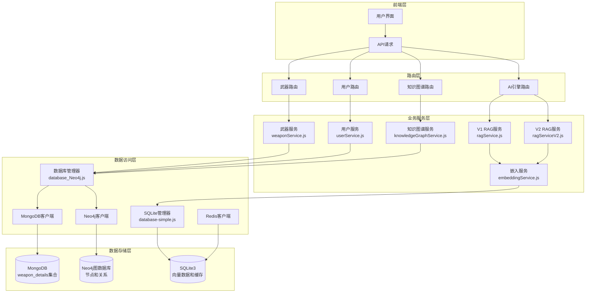
```mermaid
graph TB
subgraph "前端层"
UI[用户界面]
API[API请求]
end
subgraph "路由层"
WR[武器路由]
UR[用户路由]
KGR[知识图谱路由]
AR[AI引擎路由]
end
subgraph "业务服务层"
WS[武器服务<br/>weaponService.js]
US[用户服务<br/>userService.js]
KGS[知识图谱服务<br/>knowledgeGraphService.js]
ES[嵌入服务<br/>embeddingService.js]
RS[V1 RAG服务<br/>ragService.js]
RSV2[V2 RAG服务<br/>ragServiceV2.js]
end
subgraph "数据访问层"
DM[数据库管理器<br/>database_Neo4j.js]
SM[SQLite管理器<br/>database-simple.js]
MC[MongoDB客户端]
NC[Neo4j客户端]
RC[Redis客户端]
end
subgraph "数据存储层"
MD[(MongoDB<br/>weapon_details集合)]
NG[(Neo4j图数据库<br/>节点和关系)]
SQ[(SQLite3<br/>向量数据和缓存)]
end
UI --> API
API --> WR
API --> UR
API --> KGR
API --> AR
WR --> WS
UR --> US
KGR --> KGS
AR --> RS
AR --> RSV2
RS --> ES
RSV2 --> ES
WS --> DM
US --> DM
KGS --> DM
ES --> SM
DM --> MC
DM --> NC
SM --> SQ
MC --> MD
NC --> NG
RC --> SQ
```

**图表来源**
- [weaponService.js:1-486](file://backend/src/services/weaponService.js#L1-L486)
- [userService.js:1-318](file://backend/src/services/userService.js#L1-L318)
- [knowledgeGraphService.js:1-430](file://backend/src/services/knowledgeGraphService.js#L1-L430)
- [embeddingService.js:1-314](file://backend/src/services/embeddingService.js#L1-L314)
- [ragServiceV2.js:1-919](file://backend/src/services/ragServiceV2.js#L1-L919)
- [database_Neo4j.js:1-141](file://backend/src/config/database_Neo4j.js#L1-L141)
- [database-simple.js:1-572](file://backend/src/config/database-simple.js#L1-L572)

## 核心业务服务

### 武器服务 (WeaponService)

武器服务是系统的核心业务组件，负责武器的全生命周期管理，包括CRUD操作和复杂的关系查询。

#### 主要功能模块

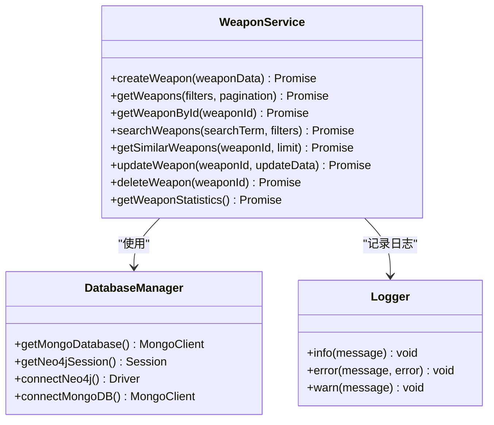
```mermaid
classDiagram
class WeaponService {
+createWeapon(weaponData) Promise
+getWeapons(filters, pagination) Promise
+getWeaponById(weaponId) Promise
+searchWeapons(searchTerm, filters) Promise
+getSimilarWeapons(weaponId, limit) Promise
+updateWeapon(weaponId, updateData) Promise
+deleteWeapon(weaponId) Promise
+getWeaponStatistics() Promise
}
class DatabaseManager {
+getMongoDatabase() MongoClient
+getNeo4jSession() Session
+connectNeo4j() Driver
+connectMongoDB() MongoClient
}
class Logger {
+info(message) void
+error(message, error) void
+warn(message) void
}
WeaponService --> DatabaseManager : "使用"
WeaponService --> Logger : "记录日志"
```

**图表来源**
- [weaponService.js:2-486](file://backend/src/services/weaponService.js#L2-L486)
- [database_Neo4j.js:6-141](file://backend/src/config/database_Neo4j.js#L6-L141)

#### CRUD操作详解

**创建武器 (createWeapon)**

创建武器涉及两个数据库的同步操作：

1. **MongoDB存储**: 将武器的详细文档存储在`weapon_details`集合中
2. **Neo4j图谱**: 创建武器节点并建立与类别、国家的关联关系

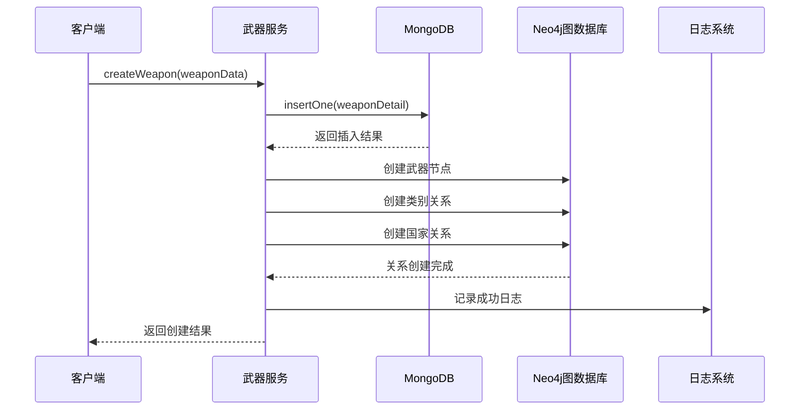
```mermaid
sequenceDiagram
participant Client as 客户端
participant WS as 武器服务
participant Mongo as MongoDB
participant Neo4j as Neo4j图数据库
participant Logger as 日志系统
Client->>WS : createWeapon(weaponData)
WS->>Mongo : insertOne(weaponDetail)
Mongo-->>WS : 返回插入结果
WS->>Neo4j : 创建武器节点
WS->>Neo4j : 创建类别关系
WS->>Neo4j : 创建国家关系
Neo4j-->>WS : 关系创建完成
WS->>Logger : 记录成功日志
WS-->>Client : 返回创建结果
```

**图表来源**
- [weaponService.js:5-70](file://backend/src/services/weaponService.js#L5-L70)

**更新武器 (updateWeapon)**

更新操作确保两个数据库的一致性：

1. **MongoDB更新**: 更新武器的详细信息文档
2. **Neo4j同步**: 更新节点属性并重建关系

**删除武器 (deleteWeapon)**

采用级联删除策略：

1. **MongoDB删除**: 删除武器的详细文档
2. **Neo4j删除**: 使用`DETACH DELETE`移除节点及其所有关系

#### 相似武器推荐 (getSimilarWeapons)

利用Neo4j的图查询能力实现智能推荐：

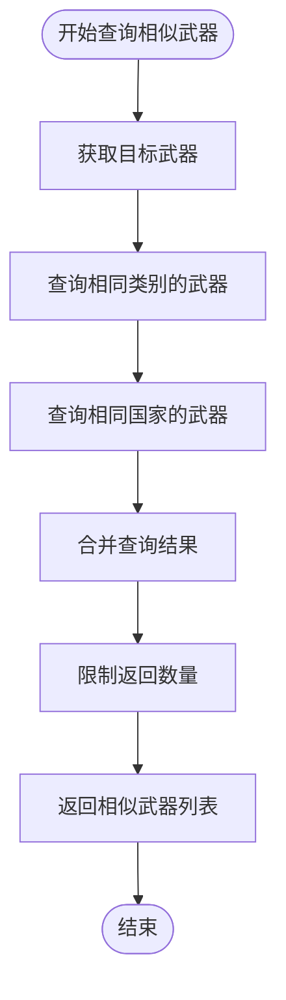
```mermaid
flowchart TD
Start([开始查询相似武器]) --> GetWeapon["获取目标武器"]
GetWeapon --> QueryCategory["查询相同类别的武器"]
QueryCategory --> QueryCountry["查询相同国家的武器"]
QueryCountry --> CombineResults["合并查询结果"]
CombineResults --> LimitResults["限制返回数量"]
LimitResults --> ReturnResults["返回相似武器列表"]
ReturnResults --> End([结束])
```

**图表来源**
- [weaponService.js:220-250](file://backend/src/services/weaponService.js#L220-L250)

**节来源**
- [weaponService.js:5-486](file://backend/src/services/weaponService.js#L5-L486)

### 用户服务 (UserService)

用户服务提供完整的用户管理功能，包括注册、登录、资料管理和兴趣记录。

#### 功能架构

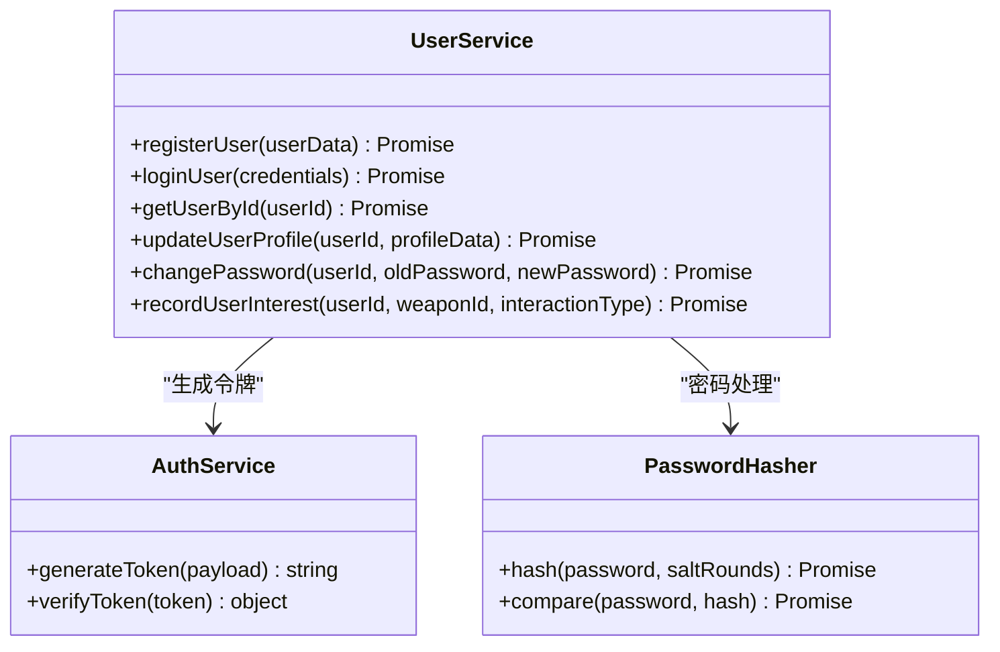
```mermaid
classDiagram
class UserService {
+registerUser(userData) Promise
+loginUser(credentials) Promise
+getUserById(userId) Promise
+updateUserProfile(userId, profileData) Promise
+changePassword(userId, oldPassword, newPassword) Promise
+recordUserInterest(userId, weaponId, interactionType) Promise
}
class AuthService {
+generateToken(payload) string
+verifyToken(token) object
}
class PasswordHasher {
+hash(password, saltRounds) Promise
+compare(password, hash) Promise
}
UserService --> AuthService : "生成令牌"
UserService --> PasswordHasher : "密码处理"
```

**图表来源**
- [userService.js:6-318](file://backend/src/services/userService.js#L6-L318)

#### 用户注册流程

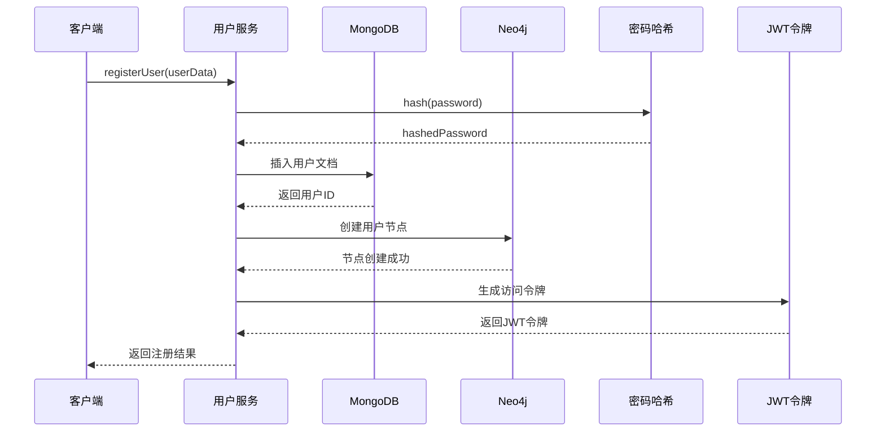
```mermaid
sequenceDiagram
participant Client as 客户端
participant US as 用户服务
participant Mongo as MongoDB
participant Neo4j as Neo4j
participant BCrypt as 密码哈希
participant JWT as JWT令牌
Client->>US : registerUser(userData)
US->>BCrypt : hash(password)
BCrypt-->>US : hashedPassword
US->>Mongo : 插入用户文档
Mongo-->>US : 返回用户ID
US->>Neo4j : 创建用户节点
Neo4j-->>US : 节点创建成功
US->>JWT : 生成访问令牌
JWT-->>US : 返回JWT令牌
US-->>Client : 返回注册结果
```

**图表来源**
- [userService.js:8-80](file://backend/src/services/userService.js#L8-L80)

#### 用户兴趣记录

用户服务提供了强大的兴趣记录功能，用于构建推荐系统：

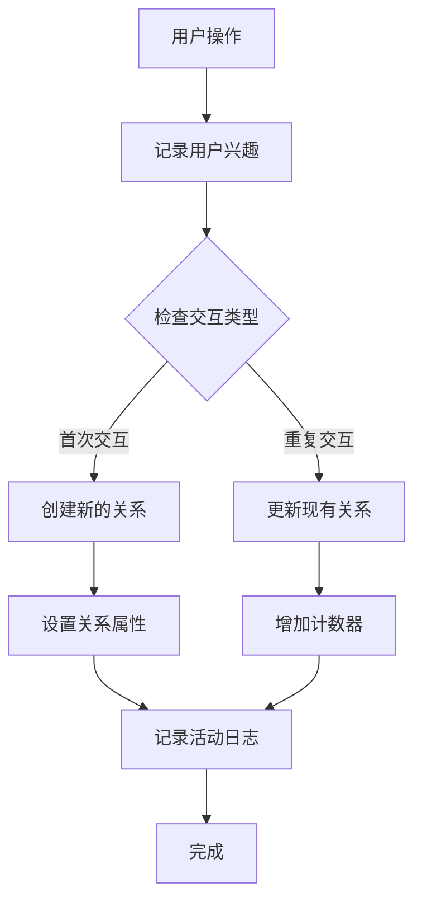
```mermaid
flowchart TD
UserAction[用户操作] --> RecordInterest["记录用户兴趣"]
RecordInterest --> CheckInteraction{"检查交互类型"}
CheckInteraction --> |首次交互| CreateRelation["创建新的关系"]
CheckInteraction --> |重复交互| UpdateRelation["更新现有关系"]
CreateRelation --> SetProperties["设置关系属性"]
UpdateRelation --> IncrementCount["增加计数器"]
SetProperties --> LogActivity["记录活动日志"]
IncrementCount --> LogActivity
LogActivity --> Complete[完成]
```

**图表来源**
- [userService.js:290-318](file://backend/src/services/userService.js#L290-L318)

**节来源**
- [userService.js:1-318](file://backend/src/services/userService.js#L1-L318)

### 知识图谱服务 (KnowledgeGraphService)

知识图谱服务专门处理Neo4j图数据库的操作，提供复杂的图查询和推理功能。

#### 核心功能模块

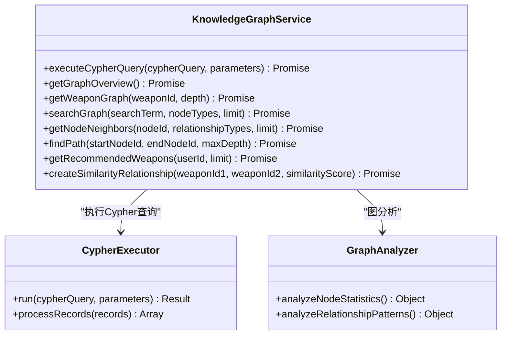
```mermaid
classDiagram
class KnowledgeGraphService {
+executeCypherQuery(cypherQuery, parameters) Promise
+getGraphOverview() Promise
+getWeaponGraph(weaponId, depth) Promise
+searchGraph(searchTerm, nodeTypes, limit) Promise
+getNodeNeighbors(nodeId, relationshipTypes, limit) Promise
+findPath(startNodeId, endNodeId, maxDepth) Promise
+getRecommendedWeapons(userId, limit) Promise
+createSimilarityRelationship(weaponId1, weaponId2, similarityScore) Promise
}
class CypherExecutor {
+run(cypherQuery, parameters) Result
+processRecords(records) Array
}
class GraphAnalyzer {
+analyzeNodeStatistics() Object
+analyzeRelationshipPatterns() Object
}
KnowledgeGraphService --> CypherExecutor : "执行Cypher查询"
KnowledgeGraphService --> GraphAnalyzer : "图分析"
```

**图表来源**
- [knowledgeGraphService.js:4-430](file://backend/src/services/knowledgeGraphService.js#L4-L430)

#### 推荐算法实现

知识图谱服务实现了基于用户兴趣的武器推荐算法：

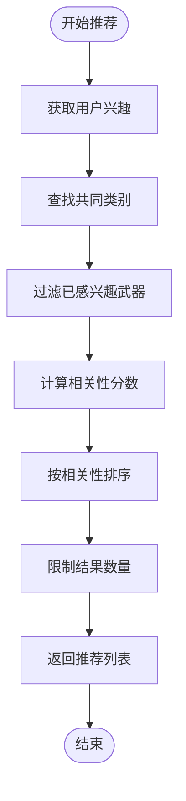
```mermaid
flowchart TD
Start([开始推荐]) --> GetUserInterests["获取用户兴趣"]
GetUserInterests --> FindCommonCategories["查找共同类别"]
FindCommonCategories --> FilterAlreadyInterested["过滤已感兴趣武器"]
FilterAlreadyInterested --> CalculateRelevance["计算相关性分数"]
CalculateRelevance --> SortByRelevance["按相关性排序"]
SortByRelevance --> LimitResults["限制结果数量"]
LimitResults --> ReturnRecommendations["返回推荐列表"]
ReturnRecommendations --> End([结束])
```

**图表来源**
- [knowledgeGraphService.js:380-410](file://backend/src/services/knowledgeGraphService.js#L380-L410)

**节来源**
- [knowledgeGraphService.js:1-430](file://backend/src/services/knowledgeGraphService.js#L1-L430)

## 向量搜索服务

### EmbeddingService 架构设计

向量搜索服务基于阿里云百炼（DashScope）text-embedding-v3模型，为药材提供语义检索能力，解决传统CONTAINS字面匹配无法处理「证型↔功效」不对齐的问题。

#### 核心特性

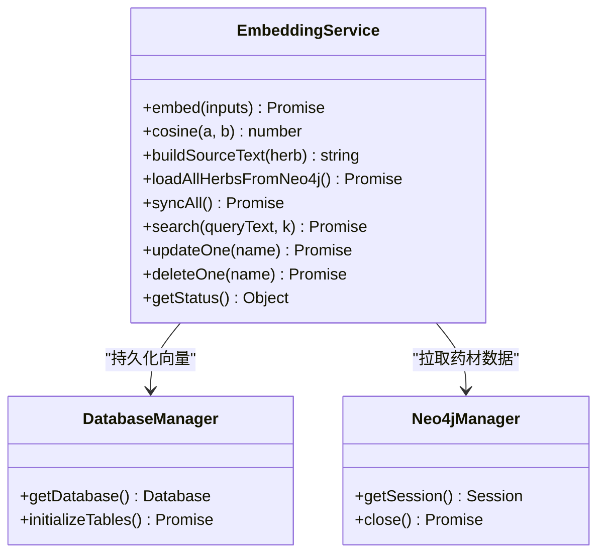
```mermaid
classDiagram
class EmbeddingService {
+embed(inputs) Promise
+cosine(a, b) number
+buildSourceText(herb) string
+loadAllHerbsFromNeo4j() Promise
+syncAll() Promise
+search(queryText, k) Promise
+updateOne(name) Promise
+deleteOne(name) Promise
+getStatus() Object
}
class DatabaseManager {
+getDatabase() Database
+initializeTables() Promise
}
class Neo4jManager {
+getSession() Session
+close() Promise
}
EmbeddingService --> DatabaseManager : "持久化向量"
EmbeddingService --> Neo4jManager : "拉取药材数据"
```

**图表来源**
- [embeddingService.js:26-314](file://backend/src/services/embeddingService.js#L26-L314)
- [database-simple.js:5-572](file://backend/src/config/database-simple.js#L5-L572)

#### 向量化流程

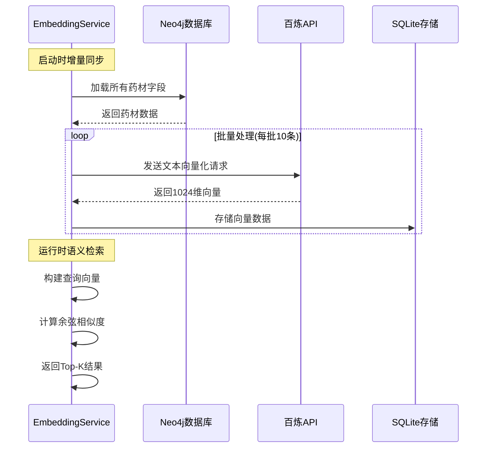
```mermaid
sequenceDiagram
participant Service as EmbeddingService
participant Neo4j as Neo4j数据库
participant DashScope as 百炼API
participant SQLite as SQLite存储
Note over Service : 启动时增量同步
Service->>Neo4j : 加载所有药材字段
Neo4j-->>Service : 返回药材数据
loop 批量处理(每批10条)
Service->>DashScope : 发送文本向量化请求
DashScope-->>Service : 返回1024维向量
Service->>SQLite : 存储向量数据
end
Note over Service : 运行时语义检索
Service->>Service : 构建查询向量
Service->>Service : 计算余弦相似度
Service->>Service : 返回Top-K结果
```

**图表来源**
- [embeddingService.js:190-251](file://backend/src/services/embeddingService.js#L190-L251)

#### 增量同步机制

系统采用智能增量同步策略，避免重复计算：

1. **启动预热**: 服务器启动时执行增量同步
2. **差异检测**: 比较source_text判断是否需要重新向量化
3. **单条更新**: CRUD操作时实时更新对应药材向量
4. **内存缓存**: 运行时维护name→vector映射表

**节来源**
- [embeddingService.js:1-314](file://backend/src/services/embeddingService.js#L1-L314)
- [EMBEDDING_VECTOR_SEARCH.md:1-520](file://docs/EMBEDDING_VECTOR_SEARCH.md#L1-L520)

## RAG智能问答服务

### V1 RAG服务基础实现

V1版本提供基础的检索增强生成功能，结合Neo4j图数据库和DeepSeek LLM。

#### 核心流程

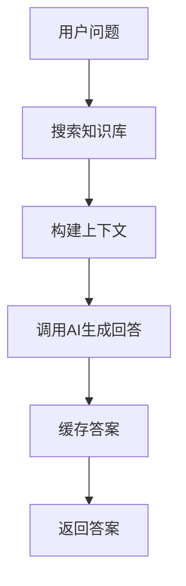
```mermaid
flowchart TD
Question[用户问题] --> SearchKB[搜索知识库]
SearchKB --> BuildContext[构建上下文]
BuildContext --> CallAI[调用AI生成回答]
CallAI --> CacheAnswer[缓存答案]
CacheAnswer --> ReturnAnswer[返回答案]
```

**图表来源**
- [ragService.js:15-303](file://backend/src/services/ragService.js#L15-L303)

### V2 RAG服务高级实现

V2版本采用LangChain.js实现GraphRAG管道，支持两种检索模式和性能优化。

#### 双模式架构

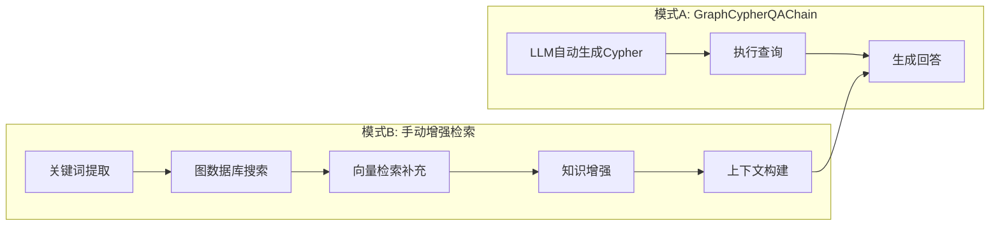
```mermaid
graph LR
subgraph "模式A: GraphCypherQAChain"
LLM[LLM自动生成Cypher] --> Execute[执行查询]
Execute --> Generate[生成回答]
end
subgraph "模式B: 手动增强检索"
Keywords[关键词提取] --> GraphSearch[图数据库搜索]
GraphSearch --> VectorSearch[向量检索补充]
VectorSearch --> Enrich[知识增强]
Enrich --> ContextBuild[上下文构建]
ContextBuild --> Generate
end
```

**图表来源**
- [ragServiceV2.js:42-800](file://backend/src/services/ragServiceV2.js#L42-L800)

#### 性能优化策略

V2版本实现了多项性能优化：

1. **并发控制**: 使用受控并发池处理药材知识增强
2. **智能缓存**: 多层缓存机制减少重复计算
3. **去LLM化**: 关键词提取改用本地n-gram算法
4. **流式响应**: 支持流式输出提升用户体验

**节来源**
- [ragService.js:1-303](file://backend/src/services/ragService.js#L1-L303)
- [ragServiceV2.js:1-919](file://backend/src/services/ragServiceV2.js#L1-L919)
- [RAG_PERFORMANCE_OPTIMIZATION.md:1-303](file://docs/RAG_PERFORMANCE_OPTIMIZATION.md#L1-L303)

## 数据库集成策略

### 多数据库混合架构

系统采用混合数据库架构，充分发挥不同数据库的优势：

| 数据库 | 存储内容 | 查询优势 | 使用场景 |
|--------|----------|----------|----------|
| MongoDB | 武器详细文档 | 文档查询、全文搜索 | 武器详情、搜索、统计 |
| Neo4j | 实体关系图谱 | 图遍历、关联查询 | 推荐系统、路径查找 |
| SQLite3 | 向量数据、缓存 | 快速读取、地理信息 | 向量存储、会话缓存 |

### 向量数据存储设计

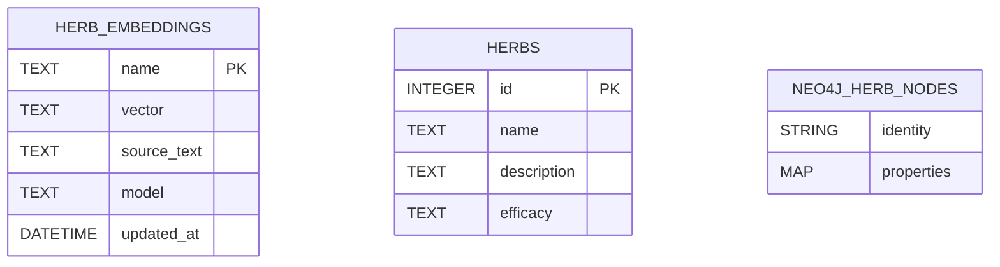
```mermaid
erDiagram
HERB_EMBEDDINGS {
TEXT name PK
TEXT vector
TEXT source_text
TEXT model
DATETIME updated_at
}
HERBS {
INTEGER id PK
TEXT name
TEXT description
TEXT efficacy
}
NEO4J_HERB_NODES {
STRING identity
MAP properties
}
```

**图表来源**
- [database-simple.js:307-315](file://backend/src/config/database-simple.js#L307-L315)

### 数据同步机制

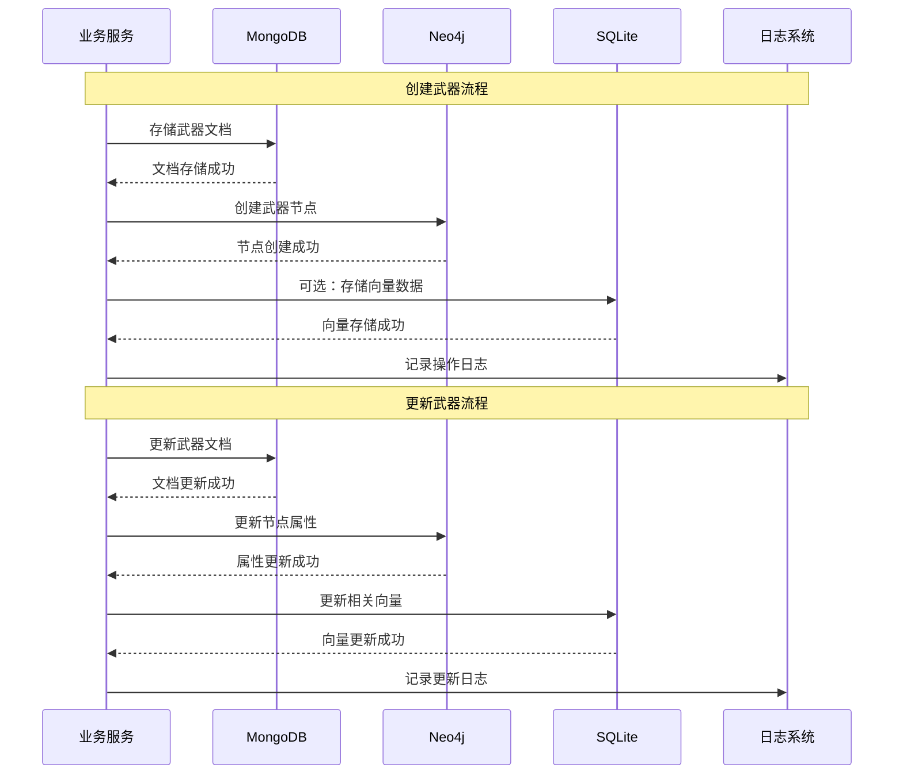
```mermaid
sequenceDiagram
participant Service as 业务服务
participant Mongo as MongoDB
participant Neo4j as Neo4j
participant SQLite as SQLite
participant Logger as 日志系统
Note over Service,Logger : 创建武器流程
Service->>Mongo : 存储武器文档
Mongo-->>Service : 文档存储成功
Service->>Neo4j : 创建武器节点
Neo4j-->>Service : 节点创建成功
Service->>SQLite : 可选：存储向量数据
SQLite-->>Service : 向量存储成功
Service->>Logger : 记录操作日志
Note over Service,Logger : 更新武器流程
Service->>Mongo : 更新武器文档
Mongo-->>Service : 文档更新成功
Service->>Neo4j : 更新节点属性
Neo4j-->>Service : 属性更新成功
Service->>SQLite : 更新相关向量
SQLite-->>Service : 向量更新成功
Service->>Logger : 记录更新日志
```

**图表来源**
- [weaponService.js:5-70](file://backend/src/services/weaponService.js#L5-L70)
- [weaponService.js:252-320](file://backend/src/services/weaponService.js#L252-L320)

**节来源**
- [database_Neo4j.js:1-141](file://backend/src/config/database_Neo4j.js#L1-L141)
- [database-simple.js:1-572](file://backend/src/config/database-simple.js#L1-L572)

## 服务间协作机制

### 路由层协调

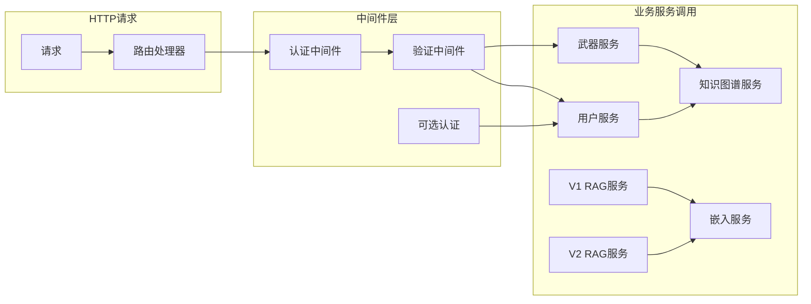
```mermaid
graph LR
subgraph "HTTP请求"
Req[请求] --> Route[路由处理器]
end
subgraph "中间件层"
Auth[认证中间件]
Validate[验证中间件]
OptionalAuth[可选认证]
end
subgraph "业务服务调用"
WS[武器服务]
US[用户服务]
KGS[知识图谱服务]
ES[嵌入服务]
RS[V1 RAG服务]
RSV2[V2 RAG服务]
end
Route --> Auth
Auth --> Validate
Validate --> WS
Validate --> US
WS --> KGS
US --> KGS
RS --> ES
RSV2 --> ES
OptionalAuth --> US
```

**图表来源**
- [weapons.js:1-218](file://backend/src/routes/weapons.js#L1-L218)
- [auth.js:1-144](file://backend/src/routes/auth.js#L1-L144)

### 权限控制机制

系统实现了多层次的权限控制：

| 中间件 | 功能 | 使用场景 |
|--------|------|----------|
| authenticateToken | JWT认证 | 需要登录的功能 |
| optionalAuth | 可选认证 | 可选登录的功能 |
| requireAdmin | 管理员权限 | 管理员专用功能 |

**节来源**
- [auth.js:1-106](file://backend/src/middleware/auth.js#L1-L106)

## 事务管理与数据一致性

### ACID特性保障

由于使用了多个不同的数据库，系统采用了最终一致性的策略：

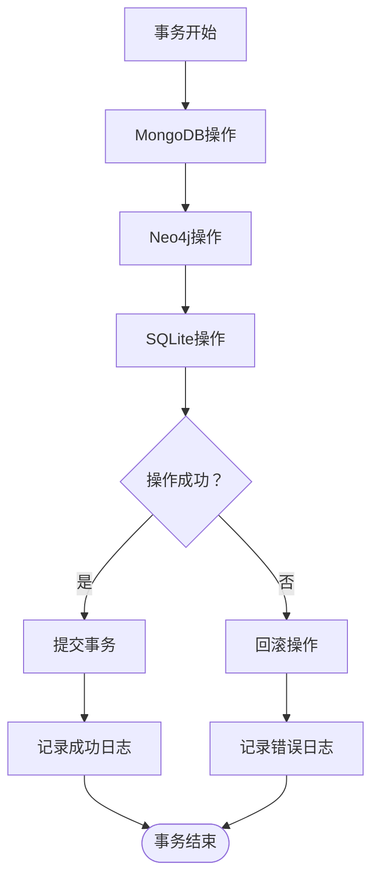
```mermaid
flowchart TD
Transaction[事务开始] --> Step1["MongoDB操作"]
Step1 --> Step2["Neo4j操作"]
Step2 --> Step3["SQLite操作"]
Step3 --> CheckSuccess{"操作成功？"}
CheckSuccess --> |是| Commit["提交事务"]
CheckSuccess --> |否| Rollback["回滚操作"]
Commit --> LogSuccess["记录成功日志"]
Rollback --> LogError["记录错误日志"]
LogSuccess --> End([事务结束])
LogError --> End
```

### 错误处理策略

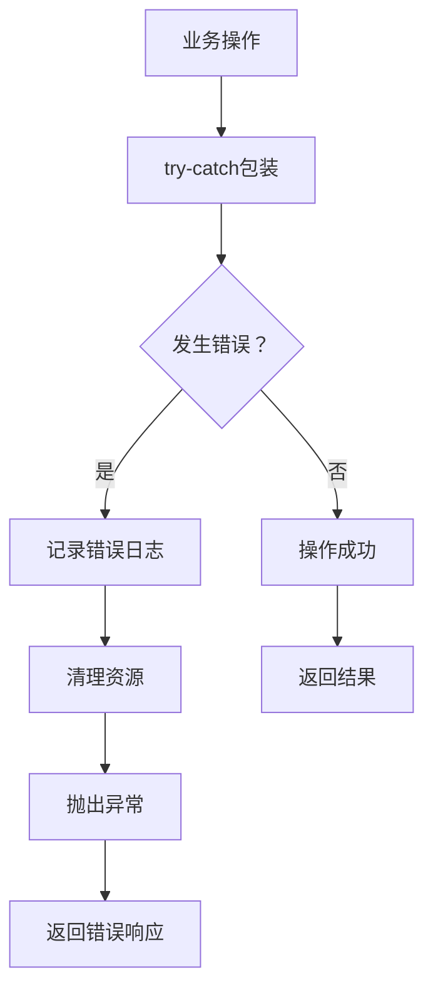
```mermaid
flowchart TD
Operation[业务操作] --> TryCatch["try-catch包装"]
TryCatch --> ErrorCheck{"发生错误？"}
ErrorCheck --> |否| Success["操作成功"]
ErrorCheck --> |是| LogError["记录错误日志"]
LogError --> Cleanup["清理资源"]
Cleanup --> ThrowError["抛出异常"]
Success --> ReturnResult["返回结果"]
ThrowError --> ErrorResponse["返回错误响应"]
```

**图表来源**
- [weaponService.js:15-25](file://backend/src/services/weaponService.js#L15-L25)
- [userService.js:15-25](file://backend/src/services/userService.js#L15-L25)

**节来源**
- [weaponService.js:15-486](file://backend/src/services/weaponService.js#L15-L486)
- [userService.js:15-318](file://backend/src/services/userService.js#L15-L318)

## 性能优化策略

### 缓存机制

系统集成了多层次缓存策略，提升频繁访问数据的性能：

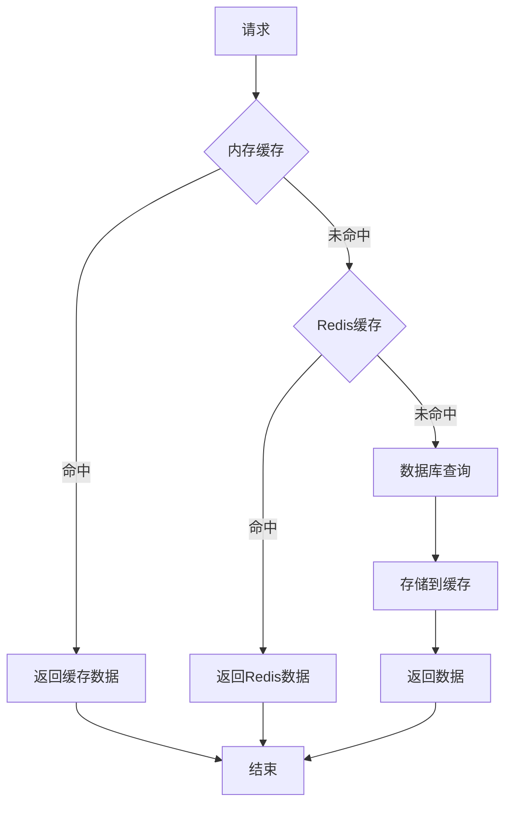
```mermaid
graph TB
Request[请求] --> MemoryCache{内存缓存}
MemoryCache --> |命中| ReturnCached[返回缓存数据]
MemoryCache --> |未命中| RedisCache{Redis缓存}
RedisCache --> |命中| ReturnRedis[返回Redis数据]
RedisCache --> |未命中| Database[数据库查询]
Database --> StoreCache[存储到缓存]
StoreCache --> ReturnData[返回数据]
ReturnCached --> End[结束]
ReturnRedis --> End
ReturnData --> End
```

### 向量检索优化

1. **批量处理**: 百炼API单次最多处理10条文本
2. **增量同步**: 只重新计算变化的药材向量
3. **内存缓存**: 运行时维护向量映射表
4. **余弦相似度**: 高效的向量相似度计算

### RAG性能优化

V2版本实现了多项RAG性能优化：

1. **并发控制**: 使用3个并发worker处理药材知识增强
2. **智能限流**: 限制每次最多补全5味药材
3. **去LLM化**: 关键词提取改用本地n-gram算法
4. **多级缓存**: 答案缓存、知识增强缓存、向量缓存

**节来源**
- [database_Neo4j.js:6-141](file://backend/src/config/database_Neo4j.js#L6-L141)
- [database-simple.js:517-547](file://backend/src/config/database-simple.js#L517-L547)

## 安全机制

### 数据验证

系统实现了全面的数据验证机制：

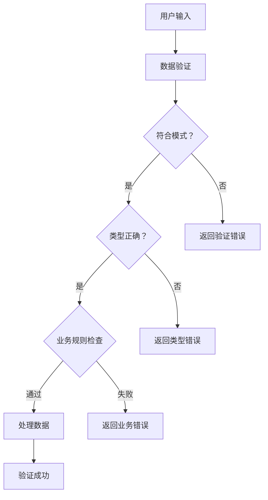
```mermaid
flowchart TD
Input[用户输入] --> Validation[数据验证]
Validation --> SchemaCheck{"符合模式？"}
SchemaCheck --> |是| TypeCheck{"类型正确？"}
SchemaCheck --> |否| ValidationError["返回验证错误"]
TypeCheck --> |是| BusinessCheck{"业务规则检查"}
TypeCheck --> |否| TypeError["返回类型错误"]
BusinessCheck --> |通过| ProcessData["处理数据"]
BusinessCheck --> |失败| BusinessError["返回业务错误"]
ProcessData --> Success["验证成功"]
```

**图表来源**
- [validation.js:8-25](file://backend/src/middleware/validation.js#L8-L25)

### 认证与授权

1. **JWT令牌**: 无状态认证机制
2. **密码加密**: bcrypt哈希算法
3. **权限控制**: 角色基础访问控制
4. **API密钥管理**: 环境变量配置敏感信息

**节来源**
- [validation.js:1-178](file://backend/src/middleware/validation.js#L1-L178)
- [auth.js:1-106](file://backend/src/middleware/auth.js#L1-L106)

## 故障排除指南

### 常见问题诊断

| 问题类型 | 症状 | 可能原因 | 解决方案 |
|----------|------|----------|----------|
| 数据库连接失败 | 服务启动失败 | 配置错误、网络问题 | 检查环境变量、网络连通性 |
| 数据不一致 | 多个数据库数据不同步 | 事务中断、异常处理不当 | 实施补偿机制、重试策略 |
| 查询性能差 | 响应时间过长 | 缺少索引、查询复杂度过高 | 优化查询、添加索引 |
| 向量检索失效 | 语义检索不工作 | API Key未配置、向量未初始化 | 检查配置、执行同步任务 |
| RAG响应慢 | 问答延迟过高 | LLM调用过多、并发控制不当 | 启用V2版本、调整并发参数 |

### 日志分析

系统提供了完善的日志记录机制：

```mermaid
flowchart TD
Event[业务事件] --> Logger[日志系统]
Logger --> Console[控制台输出]
Logger --> File[文件输出]
Logger --> ErrorFile[错误文件]
Console --> DevDebug[开发调试]
File --> AuditLog[审计日志]
ErrorFile --> ErrorAnalysis[错误分析]
```

**图表来源**
- [logger.js:1-47](file://backend/src/utils/logger.js#L1-L47)

**节来源**
- [logger.js:1-47](file://backend/src/utils/logger.js#L1-L47)

## 总结

兵智世界的业务服务层展现了现代Web应用的最佳实践：

### 核心优势

1. **多数据库架构**: 充分发挥MongoDB、Neo4j和SQLite各自的优势
2. **服务化设计**: 清晰的职责分离和模块化架构
3. **数据一致性**: 通过最终一致性策略保证数据完整性
4. **性能优化**: 多层次缓存、向量检索和并发控制
5. **安全保障**: 全面的认证授权和数据验证
6. **智能问答**: 基于RAG的语义理解和知识推理

### 技术创新

- **向量检索**: 利用阿里云百炼Embedding实现语义匹配
- **GraphRAG**: 结合Neo4j图数据库和LLM的智能问答
- **混合存储**: 根据数据特征选择最适合的存储方式
- **微服务理念**: 单一职责原则和松耦合设计

### 发展方向

1. **容器化部署**: 提升部署灵活性和可扩展性
2. **监控告警**: 建立完善的运维监控体系
3. **API版本控制**: 支持向后兼容的API演进
4. **自动化测试**: 提升代码质量和发布效率
5. **AI模型升级**: 持续优化向量模型和LLM效果

这个业务服务层为兵智世界提供了坚实的技术基础，支撑着复杂的军事武器知识管理需求，展现了企业级应用开发的成熟度和专业性。