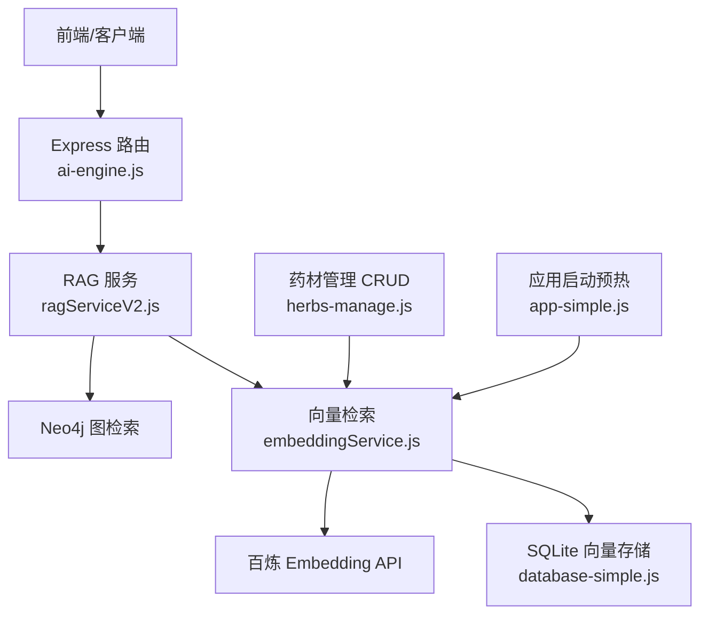
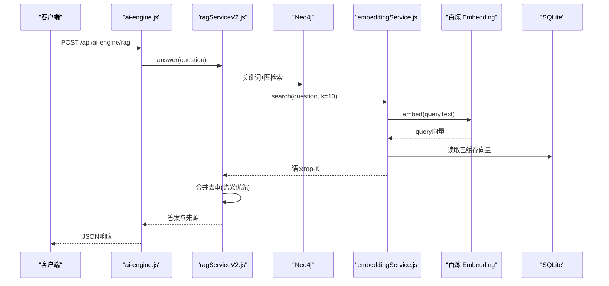
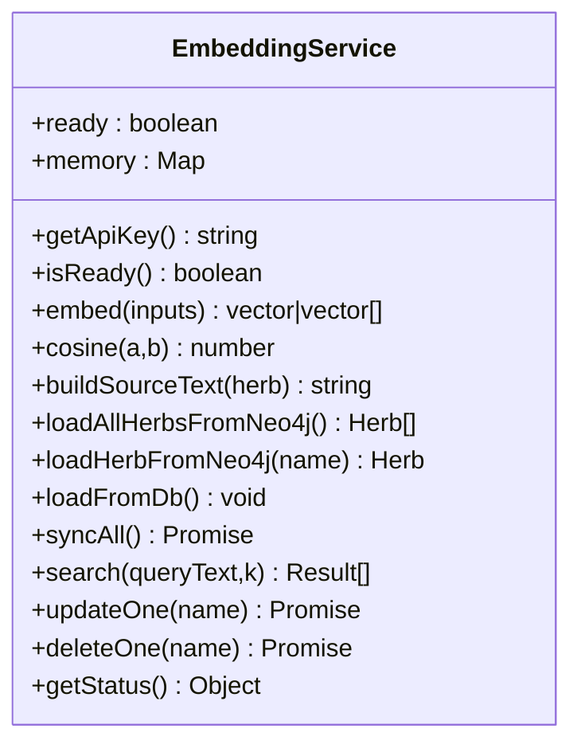
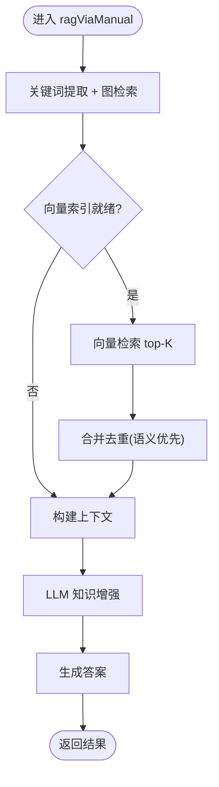
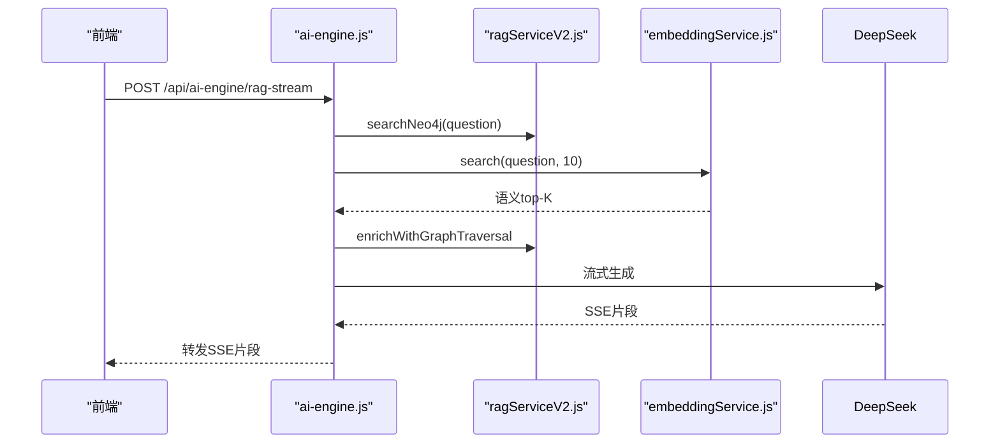
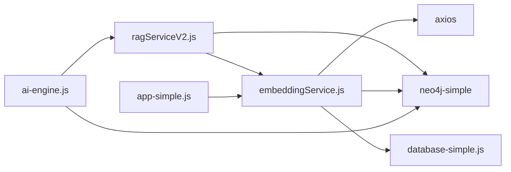

# 向量搜索服务

<cite>
**本文引用的文件**
- [embeddingService.js](file://backend/src/services/embeddingService.js)
- [ragServiceV2.js](file://backend/src/services/ragServiceV2.js)
- [ai-engine.js](file://backend/src/routes/ai-engine.js)
- [herbs-manage.js](file://backend/src/routes/herbs-manage.js)
- [database-simple.js](file://backend/src/config/database-simple.js)
- [app-simple.js](file://backend/src/app-simple.js)
- [EMBEDDING_VECTOR_SEARCH.md](file://docs/EMBEDDING_VECTOR_SEARCH.md)
</cite>

## 目录
1. [简介](#简介)
2. [项目结构](#项目结构)
3. [核心组件](#核心组件)
4. [架构总览](#架构总览)
5. [详细组件分析](#详细组件分析)
6. [依赖关系分析](#依赖关系分析)
7. [性能考量](#性能考量)
8. [故障排查指南](#故障排查指南)
9. [结论](#结论)
10. [附录](#附录)

## 简介
本项目在现有知识图谱与问答系统之上，新增了“向量检索”能力：通过阿里云百炼 text-embedding-v3 将药材文本向量化，并以余弦相似度进行语义匹配，弥补传统 CONTAINS 字面匹配无法对齐“证型↔功效”的缺陷。向量结果与图检索结果合并去重、语义命中优先，最终由 LLM 生成专业回答。

该能力具备以下特性：
- 持久化：向量存储在 SQLite herb_embeddings 表，重启后直接加载，不重复计算
- 增量同步：启动时对比 Neo4j 药材清单，仅对新增或字段变化的药材重新向量化
- 单条更新：CRUD 操作后异步更新或删除对应向量，保证实时性
- 与 RAG 管线融合：在关键词+图检索之后插入“步骤1.5 向量检索补充”，提升召回质量

## 项目结构
围绕向量搜索的关键路径如下：
- 服务层：embeddingService.js（向量化、相似度、持久化、增量同步）
- 数据层：database-simple.js（SQLite 表结构与初始化，含 herb_embeddings）
- 集成层：ragServiceV2.js（RAG 流程中调用向量检索）、ai-engine.js（对外暴露 RAG/流式接口并复用向量检索）
- 管理侧：herbs-manage.js（增删改后触发向量单条更新/删除）
- 启动预热：app-simple.js（服务启动后延迟执行向量同步预热）

图表来源
- [ai-engine.js:137-175](file://backend/src/routes/ai-engine.js#L137-L175)
- [ragServiceV2.js:116-189](file://backend/src/services/ragServiceV2.js#L116-L189)
- [embeddingService.js:26-65](file://backend/src/services/embeddingService.js#L26-L65)
- [database-simple.js:307-315](file://backend/src/config/database-simple.js#L307-L315)
- [herbs-manage.js:301-304](file://backend/src/routes/herbs-manage.js#L301-L304)
- [app-simple.js:368-379](file://backend/src/app-simple.js#L368-L379)

章节来源
- [embeddingService.js:1-314](file://backend/src/services/embeddingService.js#L1-L314)
- [database-simple.js:1-572](file://backend/src/config/database-simple.js#L1-L572)
- [ragServiceV2.js:1-919](file://backend/src/services/ragServiceV2.js#L1-L919)
- [ai-engine.js:1-899](file://backend/src/routes/ai-engine.js#L1-L899)
- [herbs-manage.js:1-639](file://backend/src/routes/herbs-manage.js#L1-L639)
- [app-simple.js:1-396](file://backend/src/app-simple.js#L1-L396)
- [EMBEDDING_VECTOR_SEARCH.md:1-520](file://docs/EMBEDDING_VECTOR_SEARCH.md#L1-L520)

## 核心组件
- 向量服务（EmbeddingService）
  - 负责调用百炼 embedding 接口、构建源文本、计算余弦相似度、持久化到 SQLite、增量同步、单条更新/删除、状态查询
- RAG 服务（RAGServiceV2）
  - 在“步骤1.5”处接入向量检索，将语义命中结果与图检索结果合并去重，语义命中优先
- AI 引擎路由（ai-engine.js）
  - 提供 /api/ai-engine/rag 与 /api/ai-engine/rag-stream 两个入口，均复用向量检索以增强召回
- 数据库管理器（SimpleDatabaseManager）
  - 维护 SQLite 连接与表结构，包含 herb_embeddings 表定义与初始化
- 药材管理路由（herbs-manage.js）
  - 在事务提交后异步调用 updateOne/deleteOne，保持向量索引与图数据一致
- 应用启动（app-simple.js）
  - 启动后延迟执行 syncAll 预热，确保首次请求即可用

章节来源
- [embeddingService.js:26-314](file://backend/src/services/embeddingService.js#L26-L314)
- [ragServiceV2.js:116-189](file://backend/src/services/ragServiceV2.js#L116-L189)
- [ai-engine.js:137-333](file://backend/src/routes/ai-engine.js#L137-L333)
- [database-simple.js:307-315](file://backend/src/config/database-simple.js#L307-L315)
- [herbs-manage.js:301-304](file://backend/src/routes/herbs-manage.js#L301-L304)
- [app-simple.js:368-379](file://backend/src/app-simple.js#L368-L379)

## 架构总览
向量检索在整体系统中的位置与作用：
- 数据源：Neo4j 中的 Herb 节点及其属性（名称、拼音、描述、性味、归经、功效等）
- 向量化：通过百炼 OpenAI 兼容端点生成 1024 维向量
- 存储：SQLite herb_embeddings 表持久化向量与源文本
- 检索：内存 Map 缓存 + 余弦相似度排序，返回 top-K
- 融合：RAG 管线中将向量结果与图检索结果合并，语义命中优先

图表来源
- [ai-engine.js:137-175](file://backend/src/routes/ai-engine.js#L137-L175)
- [ragServiceV2.js:116-189](file://backend/src/services/ragServiceV2.js#L116-L189)
- [embeddingService.js:256-270](file://backend/src/services/embeddingService.js#L256-L270)
- [database-simple.js:307-315](file://backend/src/config/database-simple.js#L307-L315)

## 详细组件分析

### 向量服务（EmbeddingService）
职责与关键点：
- 调用百炼 embedding 接口，支持批量输入（BATCH_SIZE=10），按 index 排序保证顺序一致
- 构建源文本：name + pinyin + description + 性味 + 归经 + 功效，拼接为一段文本用于向量化与增量 diff
- 持久化：使用 SQLite 的 INSERT OR REPLACE 写入 herb_embeddings；启动时 loadFromDb 恢复内存
- 增量同步：loadAllHerbsFromNeo4j 拉取当前清单，对比 sourceText 差异，仅对缺失/变化项重算
- 检索：embed 问题向量后，遍历内存 Map 计算余弦相似度，排序取 top-K
- 单条更新/删除：供 herbs-manage 在事务提交后异步调用，保证一致性

图表来源
- [embeddingService.js:26-314](file://backend/src/services/embeddingService.js#L26-L314)

章节来源
- [embeddingService.js:1-314](file://backend/src/services/embeddingService.js#L1-L314)

### RAG 服务（RAGServiceV2）与向量融合
- 步骤1：关键词提取 + Neo4j 图检索（精确名称匹配 → 扩展匹配）
- 步骤1.5：向量检索补充
  - 若 embeddingService.isReady()，则调用 search(question, 10)
  - 过滤掉已被图检索命中的药材名，补齐详情字段
  - 合并策略：语义命中排前，CONTAINS 命中去重后追加
- 后续步骤：图遍历扩展上下文、LLM 知识增强、构建上下文、生成答案

图表来源
- [ragServiceV2.js:116-189](file://backend/src/services/ragServiceV2.js#L116-L189)

章节来源
- [ragServiceV2.js:116-189](file://backend/src/services/ragServiceV2.js#L116-L189)

### AI 引擎路由（ai-engine.js）
- 非流式 /rag：调用 ragServiceV2.answer，内部已包含向量检索融合
- 流式 /rag-stream：先执行图检索，再调用 embeddingService.search 补充语义命中，随后流式转发 DeepSeek 输出
- 健康检查与状态：提供 /health 与 /status，便于运维监控

图表来源
- [ai-engine.js:178-333](file://backend/src/routes/ai-engine.js#L178-L333)
- [ragServiceV2.js:497-587](file://backend/src/services/ragServiceV2.js#L497-L587)
- [embeddingService.js:256-270](file://backend/src/services/embeddingService.js#L256-L270)

章节来源
- [ai-engine.js:137-333](file://backend/src/routes/ai-engine.js#L137-L333)

### 数据库表设计（herb_embeddings）
- name：主键，天然唯一
- vector：TEXT，JSON 序列化的 1024 维浮点数组
- source_text：用于增量 diff 的源文本
- model：记录使用的模型名
- updated_at：更新时间戳

章节来源
- [database-simple.js:307-315](file://backend/src/config/database-simple.js#L307-L315)

### 启动预热与增量同步
- app-simple.js 在服务监听成功后，延迟 2 秒执行 embeddingService.syncAll()
- syncAll() 会先 loadFromDb()，再拉取 Neo4j 清单做 diff，仅对缺失/变化项重算
- 由于持久化与增量机制，通常“0 增量、秒级就绪”

章节来源
- [app-simple.js:368-379](file://backend/src/app-simple.js#L368-L379)
- [embeddingService.js:190-251](file://backend/src/services/embeddingService.js#L190-L251)

### 管理侧联动（herbs-manage.js）
- 新增/更新/删除后，在事务提交后异步调用 updateOne/deleteOne
- 改名场景需 deleteOne(旧名) + updateOne(新名)，因为主键为 name
- 保证向量索引与图数据的一致性，且不阻塞接口响应

章节来源
- [herbs-manage.js:301-304](file://backend/src/routes/herbs-manage.js#L301-L304)
- [herbs-manage.js:426-434](file://backend/src/routes/herbs-manage.js#L426-L434)
- [herbs-manage.js:487-489](file://backend/src/routes/herbs-manage.js#L487-L489)

## 依赖关系分析
- embeddingService.js 依赖：
  - axios：调用百炼 OpenAI 兼容端点
  - neo4j-simple：读取 Herbs 及关系标签
  - database-simple：读写 SQLite 向量表
- ragServiceV2.js 依赖：
  - embeddingService：步骤1.5 向量检索补充
  - neo4j-simple：图检索与图遍历
  - @langchain/openai：LLM 调用（DeepSeek）
- ai-engine.js 依赖：
  - ragServiceV2：统一 RAG 流程
  - embeddingService：流式模式下的向量检索补充
  - neo4j-simple：配伍检测与知识抽取写入
- database-simple.js：
  - sqlite3：本地向量持久化
- app-simple.js：
  - embeddingService：启动预热

图表来源
- [ai-engine.js:15-21](file://backend/src/routes/ai-engine.js#L15-L21)
- [ragServiceV2.js:11-17](file://backend/src/services/ragServiceV2.js#L11-L17)
- [embeddingService.js:17-19](file://backend/src/services/embeddingService.js#L17-L19)
- [database-simple.js:1-3](file://backend/src/config/database-simple.js#L1-L3)
- [app-simple.js:15-18](file://backend/src/app-simple.js#L15-L18)

章节来源
- [ai-engine.js:1-899](file://backend/src/routes/ai-engine.js#L1-L899)
- [ragServiceV2.js:1-919](file://backend/src/services/ragServiceV2.js#L1-L919)
- [embeddingService.js:1-314](file://backend/src/services/embeddingService.js#L1-L314)
- [database-simple.js:1-572](file://backend/src/config/database-simple.js#L1-L572)
- [app-simple.js:1-396](file://backend/src/app-simple.js#L1-L396)

## 性能考量
- 批量限制：百炼 text-embedding-v3 单次 input 上限为 10 条，代码中 BATCH_SIZE=10，避免 400 错误
- 增量同步：通过 sourceText 比对，避免全量重算；首次全量约数秒，后续“0 增量、秒级就绪”
- 内存检索：向量存在内存 Map，余弦相似度计算为纯内存操作，微秒级
- 持久化：重启直接 loadFromDb，零网络开销
- 并发控制：syncAll 使用 _syncPromise 防重入；LLM 知识增强采用受控并发池
- 缓存：答案缓存 5 分钟、药材补全缓存 24 小时，减少重复调用

[本节为通用指导，无需特定文件引用]

## 故障排查指南
常见问题与定位要点：
- 向量检索未生效
  - 检查 embeddingService.isReady() 是否为 true（需配置 DASHSCOPE_API_KEY 并完成首次同步）
  - 确认 herb_embeddings 表是否存在且可读取
- 向量不存在或过期
  - 查看 SQLite 路径与权限；必要时清空 herb_embeddings 表并重启以重算
- 修改药材后向量未更新
  - 确认 herbs-manage 在事务提交后调用了 updateOne/deleteOne
  - 改名场景需 deleteOne(旧名) + updateOne(新名)
- 流式模式下向量检索失败
  - 检查 ai-engine.js 流式分支是否调用 embeddingService.search，并捕获异常日志
- 模型切换导致维度不一致
  - 更换 EMBEDDING_MODEL 后需清空 herb_embeddings 表，避免新旧向量混用

章节来源
- [embeddingService.js:199-202](file://backend/src/services/embeddingService.js#L199-L202)
- [embeddingService.js:256-270](file://backend/src/services/embeddingService.js#L256-L270)
- [herbs-manage.js:426-434](file://backend/src/routes/herbs-manage.js#L426-L434)
- [ai-engine.js:212-226](file://backend/src/routes/ai-engine.js#L212-L226)
- [EMBEDDING_VECTOR_SEARCH.md:504-520](file://docs/EMBEDDING_VECTOR_SEARCH.md#L504-L520)

## 结论
向量检索在本项目中作为“步骤1.5”无缝融入 RAG 管线，显著提升了“证型↔功效”语义对齐的召回质量。通过持久化与增量同步，系统在启动与运行期均具备高可用性与低成本优势；结合管理侧的单条更新机制，保证了向量索引与图数据的强一致性。配合流式与非流式两种问答模式，用户可获得更准确、更专业的中医药建议。

[本节为总结性内容，无需特定文件引用]

## 附录
- 关键设计权衡与坑位说明详见文档：[EMBEDDING_VECTOR_SEARCH.md:457-488](file://docs/EMBEDDING_VECTOR_SEARCH.md#L457-L488)
- 数据库表结构见：[database-simple.js:307-315](file://backend/src/config/database-simple.js#L307-L315)
- 启动预热逻辑见：[app-simple.js:368-379](file://backend/src/app-simple.js#L368-L379)

[本节为参考指引，无需特定文件引用]