# 知识图谱服务

<cite>
**本文档中引用的文件**
- [knowledgeGraphService.js](file://backend/src/services/knowledgeGraphService.js)
- [ragServiceV2.js](file://backend/src/services/ragServiceV2.js)
- [embeddingService.js](file://backend/src/services/embeddingService.js)
- [knowledge.js](file://backend/src/routes/knowledge.js)
- [neo4j-simple.js](file://backend/src/config/neo4j-simple.js)
- [ai-engine.js](file://backend/src/routes/ai-engine.js)
</cite>

## 更新摘要
**变更内容**
- 新增RAG服务V2的向量搜索集成功能说明
- 更新性能优化章节，包含top-K限制和并发处理机制
- 增强知识图谱与向量检索的协同工作机制描述
- 补充LLM知识增强的并发处理实现细节

## 目录
1. [简介](#简介)
2. [项目结构](#项目结构)
3. [核心组件](#核心组件)
4. [架构概览](#架构概览)
5. [详细组件分析](#详细组件分析)
6. [依赖关系分析](#依赖关系分析)
7. [性能考虑](#性能考虑)
8. [故障排除指南](#故障排除指南)
9. [结论](#结论)

## 简介

知识图谱服务是兵智世界系统的核心组件之一，基于Neo4j图数据库构建，提供了强大的知识图谱数据处理和查询功能。**最新升级**集成了RAG服务V2，通过向量搜索和LLM知识增强，实现了更智能的知识检索和问答能力。该服务通过Cypher查询语言实现了复杂的图数据分析，包括节点关系查询、路径查找、推荐算法等功能，并支持语义化的中药知识检索。

## 项目结构

知识图谱服务在项目中的组织结构如下：

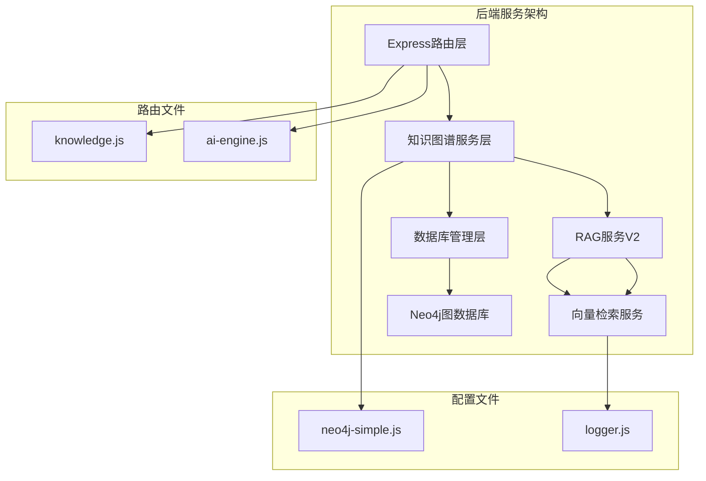

**图表来源**
- [knowledgeGraphService.js:1-10](file://backend/src/services/knowledgeGraphService.js#L1-L10)
- [ragServiceV2.js:1-20](file://backend/src/services/ragServiceV2.js#L1-L20)
- [neo4j-simple.js:1-10](file://backend/src/config/neo4j-simple.js#L1-L10)

**章节来源**
- [knowledgeGraphService.js:1-430](file://backend/src/services/knowledgeGraphService.js#L1-L430)
- [ragServiceV2.js:1-919](file://backend/src/services/ragServiceV2.js#L1-L919)
- [neo4j-simple.js:1-97](file://backend/src/config/neo4j-simple.js#L1-L97)

## 核心组件

知识图谱服务包含以下核心功能模块：

### 主要功能模块
1. **Cypher查询执行器** - 安全执行Neo4j Cypher查询
2. **图谱概览统计** - 提供节点和关系统计信息
3. **武器图谱获取** - 基于深度遍历的武器关联数据
4. **图谱搜索引擎** - 支持属性和类型的多维搜索
5. **邻居节点发现** - 获取指定节点的直接关联节点
6. **最短路径查找** - 基于Neo4j算法的路径发现
7. **推荐系统** - 基于用户兴趣的武器推荐
8. **相似关系创建** - 自动生成武器间的相似性关系
9. **RAG智能问答** - 基于向量搜索和LLM的知识问答
10. **向量检索** - 基于语义相似度的中药知识检索

**章节来源**
- [knowledgeGraphService.js:4-430](file://backend/src/services/knowledgeGraphService.js#L4-L430)
- [ragServiceV2.js:42-919](file://backend/src/services/ragServiceV2.js#L42-L919)

## 架构概览

知识图谱服务采用分层架构设计，确保了良好的可维护性和扩展性：

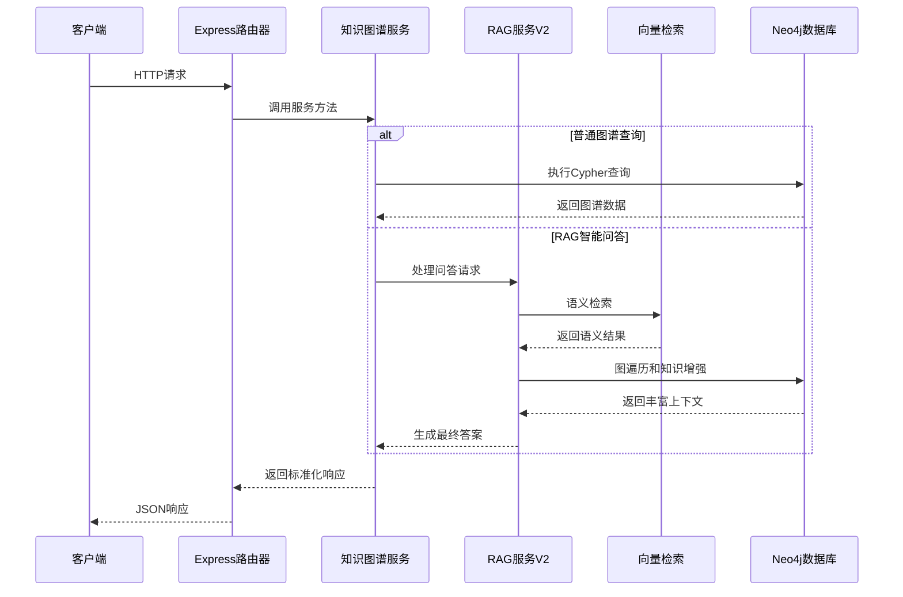

**图表来源**
- [knowledge.js:1-50](file://backend/src/routes/knowledge.js#L1-L50)
- [knowledgeGraphService.js:5-50](file://backend/src/services/knowledgeGraphService.js#L5-L50)
- [ragServiceV2.js:773-850](file://backend/src/services/ragServiceV2.js#L773-L850)

## 详细组件分析

### executeCypherQuery方法 - 安全Cypher查询执行

executeCypherQuery方法是知识图谱服务的核心查询接口，负责安全地执行Cypher查询并处理复杂的数据结构。

#### 查询执行流程

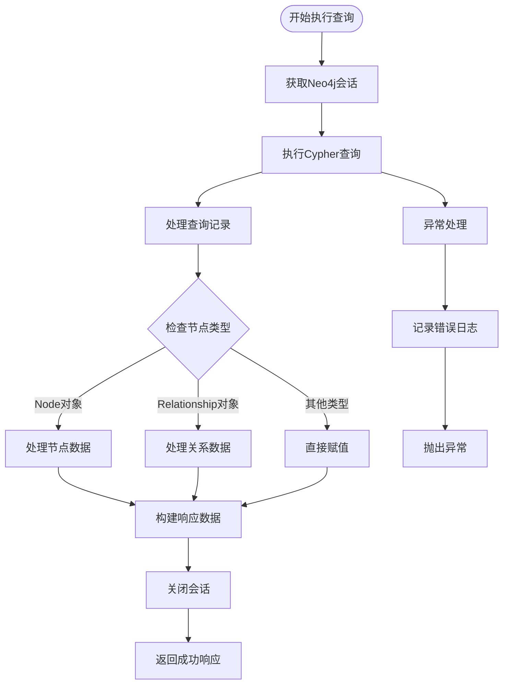

**图表来源**
- [knowledgeGraphService.js:5-50](file://backend/src/services/knowledgeGraphService.js#L5-L50)

#### 节点和关系对象处理

服务能够智能识别和处理Neo4j返回的复杂对象类型：

| 对象类型 | 处理方式 | 返回结构 |
|---------|---------|---------|
| Node对象 | 提取identity、labels、properties | `{id, labels, properties}` |
| Relationship对象 | 提取identity、type、properties及start/end | `{id, type, properties, source, target}` |
| 其他类型 | 直接返回原始值 | `{原始值}` |

**章节来源**
- [knowledgeGraphService.js:5-50](file://backend/src/services/knowledgeGraphService.js#L5-L50)

### getGraphOverview方法 - 图谱统计功能

getGraphOverview方法提供全面的知识图谱统计信息，帮助用户了解图谱的整体结构和规模。

#### 统计查询逻辑

```mermaid
graph LR
subgraph "节点统计"
A[MATCH (n)] --> B[RETURN labels(n), count(n)]
B --> C[ORDER BY count DESC]
end
subgraph "关系统计"
D[MATCH ()-[r]->()] --> E[RETURN type(r), count(r)]
E --> F[ORDER BY count DESC]
end
subgraph "汇总计算"
G[节点总数计算]
H[关系总数计算]
end
C --> G
F --> H
```

**图表来源**
- [knowledgeGraphService.js:52-85](file://backend/src/services/knowledgeGraphService.js#L52-L85)

#### 统计指标说明

| 指标类型 | 查询语句 | 计算方式 |
|---------|---------|---------|
| 节点统计 | `MATCH (n) RETURN labels(n), count(n)` | 按标签分组计数 |
| 关系统计 | `MATCH ()-[r]->() RETURN type(r), count(r)` | 按关系类型分组计数 |
| 总节点数 | `SUM(count)` | 所有节点类型的计数总和 |
| 总关系数 | `SUM(count)` | 所有关系类型的计数总和 |

**章节来源**
- [knowledgeGraphService.js:52-85](file://backend/src/services/knowledgeGraphService.js#L52-L85)

### getWeaponGraph方法 - 武器关联图谱

getWeaponGraph方法实现基于深度遍历的武器关联数据获取，支持灵活的查询深度控制。

#### 深度遍历算法

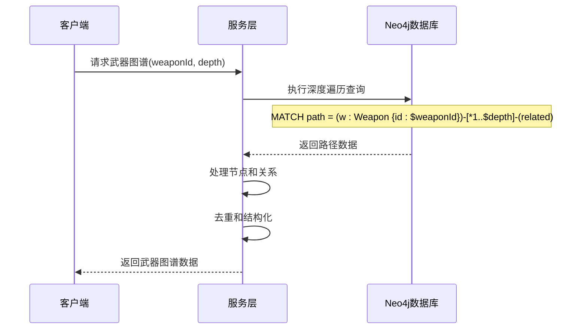

**图表来源**
- [knowledgeGraphService.js:87-130](file://backend/src/services/knowledgeGraphService.js#L87-L130)

#### 查询参数控制

| 参数 | 类型 | 默认值 | 说明 |
|------|------|--------|------|
| weaponId | String | 必需 | 目标武器的唯一标识符 |
| depth | Number | 2 | 遍历的最大深度，范围1-5 |
| limit | Number | 100 | 结果集限制 |

**章节来源**
- [knowledgeGraphService.js:87-130](file://backend/src/services/knowledgeGraphService.js#L87-L130)

### searchGraph方法 - 图谱搜索机制

searchGraph方法提供强大的图谱搜索功能，支持按节点属性和类型进行多维过滤。

#### 搜索查询构建

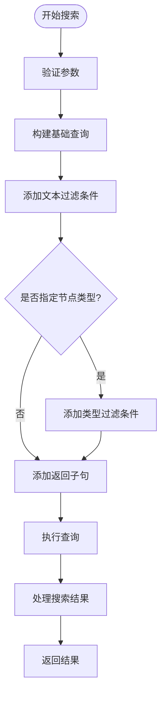

**图表来源**
- [knowledgeGraphService.js:132-180](file://backend/src/services/knowledgeGraphService.js#L132-L180)

#### 搜索条件组合

| 条件类型 | Cypher表达式 | 示例 |
|---------|-------------|------|
| 文本搜索 | `n.name CONTAINS $searchTerm` | 搜索武器名称包含"AK"的节点 |
| 类型过滤 | `$label0 IN labels(n) OR $label1 IN labels(n)` | 只搜索武器和国家节点 |
| 组合条件 | `WHERE condition1 AND condition2` | 同时满足文本和类型条件 |

**章节来源**
- [knowledgeGraphService.js:132-180](file://backend/src/services/knowledgeGraphService.js#L132-L180)

### getNodeNeighbors方法 - 邻居节点发现

getNodeNeighbors方法实现节点邻居的高效发现，支持关系类型过滤和结果限制。

#### 邻居发现算法

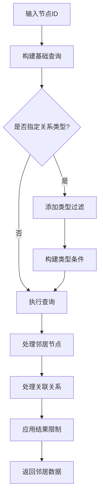

**图表来源**
- [knowledgeGraphService.js:182-230](file://backend/src/services/knowledgeGraphService.js#L182-L230)

#### 查询优化策略

| 优化技术 | 实现方式 | 性能收益 |
|---------|---------|---------|
| 关系类型过滤 | `type(r) IN [type1, type2]` | 减少不必要的关系扫描 |
| 结果限制 | `LIMIT $limit` | 控制内存使用和响应时间 |
| ID精确匹配 | `id(n) = $nodeId` | 利用索引加速查找 |

**章节来源**
- [knowledgeGraphService.js:182-230](file://backend/src/services/knowledgeGraphService.js#L182-L230)

### findPath方法 - 最短路径查找

findPath方法利用Neo4j的内置最短路径算法，查找两个节点之间的最优连接路径。

#### 路径查找流程

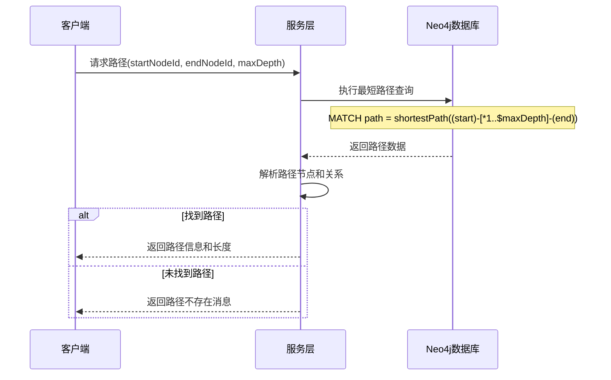

**图表来源**
- [knowledgeGraphService.js:232-280](file://backend/src/services/knowledgeGraphService.js#L232-L280)

#### 路径查询参数

| 参数 | 类型 | 默认值 | 限制 | 说明 |
|------|------|--------|------|------|
| startNodeId | Number | 必需 | 无 | 起始节点的内部ID |
| endNodeId | Number | 必需 | 无 | 结束节点的内部ID |
| maxDepth | Number | 5 | ≤10 | 最大搜索深度 |

**章节来源**
- [knowledgeGraphService.js:232-280](file://backend/src/services/knowledgeGraphService.js#L232-L280)

### getRecommendedWeapons方法 - 推荐算法

getRecommendedWeapons方法基于用户兴趣图谱实现智能武器推荐，采用协同过滤思想。

#### 推荐算法流程

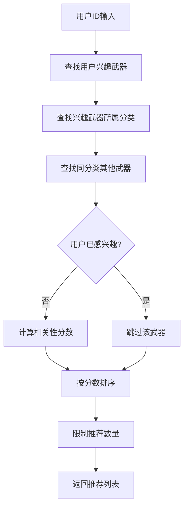

**图表来源**
- [knowledgeGraphService.js:282-320](file://backend/src/services/knowledgeGraphService.js#L282-L320)

#### 推荐评分机制

| 评分因素 | 计算方式 | 权重 |
|---------|---------|------|
| 分类匹配度 | 同一分类的武器数量 | 主要 |
| 用户兴趣覆盖 | 已感兴趣的武器排除 | 排序依据 |
| 数量统计 | 相似武器的数量 | 评分依据 |

**章节来源**
- [knowledgeGraphService.js:282-320](file://backend/src/services/knowledgeGraphService.js#L282-L320)

### createSimilarityRelationship方法 - 相似关系创建

createSimilarityRelationship方法实现武器间的相似性关系建立，支持自定义相似度阈值。

#### 关系创建逻辑

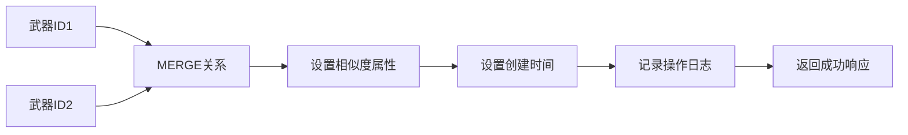

**图表来源**
- [knowledgeGraphService.js:322-350](file://backend/src/services/knowledgeGraphService.js#L322-L350)

#### 关系属性配置

| 属性名 | 类型 | 默认值 | 说明 |
|-------|------|--------|------|
| similarity_score | Float | 0.8 | 相似度分数，范围0-1 |
| created_at | DateTime | 当前时间 | 关系创建时间戳 |

**章节来源**
- [knowledgeGraphService.js:322-350](file://backend/src/services/knowledgeGraphService.js#L322-L350)

### RAG服务V2 - 智能问答系统

**新增功能** RAG服务V2集成了向量搜索和LLM知识增强，提供智能化的中医药知识问答能力。

#### 双模式检索架构

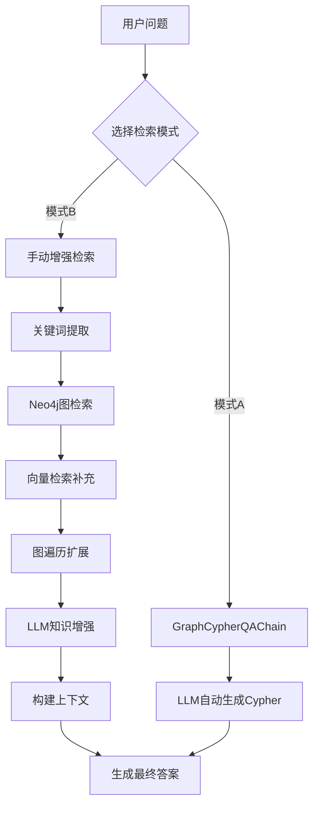

**图表来源**
- [ragServiceV2.js:87-268](file://backend/src/services/ragServiceV2.js#L87-L268)

#### 向量搜索集成

RAG服务V2通过embeddingService实现语义检索，弥补传统CONTAINS匹配的不足：

| 检索阶段 | 技术 | 作用 | 性能优化 |
|---------|------|------|---------|
| 关键词提取 | n-gram本地提取 | 快速捞出药材名等字面词 | 避免额外LLM调用 |
| 精确匹配 | Neo4j CONTAINS | 名称精确匹配 | LIMIT 20限制 |
| 扩展匹配 | 功效/描述/拼音 | 模糊匹配补充 | LIMIT 15限制 |
| 向量检索 | 语义相似度 | 证型↔功效语义匹配 | top-K=10限制 |
| 图遍历 | 1-2跳关联 | 丰富上下文信息 | 批量处理 |

**章节来源**
- [ragServiceV2.js:116-268](file://backend/src/services/ragServiceV2.js#L116-L268)
- [embeddingService.js:256-270](file://backend/src/services/embeddingService.js#L256-L270)

### LLM知识增强 - 并发处理优化

**新增功能** 实现了受控并发和上限控制的LLM知识增强机制。

#### 并发处理流程

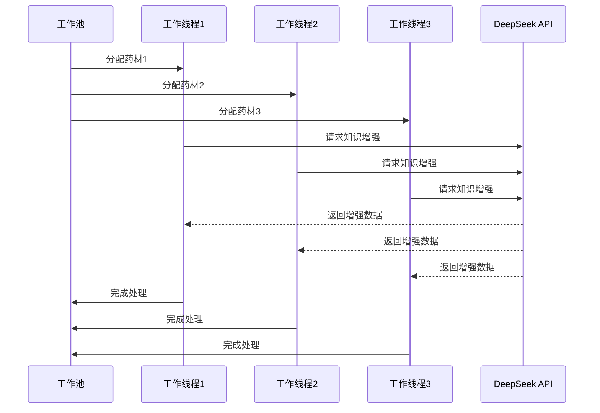

**图表来源**
- [ragServiceV2.js:648-670](file://backend/src/services/ragServiceV2.js#L648-L670)

#### 性能优化配置

| 优化项 | 配置 | 效果 |
|--------|------|------|
| ENRICH_HERB_LIMIT | 5 | 最多补全前5味药材 |
| ENRICH_CONCURRENCY | 3 | 并发度为3 |
| CACHE_TTL | 5分钟 | 答案缓存5分钟 |
| ENRICH_CACHE_TTL | 24小时 | 知识增强缓存24小时 |
| BATCH_SIZE | 10 | 向量化批处理大小 |

**章节来源**
- [ragServiceV2.js:22-28](file://backend/src/services/ragServiceV2.js#L22-L28)
- [ragServiceV2.js:648-670](file://backend/src/services/ragServiceV2.js#L648-L670)

## 依赖关系分析

知识图谱服务的依赖关系体现了清晰的分层架构：

```mermaid
graph TB
subgraph "外部依赖"
A[neo4j-driver]
B[express]
C[logger]
D[@langchain/openai]
E[axios]
end
subgraph "内部模块"
F[database_Neo4j.js]
G[knowledgeGraphService.js]
H[ragServiceV2.js]
I[embeddingService.js]
J[knowledge.js]
end
subgraph "配置管理"
K[环境变量]
L[连接池]
M[缓存机制]
end
A --> F
B --> J
C --> G
D --> H
E --> I
F --> G
F --> H
F --> I
J --> G
J --> H
K --> F
K --> H
K --> I
L --> F
M --> H
M --> I
```

**图表来源**
- [knowledgeGraphService.js:1-5](file://backend/src/services/knowledgeGraphService.js#L1-L5)
- [ragServiceV2.js:11-17](file://backend/src/services/ragServiceV2.js#L11-L17)
- [embeddingService.js:17-20](file://backend/src/services/embeddingService.js#L17-L20)

### 模块间交互

| 调用方 | 被调用方 | 调用方式 | 参数传递 |
|-------|---------|---------|---------|
| knowledge.js | knowledgeGraphService | 直接调用 | HTTP请求参数 |
| ai-engine.js | ragServiceV2 | 直接调用 | 问题和选项 |
| ragServiceV2 | embeddingService | 方法调用 | 问题和K值 |
| knowledgeGraphService | databaseManager | 方法调用 | Cypher查询和参数 |
| databaseManager | neo4j-driver | 底层API | 连接配置 |

**章节来源**
- [knowledge.js:1-182](file://backend/src/routes/knowledge.js#L1-L182)
- [ai-engine.js:142-177](file://backend/src/routes/ai-engine.js#L142-L177)
- [knowledgeGraphService.js:1-10](file://backend/src/services/knowledgeGraphService.js#L1-L10)

## 性能考虑

### 查询优化策略

1. **索引利用**：充分利用Neo4j的索引机制，特别是对常用查询字段如`id`和`name`建立索引
2. **查询限制**：合理设置查询结果的LIMIT值，避免返回过多数据
3. **深度控制**：对深度遍历查询设置合理的最大深度限制
4. **连接池管理**：通过数据库管理器实现连接池复用

### 向量检索优化

**新增功能** 向量检索采用了多种性能优化策略：

| 优化技术 | 实现方式 | 性能收益 |
|---------|---------|---------|
| top-K限制 | 语义检索限制为top-10 | 减少后续处理量 |
| 增量同步 | 启动时diff对比，仅计算变化 | 避免重复向量化 |
| 批量处理 | BATCH_SIZE=10批量向量化 | 提高API调用效率 |
| 内存缓存 | 向量存储在内存Map中 | 避免重复计算 |
| SQLite持久化 | 向量持久化到数据库 | 重启后快速恢复 |

### 并发处理优化

**新增功能** RAG服务V2实现了高效的并发处理机制：

| 优化项 | 实现方式 | 效果 |
|--------|---------|------|
| 工作池模式 | Promise.all + 计数器 | 并行处理多个药材 |
| 并发度控制 | ENRICH_CONCURRENCY=3 | 避免过度并发 |
| 上限限制 | ENRICH_HERB_LIMIT=5 | 控制LLM调用次数 |
| 缓存机制 | 多层缓存（答案、知识增强） | 减少重复计算 |

### 缓存策略

服务实现了多层次的缓存机制：

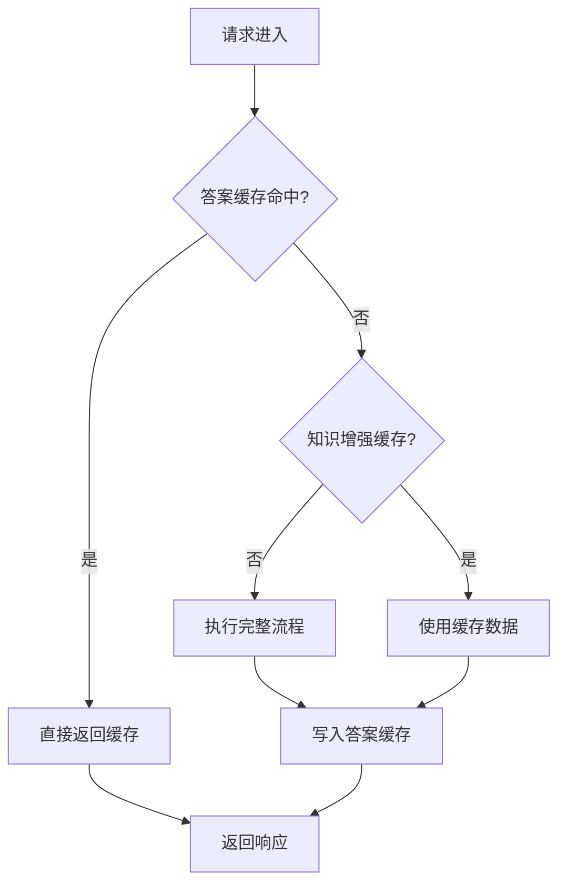

**图表来源**
- [ragServiceV2.js:22-28](file://backend/src/services/ragServiceV2.js#L22-L28)
- [ragServiceV2.js:776-849](file://backend/src/services/ragServiceV2.js#L776-L849)

### 错误处理机制

服务实现了多层次的错误处理：

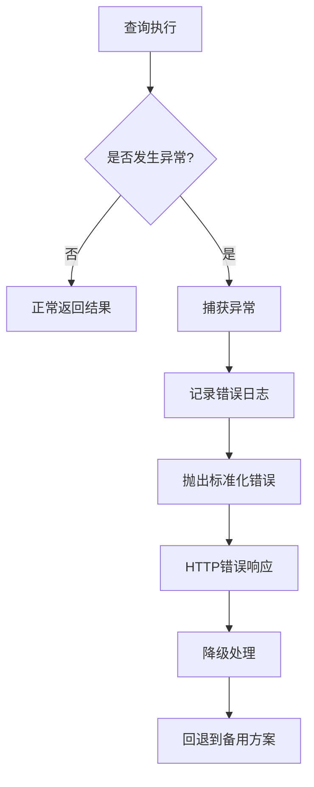

**图表来源**
- [knowledgeGraphService.js:35-50](file://backend/src/services/knowledgeGraphService.js#L35-L50)
- [ragServiceV2.js:107-110](file://backend/src/services/ragServiceV2.js#L107-L110)

## 故障排除指南

### 常见问题及解决方案

| 问题类型 | 症状 | 可能原因 | 解决方案 |
|---------|------|---------|---------|
| 连接失败 | 数据库连接超时 | Neo4j服务不可用 | 检查服务状态和网络连接 |
| 查询超时 | 请求处理时间过长 | 查询复杂度过高 | 优化查询条件和增加LIMIT |
| 内存溢出 | 服务崩溃 | 返回结果过大 | 减少查询深度和结果数量 |
| 权限错误 | Cypher查询被拒绝 | 使用了危险操作 | 移除DELETE、DROP等关键字 |
| 向量检索失败 | 语义检索不可用 | API Key未配置 | 检查DASHSCOPE_API_KEY配置 |
| LLM调用失败 | 知识增强失败 | DeepSeek API不可用 | 检查DEEPSEEK_API_KEY和网络 |

### 监控和调试

1. **日志监控**：通过logger模块记录详细的执行日志
2. **性能监控**：监控查询执行时间和资源使用情况
3. **错误追踪**：建立完善的错误报告和处理机制
4. **缓存监控**：跟踪缓存命中率和失效情况

**章节来源**
- [knowledgeGraphService.js:35-50](file://backend/src/services/knowledgeGraphService.js#L35-L50)
- [neo4j-simple.js:15-30](file://backend/src/config/neo4j-simple.js#L15-L30)
- [ragServiceV2.js:56-84](file://backend/src/services/ragServiceV2.js#L56-L84)

## 结论

知识图谱服务是一个功能完整、设计合理的图数据库应用服务。它通过精心设计的API接口和查询优化策略，为兵智世界系统提供了强大的知识图谱分析能力。**最新的RAG服务V2升级**进一步增强了系统的智能化水平，通过向量搜索和LLM知识增强，实现了更精准和智能的中医药知识问答。

### 主要优势

1. **安全性**：实现了完善的参数化查询和危险操作防护
2. **性能**：通过合理的查询限制和优化策略保证了良好的响应性能
3. **可扩展性**：模块化的架构设计便于功能扩展和维护
4. **可靠性**：完善的错误处理和日志记录机制确保了服务稳定性
5. **智能化**：集成了向量搜索和LLM知识增强，提供更智能的问答体验

### 技术特色

1. **双模式检索**：支持GraphCypherQAChain和手动增强两种检索模式
2. **向量语义检索**：通过百炼text-embedding-v3实现语义级匹配
3. **并发处理优化**：工作池模式和受限并发提升处理效率
4. **多级缓存机制**：答案缓存、知识增强缓存、向量缓存等多层缓存
5. **增量同步**：智能检测数据变化，仅重新计算必要的向量

### 改进建议

1. **缓存机制**：引入适当的缓存策略提升高频查询性能
2. **批量操作**：支持批量查询和操作以提高效率
3. **实时更新**：实现图谱数据的实时同步和更新机制
4. **可视化接口**：提供更丰富的图谱可视化和分析工具
5. **监控告警**：建立更完善的服务监控和告警机制

该服务为兵智世界的知识管理提供了坚实的技术基础，支撑了系统的智能化分析和决策功能，并通过RAG服务V2的升级，为用户提供了更加智能和精准的中医药知识问答体验。