# 应用结构与启动

<cite>
**本文档中引用的文件**
- [app.js](file://backend/src/app.js)
- [app-simple.js](file://backend/src/app-simple.js)
- [embeddingService.js](file://backend/src/services/embeddingService.js)
- [knowledge-graph.js](file://backend/src/routes/knowledge-graph.js)
- [start-simple-server.js](file://start-simple-server.js)
- [package.json](file://backend/package.json)
- [config/index.js](file://backend/src/config/index.js)
- [logger.js](file://backend/src/utils/logger.js)
- [database-simple.js](file://backend/src/config/database-simple.js)
- [auth.js](file://backend/src/routes/auth.js)
- [weapons.js](file://backend/src/routes/weapons.js)
- [userService.js](file://backend/src/services/userService.js)
- [userService-simple.js](file://backend/src/services/userService-simple.js)
- [auth-simple.js](file://backend/src/routes/auth-simple.js)
- [weapons-simple.js](file://backend/src/routes/weapons-simple.js)
</cite>

## 更新摘要
**变更内容**
- 添加了应用程序启动时的自动向量预热功能
- 更新了简化模式的启动流程，包含知识图谱缓存预热和语义检索向量同步
- 增强了服务就绪状态管理，确保语义搜索功能立即可用
- 优化了启动性能，支持增量向量化计算

## 目录
1. [项目概述](#项目概述)
2. [应用架构总览](#应用架构总览)
3. [核心应用类分析](#核心应用类分析)
4. [中间件配置详解](#中间件配置详解)
5. [路由系统设计](#路由系统设计)
6. [错误处理机制](#错误处理机制)
7. [数据库连接管理](#数据库连接管理)
8. [应用启动流程](#应用启动流程)
9. [向量预热系统](#向量预热系统)
10. [简单模式对比](#简单模式对比)
11. [配置管理](#配置管理)
12. [性能监控与日志](#性能监控与日志)
13. [总结](#总结)

## 项目概述

兵智世界后端系统是一个基于Express.js构建的军事知识图谱与武器识别系统，采用现代化的微服务架构设计。该项目支持两种运行模式：标准模式（使用MongoDB+Neo4j）和简化模式（使用SQLite），为不同场景提供灵活的部署选项。**最新版本增加了自动向量预热功能，确保语义搜索在应用启动后立即可用。**

### 主要特性
- **双模式架构**：支持标准和简化两种数据库配置
- **RESTful API设计**：提供完整的CRUD操作接口
- **安全中间件集成**：内置Helmet、CORS、速率限制等安全组件
- **完善的错误处理**：全局错误捕获和优雅关闭机制
- **实时日志记录**：基于Winston的日志系统
- **多层认证授权**：JWT令牌验证和角色权限控制
- **智能向量预热**：启动时自动预加载语义检索向量，提升首次查询性能

## 应用架构总览

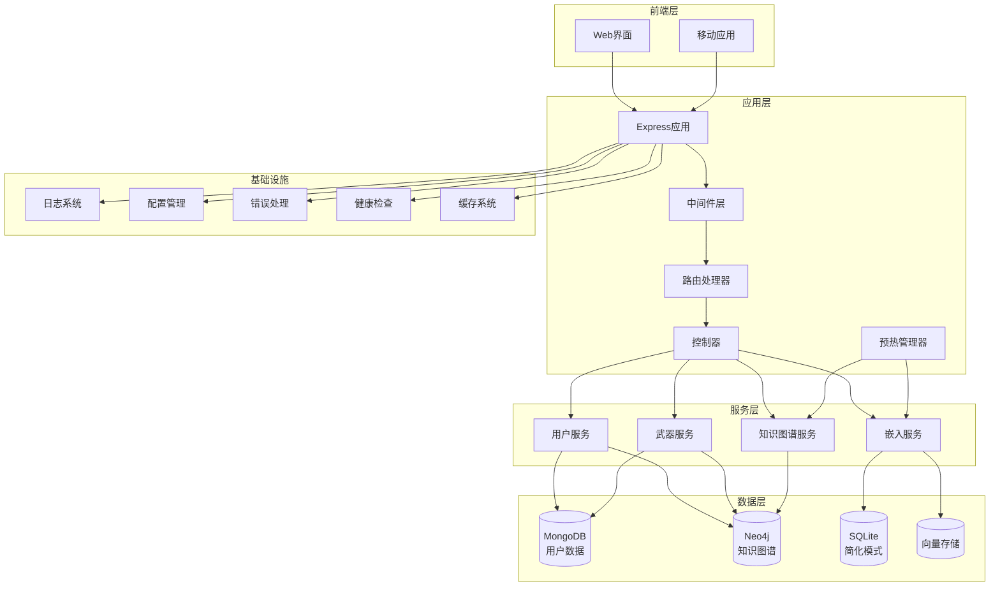

**图表来源**
- [app.js:1-276](file://backend/src/app.js#L1-L276)
- [app-simple.js:1-396](file://backend/src/app-simple.js#L1-L396)

## 核心应用类分析

### 标准模式应用类 (App)

标准模式应用类是整个系统的主入口，负责协调各个组件的初始化和运行。

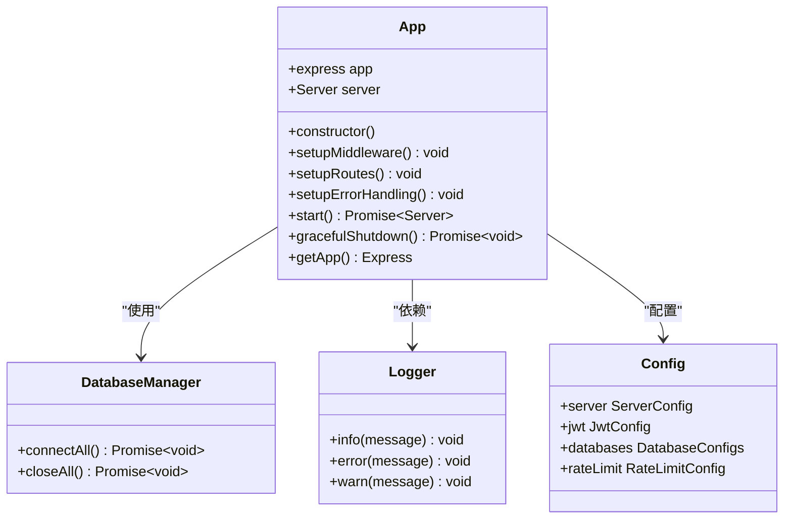

**图表来源**
- [app.js:29-267](file://backend/src/app.js#L29-L267)

### 简化模式应用类 (SimpleApp)

简化模式应用类针对SQLite数据库进行了优化，移除了复杂的多数据库配置，并**新增了向量预热功能**。

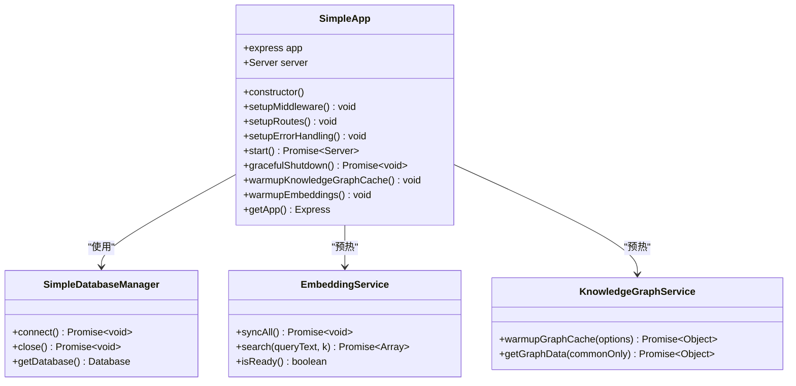

**图表来源**
- [app-simple.js:54-385](file://backend/src/app-simple.js#L54-L385)

**章节来源**
- [app.js:29-267](file://backend/src/app.js#L29-L267)
- [app-simple.js:54-385](file://backend/src/app-simple.js#L54-L385)

## 中间件配置详解

### 安全中间件 (Helmet)

Helmet提供了多层安全保护，包括：
- **Cross-Origin Resource Policy**: 限制资源跨域策略
- **HTTP Header Security**: 自动设置安全头部
- **Content Security Policy**: 防止XSS攻击
- **HTTP Strict Transport Security**: 强制HTTPS连接

### 跨域配置 (CORS)

CORS中间件根据环境动态配置：
- **生产环境**: 仅允许指定域名（localhost:3001）
- **开发环境**: 允许所有域名访问
- **凭据支持**: 支持cookies和认证头部
- **方法白名单**: 包含所有常用HTTP方法
- **头部白名单**: 支持自定义认证头部

### 请求日志 (Morgan)

Morgan中间件集成了自定义日志流：
- **格式化**: 使用'combined'格式记录请求详情
- **集成**: 将日志输出重定向到Winston日志系统
- **级别**: 根据环境调整日志详细程度

### 数据压缩 (Compression)

自动压缩响应内容：
- **算法**: 支持gzip和deflate压缩
- **阈值**: 对大于1KB的响应进行压缩
- **性能**: 减少网络传输开销

### 速率限制 (Rate Limit)

基于express-rate-limit的智能限流：
- **窗口期**: 15分钟内最多1000个请求
- **标准头部**: 返回详细的限流信息
- **API专用**: 仅对/api路径生效
- **错误响应**: 清晰的错误提示信息

**章节来源**
- [app.js:38-112](file://backend/src/app.js#L38-L112)
- [app-simple.js:63-139](file://backend/src/app-simple.js#L63-L139)

## 路由系统设计

### 标准模式路由结构

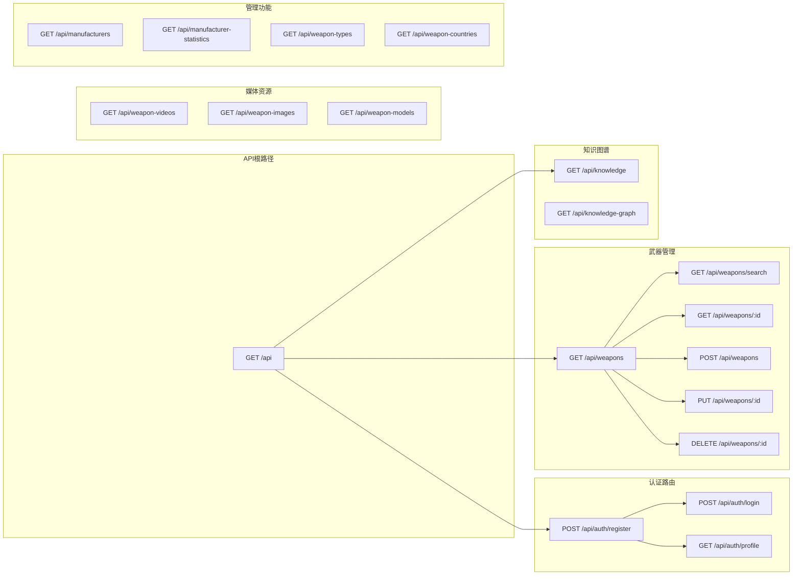

**图表来源**
- [app.js:115-154](file://backend/src/app.js#L115-L154)

### 简化模式路由结构

简化模式移除了部分高级功能，专注于核心业务逻辑，**并包含了知识图谱和AI相关的路由**：

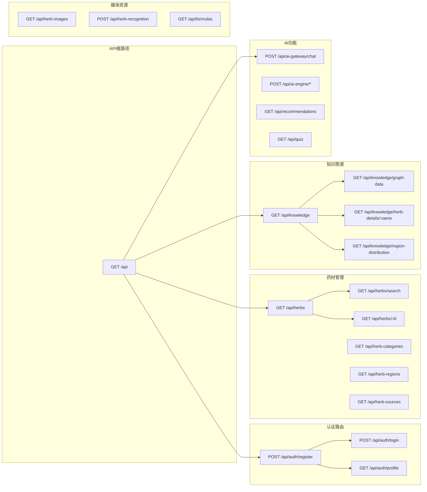

**图表来源**
- [app-simple.js:142-218](file://backend/src/app-simple.js#L142-L218)

### 路由注册机制

两个应用类都实现了统一的路由注册模式：

1. **API根路径**: 提供系统概览和可用端点信息
2. **模块化路由**: 按功能领域划分路由组
3. **权限控制**: 基于装饰器的认证和授权
4. **错误处理**: 统一的404错误处理
5. **健康检查**: 专门的健康状态端点

**章节来源**
- [app.js:115-154](file://backend/src/app.js#L115-L154)
- [app-simple.js:142-218](file://backend/src/app-simple.js#L142-L218)

## 错误处理机制

### 全局错误处理中间件

两个应用类都实现了完善的错误处理机制：

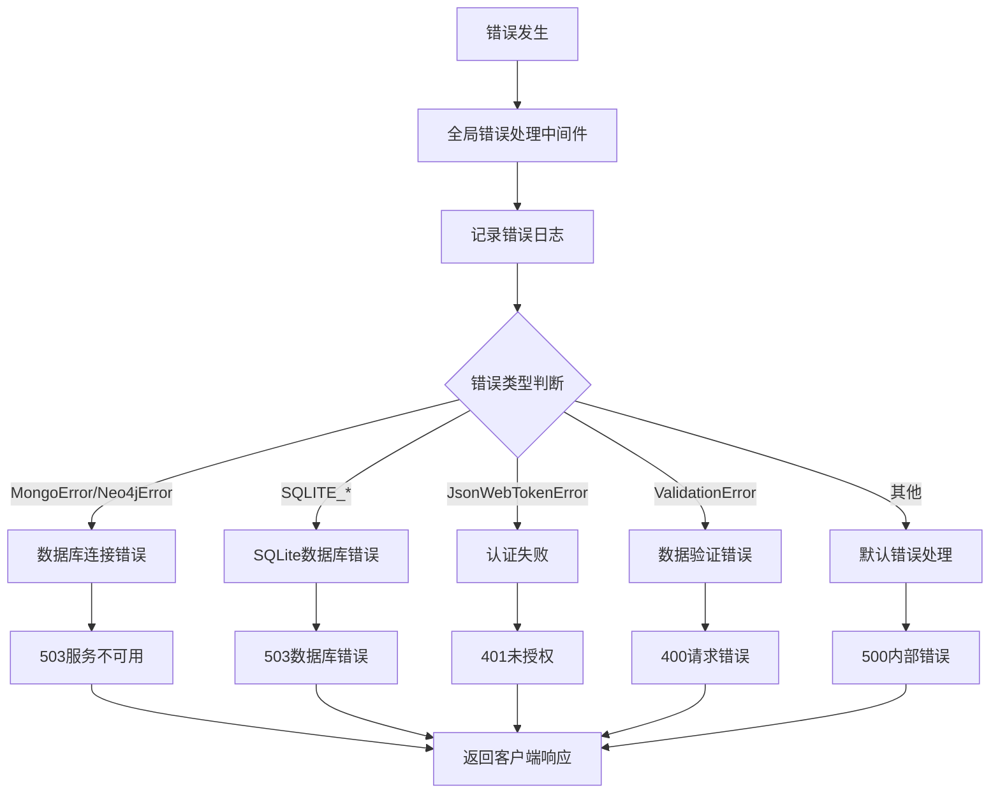

**图表来源**
- [app.js:157-201](file://backend/src/app.js#L157-L201)
- [app-simple.js:221-265](file://backend/src/app-simple.js#L221-L265)

### 进程级错误处理

- **未捕获的Promise拒绝**: 记录错误并继续运行
- **未捕获的异常**: 记录错误并优雅关闭
- **信号处理**: 支持SIGTERM和SIGINT信号
- **优雅关闭**: 确保数据库连接正确释放

### 特定错误类型处理

| 错误类型 | 状态码 | 处理策略 |
|---------|--------|----------|
| 数据库连接错误 | 503 | 提示用户稍后重试 |
| SQLite数据库错误 | 503 | 提示数据库操作错误 |
| JWT验证失败 | 401 | 要求重新登录 |
| 数据验证错误 | 400 | 返回具体验证失败信息 |
| 未找到资源 | 404 | 明确指出资源不存在 |
| 服务器内部错误 | 500 | 生产环境隐藏详细信息 |

**章节来源**
- [app.js:157-201](file://backend/src/app.js#L157-L201)
- [app-simple.js:221-265](file://backend/src/app-simple.js#L221-L265)

## 数据库连接管理

### 标准模式数据库架构

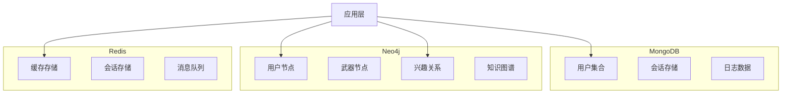

**图表来源**
- [userService.js:1-318](file://backend/src/services/userService.js#L1-L318)

### 简化模式数据库架构

简化模式使用SQLite作为单一数据源，**并支持Neo4j AuraDB用于知识图谱功能**：

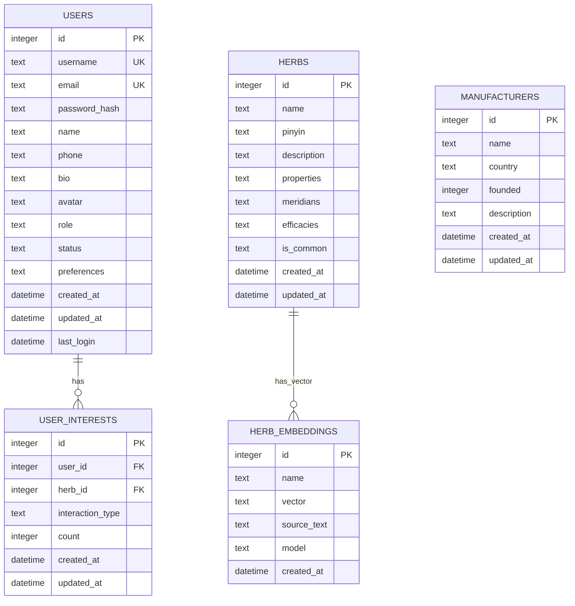

**图表来源**
- [database-simple.js:40-180](file://backend/src/config/database-simple.js#L40-L180)

### 数据库连接特性

| 特性 | 标准模式 | 简化模式 |
|------|----------|----------|
| 数据库类型 | MongoDB + Neo4j + Redis | SQLite + Neo4j AuraDB |
| 连接管理 | 多连接池管理 | 单连接管理 |
| 外键约束 | 支持复杂关系 | 支持外键约束 |
| 事务支持 | 分布式事务 | ACID事务 |
| 性能特点 | 高并发读写 | 轻量级访问 |
| 部署复杂度 | 高 | 低 |

**章节来源**
- [database-simple.js:1-323](file://backend/src/config/database-simple.js#L1-L323)

## 应用启动流程

### 标准模式启动时序

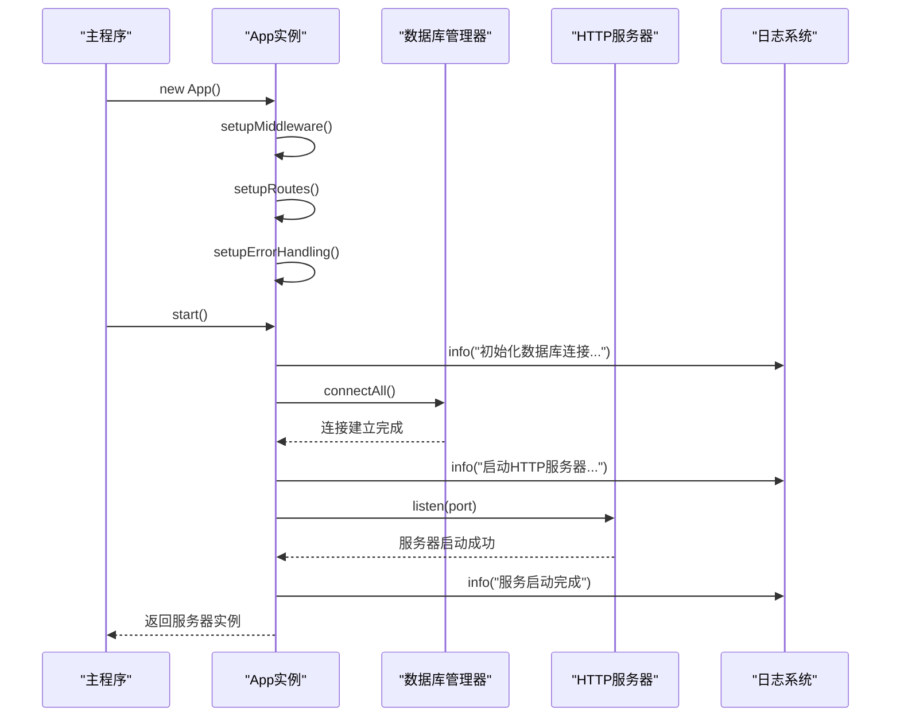

**图表来源**
- [app.js:240-261](file://backend/src/app.js#L240-L261)

### 简化模式启动时序（含向量预热）

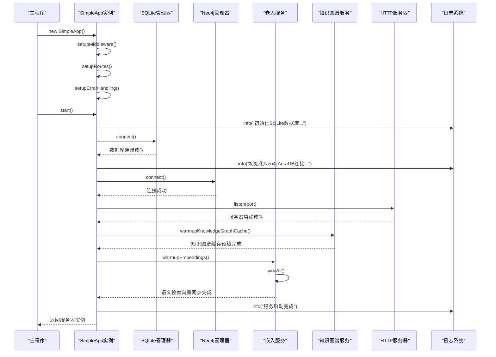

**图表来源**
- [app-simple.js:305-353](file://backend/src/app-simple.js#L305-L353)

### 启动阶段详解

1. **实例化阶段**: 创建Express应用实例
2. **中间件配置**: 依次加载安全、日志、压缩等中间件
3. **路由注册**: 注册所有API端点和静态资源
4. **错误处理**: 设置全局错误处理机制
5. **数据库连接**: 建立数据存储连接
6. **服务器启动**: 监听指定端口等待请求
7. **向量预热**: 启动知识图谱缓存和语义检索向量预热
8. **健康检查**: 提供健康状态监控端点

**章节来源**
- [app.js:240-261](file://backend/src/app.js#L240-L261)
- [app-simple.js:305-353](file://backend/src/app-simple.js#L305-L353)

## 向量预热系统

### 向量预热架构

**新增功能**：应用程序现在在启动时自动执行向量预热过程，确保语义搜索功能立即可用。

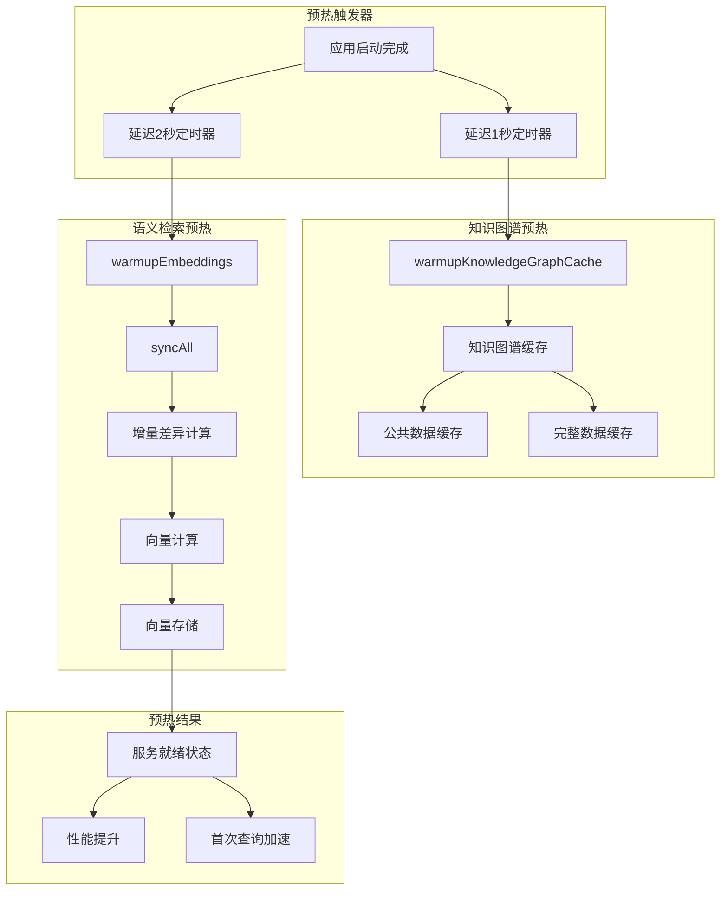

**图表来源**
- [app-simple.js:355-379](file://backend/src/app-simple.js#L355-L379)

### 知识图谱缓存预热

知识图谱缓存预热功能在应用启动后1秒自动执行：

```javascript
warmupKnowledgeGraphCache() {
  setTimeout(async () => {
    try {
      if (typeof knowledgeGraphRoutes.warmupGraphCache !== 'function') return;
      const startedAt = Date.now();
      await knowledgeGraphRoutes.warmupGraphCache({ commonOnly: true });
      logger.info(`知识图谱缓存预热完成，用时 ${Date.now() - startedAt}ms`);
    } catch (error) {
      logger.warn('知识图谱缓存预热失败:', error.message);
    }
  }, 1000);
}
```

### 语义检索向量预热

语义检索向量预热功能在应用启动后2秒自动执行，支持增量计算：

```javascript
warmupEmbeddings() {
  setTimeout(async () => {
    try {
      const startedAt = Date.now();
      await embeddingService.syncAll();
      logger.info(`语义检索向量同步完成，用时 ${Date.now() - startedAt}ms`);
    } catch (error) {
      logger.warn('语义检索向量同步失败:', error.message);
    }
  }, 2000);
}
```

### 增量向量化机制

向量预热系统采用智能增量计算策略：

1. **差异检测**：比较当前Neo4j数据与已缓存向量
2. **选择性计算**：只为新增或修改的药材计算向量
3. **批量处理**：使用批量API提高向量化效率
4. **持久化存储**：向量结果保存到SQLite数据库
5. **内存缓存**：启动时加载已有向量到内存

**章节来源**
- [app-simple.js:355-379](file://backend/src/app-simple.js#L355-L379)
- [embeddingService.js:190-251](file://backend/src/services/embeddingService.js#L190-L251)
- [knowledge-graph.js:241-244](file://backend/src/routes/knowledge-graph.js#L241-L244)

## 简单模式对比

### 功能差异对比

| 功能模块 | 标准模式 | 简化模式 | 说明 |
|----------|----------|----------|------|
| 数据库 | MongoDB + Neo4j + Redis | SQLite + Neo4j AuraDB | 简化模式使用单一数据库 |
| 用户认证 | JWT + 多数据库同步 | JWT + SQLite | 简化模式移除Neo4j关系 |
| 知识图谱 | Neo4j图数据库 | SQLite关联表 + Neo4j AuraDB | 简化模式支持混合模式 |
| 缓存系统 | Redis缓存 | 内存Map缓存 | 简化模式无外部缓存 |
| 权限控制 | 角色权限分离 | 基础权限控制 | 简化模式权限较简单 |
| 向量预热 | 无 | 自动向量预热 | **新增功能** |
| 性能特点 | 高并发处理 | 轻量级访问 | 简化模式适合小规模部署 |

### 配置差异

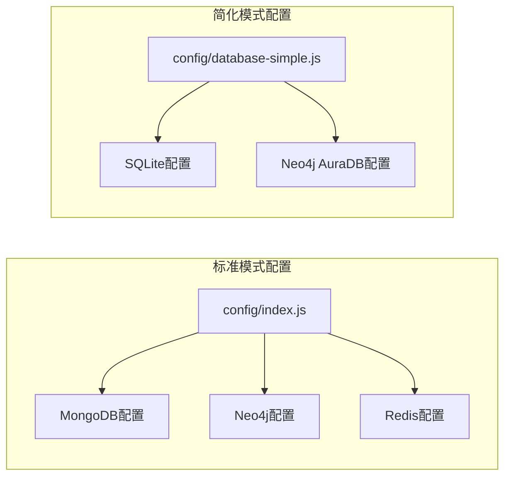

**图表来源**
- [config/index.js:15-45](file://backend/src/config/index.js#L15-L45)
- [database-simple.js:1-50](file://backend/src/config/database-simple.js#L1-L50)

### 部署场景建议

| 场景 | 推荐模式 | 原因 |
|------|----------|------|
| 生产环境 | 标准模式 | 高并发、高可用需求 |
| 开发测试 | 简化模式 | 快速部署、资源消耗低 |
| 学习研究 | 简化模式 | 架构简单、易于理解 |
| 小型项目 | 简化模式 | 成本效益高 |
| 演示环境 | 简化模式 | 快速启动、功能完整 |

**章节来源**
- [app.js:1-276](file://backend/src/app.js#L1-L276)
- [app-simple.js:1-396](file://backend/src/app-simple.js#L1-L396)

## 配置管理

### 配置结构设计

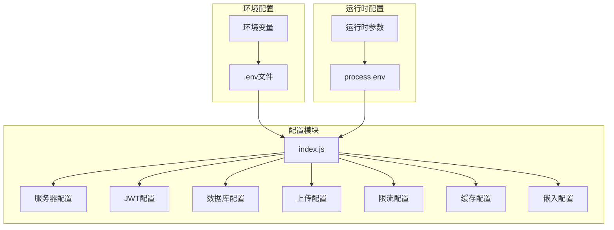

**图表来源**
- [config/index.js:1-73](file://backend/src/config/index.js#L1-L73)

### 关键配置项说明

| 配置项 | 默认值 | 说明 |
|--------|--------|------|
| PORT | 3000 | 服务器监听端口 |
| NODE_ENV | development | 运行环境 |
| JWT_SECRET | default-secret-key | JWT签名密钥 |
| JWT_EXPIRES_IN | 7d | JWT过期时间 |
| RATE_LIMIT_WINDOW_MS | 900000 | 限流时间窗口(15分钟) |
| RATE_LIMIT_MAX_REQUESTS | 1000 | 最大请求数 |
| UPLOAD_PATH | uploads/ | 文件上传路径 |
| MAX_FILE_SIZE | 10485760 | 最大文件大小(10MB) |
| DASHSCOPE_API_KEY | - | 阿里云百炼API密钥 |
| EMBEDDING_MODEL | text-embedding-v3 | 向量模型名称 |

### 环境变量加载机制

配置系统采用dotenv + process.env的方式：
1. **优先级**: 代码默认值 < .env文件 < 系统环境变量
2. **安全性**: 敏感信息通过环境变量传递
3. **灵活性**: 支持不同环境的配置切换
4. **可维护性**: 集中管理所有配置项

**章节来源**
- [config/index.js:1-73](file://backend/src/config/index.js#L1-L73)

## 性能监控与日志

### 日志系统架构

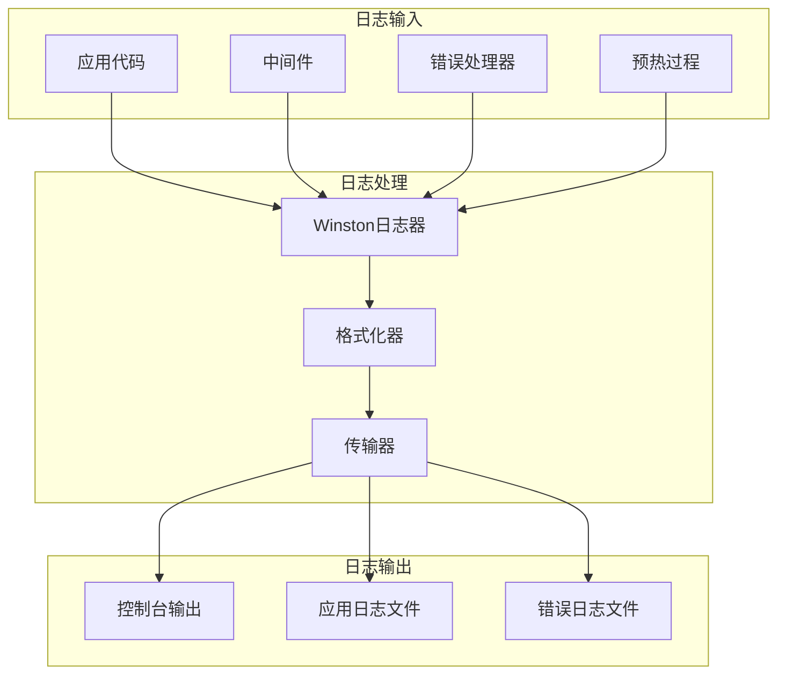

**图表来源**
- [logger.js:1-47](file://backend/src/utils/logger.js#L1-L47)

### 性能监控指标

| 指标类型 | 监控内容 | 实现方式 |
|----------|----------|----------|
| 请求性能 | 响应时间和吞吐量 | Morgan中间件 |
| 错误率 | 5xx错误统计 | 全局错误处理器 |
| 数据库性能 | 查询延迟和连接数 | 数据库管理器 |
| 系统资源 | CPU、内存使用率 | 进程监控 |
| 用户行为 | API调用频率和模式 | 日志分析 |
| 预热性能 | 向量计算耗时 | 预热过程日志 |

### 健康检查端点

两个应用类都提供了统一的健康检查机制：
- **端点**: `/health`
- **响应内容**: 服务状态、运行时间、数据库连接状态
- **用途**: 容器编排、负载均衡、故障检测

**章节来源**
- [logger.js:1-47](file://backend/src/utils/logger.js#L1-L47)
- [app.js:104-111](file://backend/src/app.js#L104-L111)
- [app-simple.js:130-138](file://backend/src/app-simple.js#L130-L138)

## 总结

兵智世界后端系统展现了现代Web应用的最佳实践，**最新版本增加了智能向量预热功能，显著提升了语义搜索的性能和用户体验**。

### 架构优势
- **模块化设计**: 清晰的分层架构和职责分离
- **双模式支持**: 灵活适应不同部署需求
- **安全优先**: 完善的安全中间件和错误处理
- **可扩展性**: 基于Express的插件化架构
- **智能预热**: 启动时自动准备语义检索能力

### 技术特色
- **异步编程**: Promise和async/await的广泛应用
- **错误处理**: 全局错误捕获和优雅关闭机制
- **日志系统**: 结构化日志和多渠道输出
- **配置管理**: 灵活的环境变量和配置系统
- **向量技术**: 基于阿里云百炼的语义检索能力
- **增量计算**: 高效的向量化差异检测机制

### 部署建议
- **生产环境**: 推荐使用标准模式，充分利用多数据库优势
- **开发环境**: 可选择简化模式，快速迭代和调试
- **学习用途**: 简化模式更适合理解系统架构和业务逻辑
- **演示环境**: 简化模式配合向量预热，提供最佳用户体验

该系统为军事知识图谱和武器识别应用提供了坚实的技术基础，其设计理念和实现方式值得在类似项目中借鉴和应用。**新增的向量预热功能确保了语义搜索在应用启动后立即可用，大幅提升了首次查询性能和用户体验。**