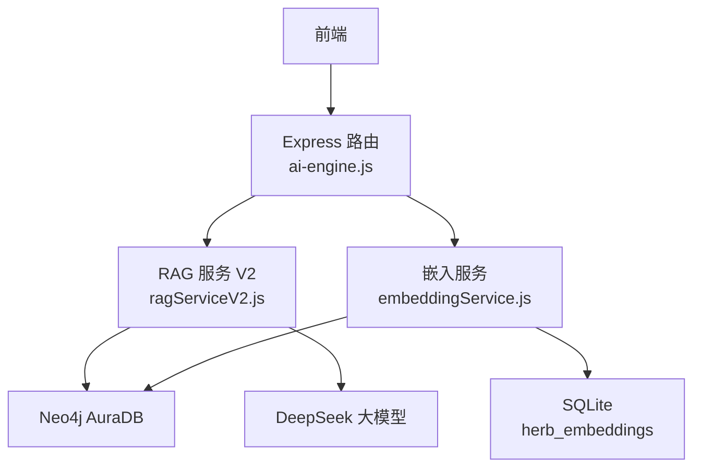
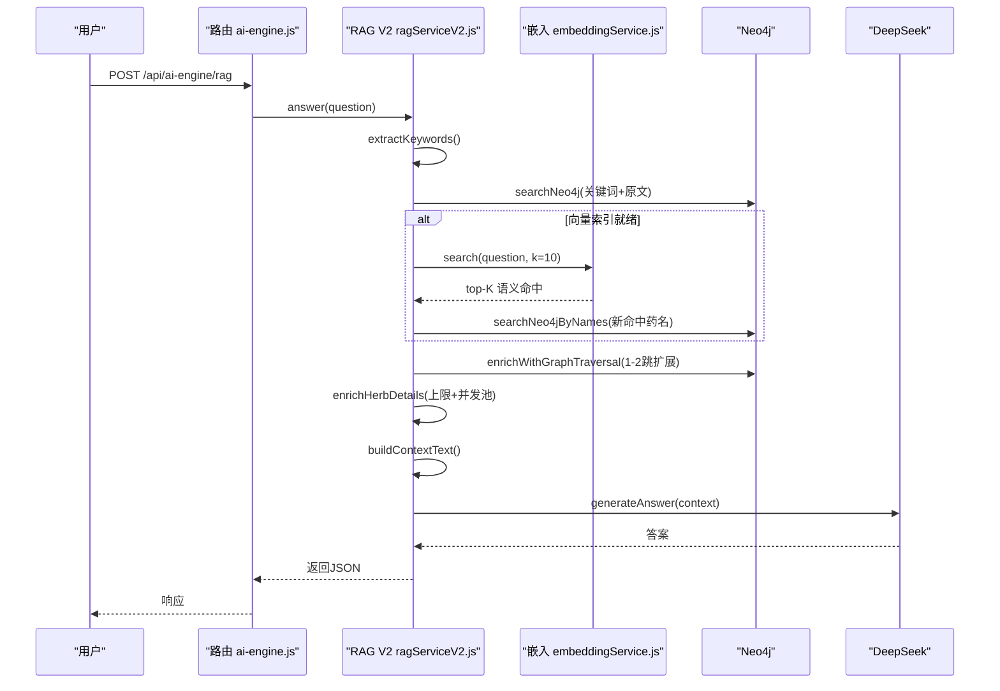
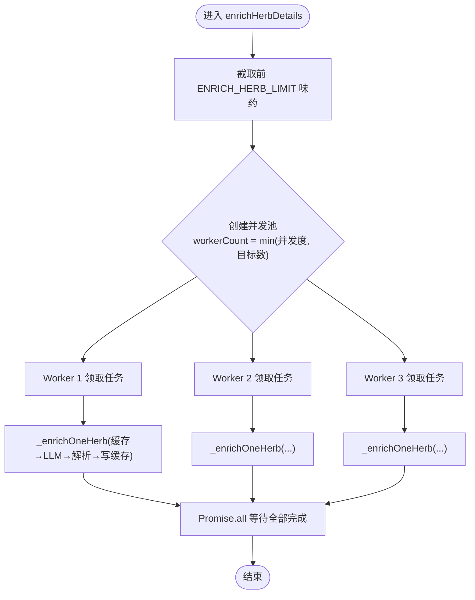
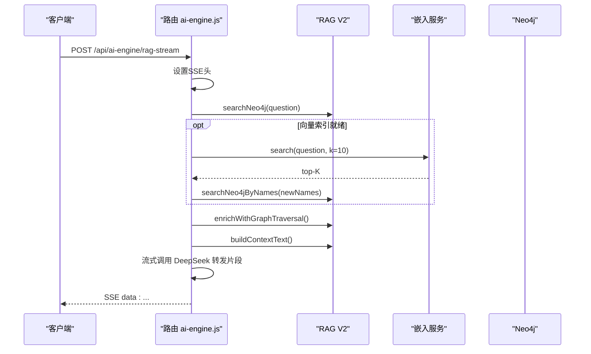
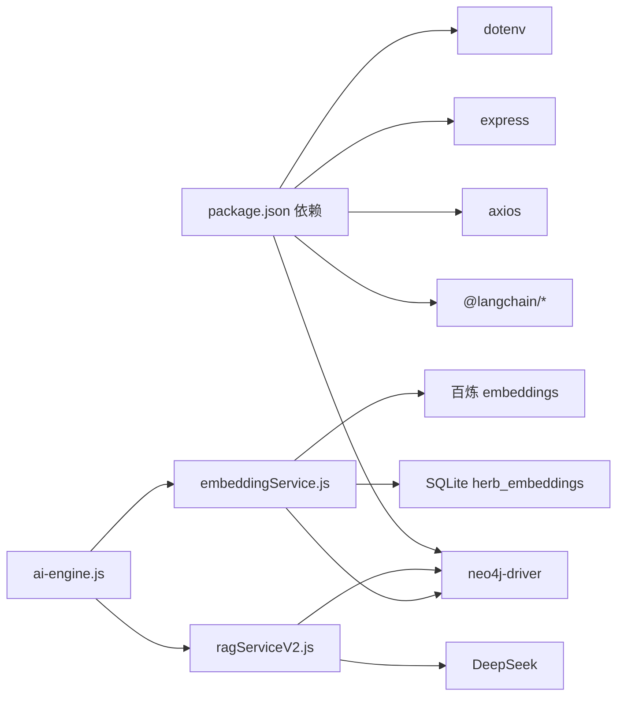

# RAG性能优化

<cite>
**本文引用的文件**
- [backend/src/services/ragServiceV2.js](file://backend/src/services/ragServiceV2.js)
- [backend/src/services/embeddingService.js](file://backend/src/services/embeddingService.js)
- [backend/src/routes/ai-engine.js](file://backend/src/routes/ai-engine.js)
- [backend/src/config/index.js](file://backend/src/config/index.js)
- [docs/RAG_PERFORMANCE_OPTIMIZATION.md](file://docs/RAG_PERFORMANCE_OPTIMIZATION.md)
- [docs/AI_ENGINE_RAG_TEACHING.md](file://docs/AI_ENGINE_RAG_TEACHING.md)
- [docs/EMBEDDING_VECTOR_SEARCH.md](file://docs/EMBEDDING_VECTOR_SEARCH.md)
- [backend/package.json](file://backend/package.json)
</cite>

## 目录
1. [引言](#引言)
2. [项目结构](#项目结构)
3. [核心组件](#核心组件)
4. [架构总览](#架构总览)
5. [详细组件分析](#详细组件分析)
6. [依赖关系分析](#依赖关系分析)
7. [性能考量与优化建议](#性能考量与优化建议)
8. [故障排查指南](#故障排查指南)
9. [结论](#结论)
10. [附录](#附录)

## 引言
本文件聚焦“神农AI”RAG（检索增强生成）问答系统的性能优化实践。系统通过Neo4j知识图谱进行结构化检索，结合向量语义检索弥补字面匹配不足，并调用DeepSeek大模型完成知识增强与答案生成。文档从问题定位、瓶颈识别、优化策略到落地实现，给出可复用的方法论与工程细节。

## 项目结构
后端采用Node.js + Express，核心RAG逻辑集中在服务层；路由层暴露REST接口；配置集中管理环境变量与数据库连接；向量检索独立为嵌入服务，持久化至SQLite并与Neo4j增量同步。



图表来源
- [backend/src/routes/ai-engine.js:137-175](file://backend/src/routes/ai-engine.js#L137-L175)
- [backend/src/services/ragServiceV2.js:116-268](file://backend/src/services/ragServiceV2.js#L116-L268)
- [backend/src/services/embeddingService.js:256-270](file://backend/src/services/embeddingService.js#L256-L270)

章节来源
- [backend/src/routes/ai-engine.js:137-175](file://backend/src/routes/ai-engine.js#L137-L175)
- [backend/src/services/ragServiceV2.js:116-268](file://backend/src/services/ragServiceV2.js#L116-L268)
- [backend/src/services/embeddingService.js:256-270](file://backend/src/services/embeddingService.js#L256-L270)
- [backend/src/config/index.js:3-59](file://backend/src/config/index.js#L3-L59)

## 核心组件
- RAG 服务 V2：负责关键词提取、图检索、图遍历扩展、LLM知识增强、上下文构建与答案生成，内置缓存与并发控制。
- 嵌入服务：基于阿里云百炼text-embedding-v3对药材文本向量化，提供内存余弦相似度检索，支持增量同步与单条更新，结果持久化至SQLite。
- AI 引擎路由：聚合RAG问答、流式问答、配伍检测、健康检查等接口，串联RAG与嵌入服务。
- 配置中心：统一管理端口、数据库、限流、缓存等环境变量。

章节来源
- [backend/src/services/ragServiceV2.js:22-28](file://backend/src/services/ragServiceV2.js#L22-L28)
- [backend/src/services/embeddingService.js:26-40](file://backend/src/services/embeddingService.js#L26-L40)
- [backend/src/routes/ai-engine.js:137-175](file://backend/src/routes/ai-engine.js#L137-L175)
- [backend/src/config/index.js:3-59](file://backend/src/config/index.js#L3-L59)

## 架构总览
一次问答的完整流水线包含：关键词提取 → Neo4j图检索 → 向量检索补充 → 图遍历扩展 → LLM知识增强 → 上下文构建 → 答案生成。优化围绕“减少LLM调用次数”和“让剩余LLM调用并行”两大杠杆展开。



图表来源
- [backend/src/routes/ai-engine.js:137-175](file://backend/src/routes/ai-engine.js#L137-L175)
- [backend/src/services/ragServiceV2.js:116-268](file://backend/src/services/ragServiceV2.js#L116-L268)
- [backend/src/services/embeddingService.js:256-270](file://backend/src/services/embeddingService.js#L256-L270)

## 详细组件分析

### 组件A：RAG 服务 V2（ragServiceV2.js）
- 关键词提取：从n-gram本地切词替代LLM抽取，避免一次网络往返，且结果确定。
- 图检索：两轮策略（精确名称→扩展功效/描述/拼音），记录执行过的Cypher便于调试。
- 图遍历扩展：获取性味归经、方剂关联、配伍冲突，丰富上下文。
- LLM知识增强：对前N味药做专业信息补全，采用受控并发池，避免串行拖慢。
- 上下文构建与答案生成：将图谱与增强数据组织为Prompt上下文，调用DeepSeek生成最终回答。



图表来源
- [backend/src/services/ragServiceV2.js:648-670](file://backend/src/services/ragServiceV2.js#L648-L670)
- [backend/src/services/ragServiceV2.js:592-646](file://backend/src/services/ragServiceV2.js#L592-L646)

章节来源
- [backend/src/services/ragServiceV2.js:285-302](file://backend/src/services/ragServiceV2.js#L285-L302)
- [backend/src/services/ragServiceV2.js:307-449](file://backend/src/services/ragServiceV2.js#L307-L449)
- [backend/src/services/ragServiceV2.js:497-587](file://backend/src/services/ragServiceV2.js#L497-L587)
- [backend/src/services/ragServiceV2.js:648-670](file://backend/src/services/ragServiceV2.js#L648-L670)
- [backend/src/services/ragServiceV2.js:725-768](file://backend/src/services/ragServiceV2.js#L725-L768)

### 组件B：嵌入服务（embeddingService.js）
- 向量化：调用百炼OpenAI兼容端点，批量大小限制为10，按index排序保证顺序一致。
- 相似度计算：内存中余弦相似度，top-K返回。
- 持久化：SQLite表存储name→vector映射，启动时加载，增量diff仅重算缺失或变化的药材。
- 单条更新：CRUD后异步更新或删除对应向量，不阻塞接口。

```mermaid
classDiagram
class EmbeddingService {
+ready : boolean
+memory : Map
+embed(inputs) Promise~number[]|number[]~
+cosine(a,b) number
+buildSourceText(herb) string
+loadAllHerbsFromNeo4j() Promise~Herb[]~
+search(queryText,k) Promise~{name,score}[]~
+updateOne(name) Promise<void>
+deleteOne(name) Promise<void>
+syncAll() Promise<void>
}
```

图表来源
- [backend/src/services/embeddingService.js:26-40](file://backend/src/services/embeddingService.js#L26-L40)
- [backend/src/services/embeddingService.js:45-65](file://backend/src/services/embeddingService.js#L45-L65)
- [backend/src/services/embeddingService.js:70-81](file://backend/src/services/embeddingService.js#L70-L81)
- [backend/src/services/embeddingService.js:86-95](file://backend/src/services/embeddingService.js#L86-L95)
- [backend/src/services/embeddingService.js:100-122](file://backend/src/services/embeddingService.js#L100-L122)
- [backend/src/services/embeddingService.js:173-185](file://backend/src/services/embeddingService.js#L173-L185)
- [backend/src/services/embeddingService.js:190-251](file://backend/src/services/embeddingService.js#L190-L251)
- [backend/src/services/embeddingService.js:256-270](file://backend/src/services/embeddingService.js#L256-L270)
- [backend/src/services/embeddingService.js:275-301](file://backend/src/services/embeddingService.js#L275-L301)

章节来源
- [backend/src/services/embeddingService.js:45-65](file://backend/src/services/embeddingService.js#L45-L65)
- [backend/src/services/embeddingService.js:190-251](file://backend/src/services/embeddingService.js#L190-L251)
- [backend/src/services/embeddingService.js:256-270](file://backend/src/services/embeddingService.js#L256-L270)

### 组件C：AI 引擎路由（ai-engine.js）
- 非流式RAG：参数校验→调用RAG服务→返回结构化结果（含模式、来源、执行过的Cypher、管线步骤）。
- 流式RAG：SSE推送状态、上下文、流式答案片段，并在中间接入向量检索补充，提升召回质量。
- 健康检查与状态：暴露引擎健康与运行状态，便于运维监控。



图表来源
- [backend/src/routes/ai-engine.js:177-333](file://backend/src/routes/ai-engine.js#L177-L333)
- [backend/src/services/ragServiceV2.js:307-449](file://backend/src/services/ragServiceV2.js#L307-L449)
- [backend/src/services/embeddingService.js:256-270](file://backend/src/services/embeddingService.js#L256-L270)

章节来源
- [backend/src/routes/ai-engine.js:137-175](file://backend/src/routes/ai-engine.js#L137-L175)
- [backend/src/routes/ai-engine.js:177-333](file://backend/src/routes/ai-engine.js#L177-L333)

## 依赖关系分析
- 外部依赖：LangChain、Neo4j驱动、Axios、Express、dotenv等，见package.json。
- 内部耦合：
  - 路由层依赖RAG服务与嵌入服务。
  - RAG服务依赖Neo4j与LLM，同时可选依赖嵌入服务用于语义补充。
  - 嵌入服务依赖Neo4j读取药材字段、SQLite持久化向量、百炼API生成向量。
- 潜在循环：无直接循环依赖，模块职责清晰。



图表来源
- [backend/package.json:21-42](file://backend/package.json#L21-L42)
- [backend/src/routes/ai-engine.js:15-24](file://backend/src/routes/ai-engine.js#L15-L24)
- [backend/src/services/ragServiceV2.js:11-16](file://backend/src/services/ragServiceV2.js#L11-L16)
- [backend/src/services/embeddingService.js:17-24](file://backend/src/services/embeddingService.js#L17-L24)

章节来源
- [backend/package.json:21-42](file://backend/package.json#L21-L42)

## 性能考量与优化建议
- 瓶颈定位：原流程中“逐味药材LLM补全”是主要耗时点，存在串行与全量两个问题。
- 优化策略：
  - 上限控制：每次最多对前N味药做LLM补全，避免无限膨胀。
  - 并发池：将串行改为受控并发（如3个worker），显著缩短补全流程时间。
  - 去LLM化：用本地n-gram提取关键词，减少一次LLM调用，语义匹配由向量检索承担。
  - 流式增强：在流式端点也接入向量检索补充，兼顾速度与召回率。
- 效果对比：以典型问题为例，LLM调用次数大幅降低，整体耗时显著下降。
- 后续方向：向量检索结果缓存、常用药材补全预热、默认使用流式端点、调优LLM参数。

章节来源
- [docs/RAG_PERFORMANCE_OPTIMIZATION.md:9-40](file://docs/RAG_PERFORMANCE_OPTIMIZATION.md#L9-L40)
- [docs/RAG_PERFORMANCE_OPTIMIZATION.md:89-154](file://docs/RAG_PERFORMANCE_OPTIMIZATION.md#L89-L154)
- [docs/RAG_PERFORMANCE_OPTIMIZATION.md:157-205](file://docs/RAG_PERFORMANCE_OPTIMIZATION.md#L157-L205)
- [docs/RAG_PERFORMANCE_OPTIMIZATION.md:208-243](file://docs/RAG_PERFORMANCE_OPTIMIZATION.md#L208-L243)
- [docs/RAG_PERFORMANCE_OPTIMIZATION.md:245-257](file://docs/RAG_PERFORMANCE_OPTIMIZATION.md#L245-L257)
- [docs/RAG_PERFORMANCE_OPTIMIZATION.md:285-293](file://docs/RAG_PERFORMANCE_OPTIMIZATION.md#L285-L293)

## 故障排查指南
- 向量检索未生效：检查是否已配置嵌入API Key并完成首次同步；确认isReady为true。
- 流式端点异常：确认SSE头设置与超时处理；查看日志中的“流式向量检索补充失败”提示。
- RAG服务降级：若Neo4j不可用，回退到SQLite查询；若LLM不可用，返回降级答案。
- 缓存命中：观察fromCache标志与缓存版本变更，确保逻辑修改后旧缓存失效。
- 依赖与环境：核对package.json依赖版本与.env环境变量（端口、数据库、限流、缓存TTL等）。

章节来源
- [backend/src/routes/ai-engine.js:137-175](file://backend/src/routes/ai-engine.js#L137-L175)
- [backend/src/routes/ai-engine.js:177-333](file://backend/src/routes/ai-engine.js#L177-L333)
- [backend/src/services/ragServiceV2.js:53-84](file://backend/src/services/ragServiceV2.js#L53-L84)
- [backend/src/services/embeddingService.js:190-251](file://backend/src/services/embeddingService.js#L190-L251)
- [backend/src/config/index.js:3-59](file://backend/src/config/index.js#L3-L59)

## 结论
本次优化围绕“少调LLM、并行调LLM”的核心思路，通过上限控制、并发池、去LLM化与流式增强，显著降低了问答延迟并提升了稳定性。向量检索作为语义召回的补充，有效解决了证型与功效字面对齐问题。整体方案具备可扩展性与可维护性，适合在生产环境持续演进。

## 附录
- 关键参考文档：
  - GraphRAG教学文档：解释整体架构与数据流。
  - 向量检索专项文档：详解嵌入服务设计、持久化与增量同步。
  - 性能优化文档：详述瓶颈定位与优化策略。

章节来源
- [docs/AI_ENGINE_RAG_TEACHING.md:1-15](file://docs/AI_ENGINE_RAG_TEACHING.md#L1-L15)
- [docs/EMBEDDING_VECTOR_SEARCH.md:1-15](file://docs/EMBEDDING_VECTOR_SEARCH.md#L1-L15)
- [docs/RAG_PERFORMANCE_OPTIMIZATION.md:1-6](file://docs/RAG_PERFORMANCE_OPTIMIZATION.md#L1-L6)