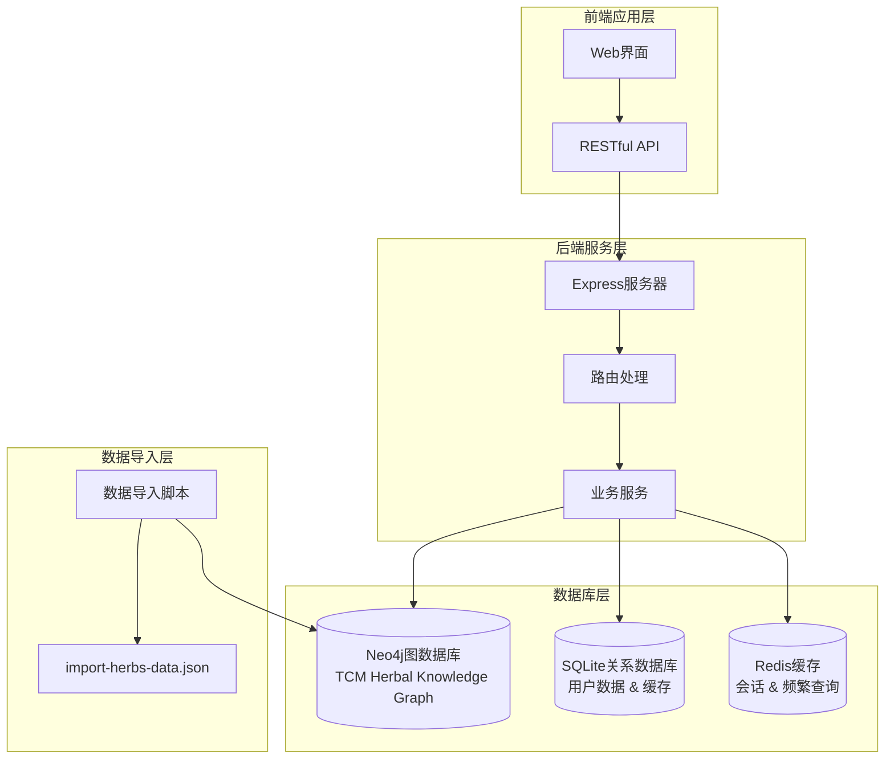
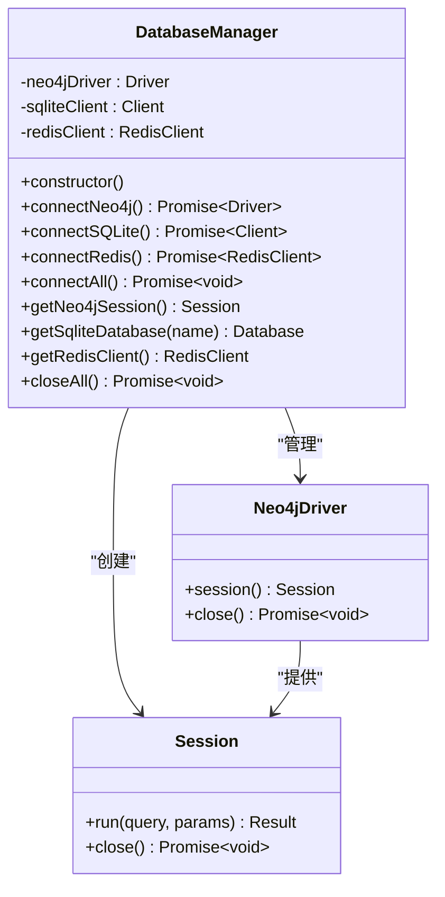
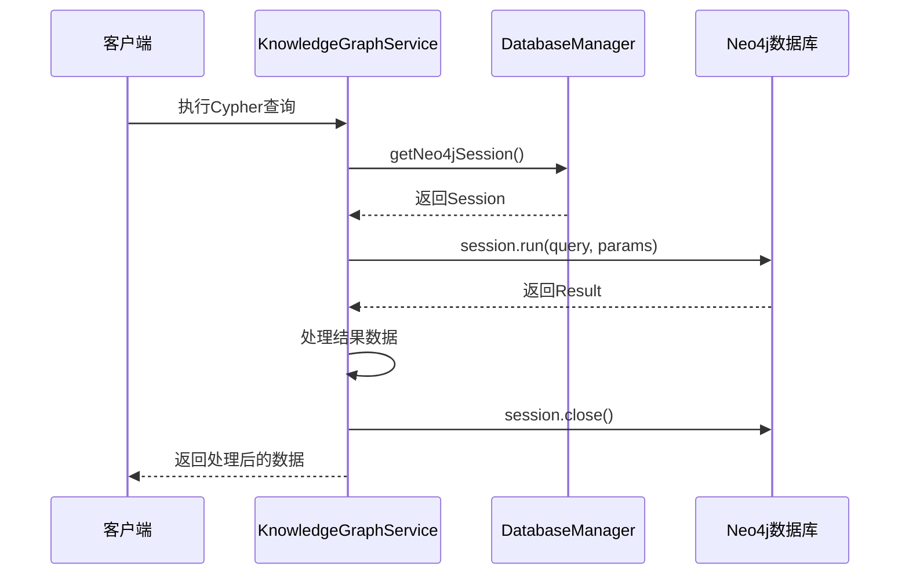
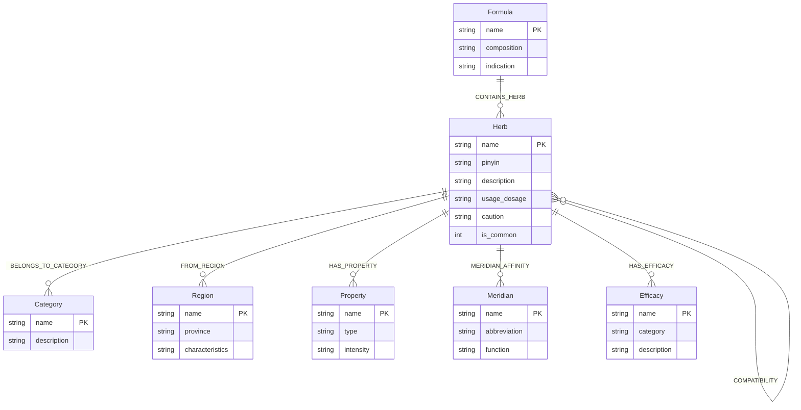
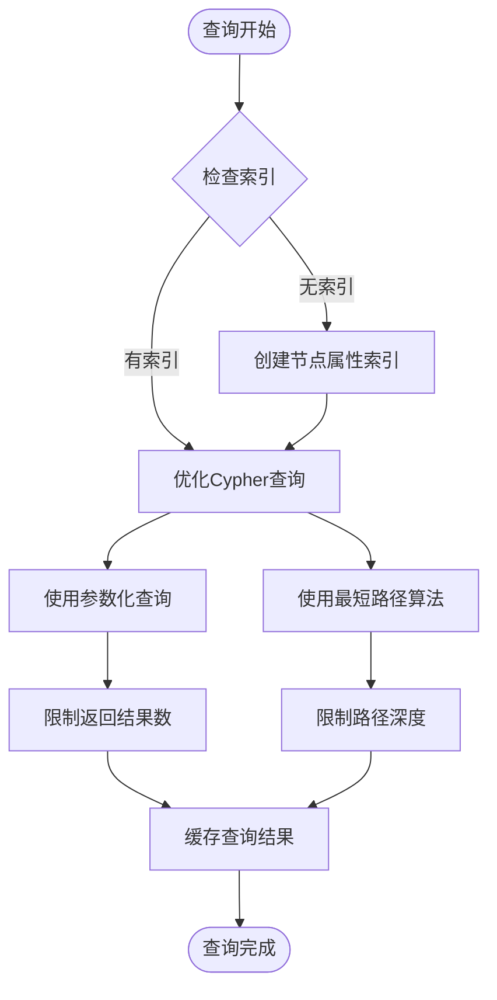
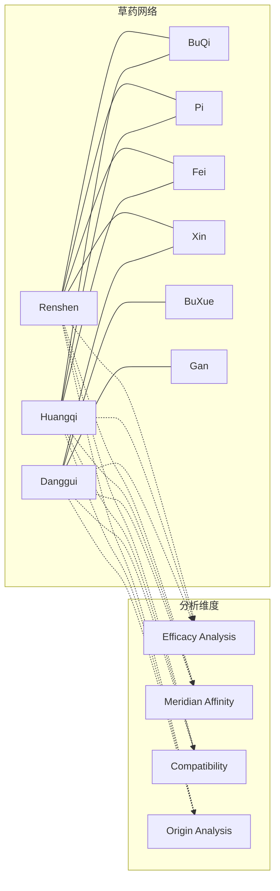
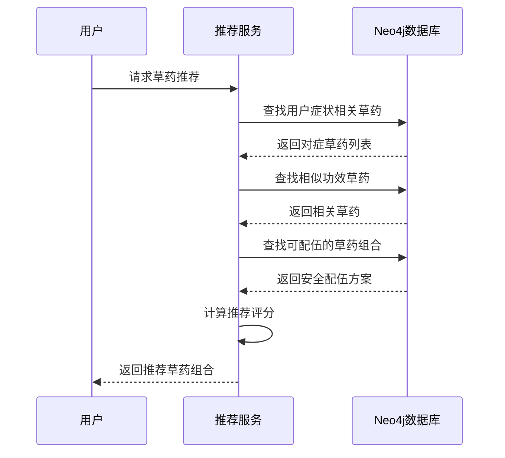
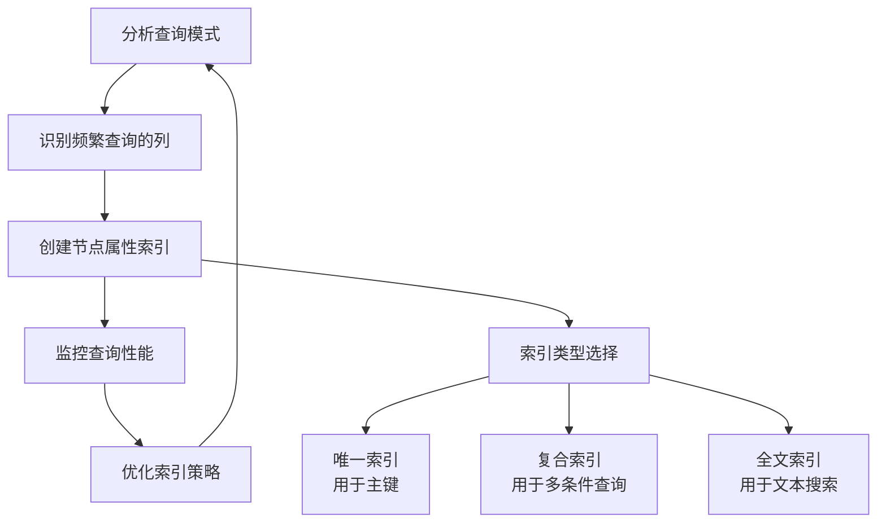
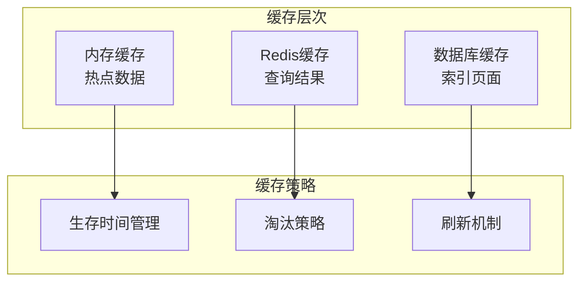
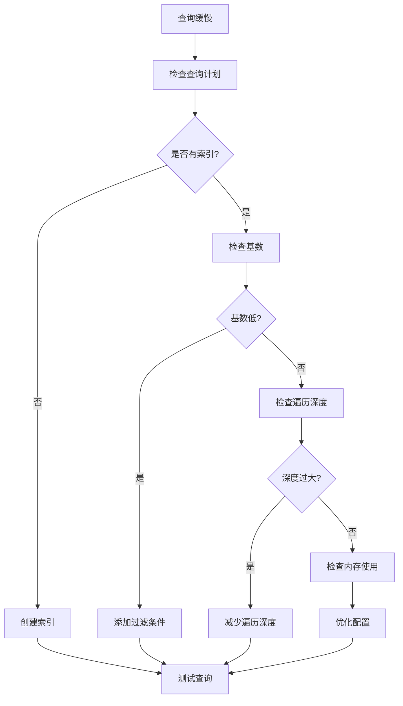

# Neo4j图数据库模型

<cite>
**本文引用的文件**
- [database_Neo4j.js](file://backend/src/config/database_Neo4j.js)
- [knowledgeGraphService.js](file://backend/src/services/knowledgeGraphService.js)
- [knowledge-graph.js](file://backend/src/routes/knowledge-graph.js)
- [herbs-manage.js](file://backend/src/routes/herbs-manage.js)
- [herb-recognition.js](file://backend/src/routes/herb-recognition.js)
- [index.js](file://backend/src/config/index.js)
- [import-herbs-data.json](file://backend/scripts/import-herbs-data.json)
- [init-herb-data.js](file://backend/scripts/init-herb-data.js)
</cite>

## 更新摘要
**所做更改**
- 将军事知识图谱完全重构为中医草药知识系统
- 新增草药、类别、产地、性味、归经、功效等核心节点类型
- 重新设计关系映射以支持复杂的中医药理论
- 更新所有查询示例和API接口以适配新的数据模型
- 增强配伍禁忌和方剂关联分析功能

## 目录
1. [引言](#引言)
2. [项目架构概述](#项目架构概述)
3. [Neo4j连接管理](#neo4j连接管理)
4. [中医草药知识图谱数据模型](#中医草药知识图谱数据模型)
5. [节点与关系结构](#节点与关系结构)
6. [Cypher查询优化](#cypher查询优化)
7. [图数据库应用场景](#图数据库应用场景)
8. [性能调优建议](#性能调优建议)
9. [故障排除指南](#故障排除指南)
10. [总结](#总结)

## 引言

Neo4j作为领先的图数据库，在中医草药知识系统中发挥着至关重要的作用。本文档深入分析了项目中Neo4j图数据库的建模策略，包括连接管理、会话获取、多数据库协同机制，以及基于完整中医理论的节点和关系数据结构规范。

该项目采用混合存储架构，结合Neo4j的图查询能力与传统关系数据库的优势，构建了一个完整的中医草药知识图谱系统，支持药材属性分析、配伍禁忌检测、方剂推荐等高级功能。

## 项目架构概述

中医草药知识系统的数据库架构采用了混合存储策略，充分利用各种数据库的优势：



**图表来源**
- [database_Neo4j.js:1-141](file://backend/src/config/database_Neo4j.js#L1-L141)
- [index.js:16-39](file://backend/src/config/index.js#L16-L39)

**章节来源**
- [database_Neo4j.js:1-141](file://backend/src/config/database_Neo4j.js#L1-L141)
- [index.js:1-80](file://backend/src/config/index.js#L1-L80)

## Neo4j连接管理

### 单例连接管理器

项目实现了DatabaseManager类作为Neo4j连接的统一管理器，采用单例模式确保连接的一致性和效率。



**图表来源**
- [database_Neo4j.js:6-141](file://backend/src/config/database_Neo4j.js#L6-L141)

### 连接配置与认证

系统通过环境变量管理数据库连接配置，支持多种部署场景：

| 配置项 | 默认值 | 描述 |
|--------|--------|------|
| NEO4J_URI | bolt://localhost:7687 | Neo4j Bolt协议连接地址 |
| NEO4J_USERNAME | neo4j | 数据库用户名 |
| NEO4J_PASSWORD | password | 数据库密码 |
| SQLITE_PATH | data/herb-knowledge.db | SQLite数据库文件路径 |
| REDIS_HOST | localhost | Redis服务器主机 |
| REDIS_PORT | 6379 | Redis服务器端口 |

### 会话管理策略

KnowledgeGraphService类展示了如何正确管理Neo4j会话：



**图表来源**
- [knowledgeGraphService.js:6-57](file://backend/src/services/knowledgeGraphService.js#L6-L57)
- [database_Neo4j.js:89-95](file://backend/src/config/database_Neo4j.js#L89-L95)

**章节来源**
- [database_Neo4j.js:1-141](file://backend/src/config/database_Neo4j.js#L1-L141)
- [index.js:16-39](file://backend/src/config/index.js#L16-L39)

## 中医草药知识图谱数据模型

### 节点标签体系

基于完整的中医理论和import-herbs-data.json文件，系统定义了多个核心节点标签：



**图表来源**
- [import-herbs-data.json:1-200](file://backend/scripts/import-herbs-data.json#L1-L200)
- [knowledge-graph.js:137-212](file://backend/src/routes/knowledge-graph.js#L137-L212)

### 节点属性定义

| 节点类型 | 主要属性 | 数据类型 | 示例值 |
|----------|----------|----------|--------|
| Herb | name, pinyin, description, usage_dosage, caution, is_common | string/int | "人参", "Renshen", "大补元气...", "煎服，3-9g", "实证忌服", 1 |
| Category | name, description | string | "补虚药", "补气药第一要药" |
| Region | name, province, characteristics | string | "吉林、辽宁", "东北地区", "寒冷气候" |
| Property | name, type, intensity | string | "甘", "温", "normal" |
| Meridian | name, abbreviation, function | string | "脾", "Pi", "运化水谷" |
| Efficacy | name, category, description | string | "大补元气", "补气", "治疗气虚欲脱" |
| Formula | name, composition, indication | string | "四君子汤", "人参、白术...", "脾胃气虚证" |

### 关系类型语义

系统定义了多种关系类型，每种都有明确的中医理论含义：

| 关系类型 | 语义描述 | 方向性 | 示例 |
|----------|----------|--------|------|
| BELONGS_TO_CATEGORY | 表示草药属于某个功效类别 | Herb → Category | 人参 → 补虚药 |
| FROM_REGION | 表示草药的产地来源 | Herb → Region | 人参 → 吉林、辽宁 |
| HAS_PROPERTY | 表示草药的性味属性 | Herb → Property | 人参 → 甘、温 |
| MERIDIAN_AFFINITY | 表示草药的归经 | Herb → Meridian | 人参 → 脾、肺、心 |
| HAS_EFFICACY | 表示草药的功效作用 | Herb → Efficacy | 人参 → 大补元气 |
| CONTAINS_HERB | 表示方剂包含的草药及剂量角色 | Formula → Herb | 四君子汤 → 人参(君药) |
| COMPATIBILITY | 表示草药间的配伍关系 | Herb ↔ Herb | 人参 ↔ 五灵脂(相反) |

**章节来源**
- [import-herbs-data.json:1-200](file://backend/scripts/import-herbs-data.json#L1-L200)
- [knowledge-graph.js:137-212](file://backend/src/routes/knowledge-graph.js#L137-L212)

## Cypher查询优化

### 基础查询模式

KnowledgeGraphService提供了多种优化的Cypher查询模式：

#### 图谱概览查询
```cypher
MATCH (n)
RETURN labels(n) as labels, count(n) as count
ORDER BY count DESC
```

#### 草药详情查询优化
```cypher
MATCH (h:Herb {name: $herbName})
OPTIONAL MATCH (h)-[:BELONGS_TO_CATEGORY]->(c:Category)
OPTIONAL MATCH (h)-[:FROM_REGION]->(r:Region)
OPTIONAL MATCH (h)-[:HAS_PROPERTY]->(p:Property)
OPTIONAL MATCH (h)-[:MERIDIAN_AFFINITY]->(m:Meridian)
OPTIONAL MATCH (h)-[:HAS_EFFICACY]->(e:Efficacy)
RETURN h, c.name as category_name, r.name as region_name,
       collect(p.name) as properties, collect(m.name) as meridians,
       collect(e.name) as efficacies
```

#### 配伍禁忌查询优化
```cypher
MATCH (h1:Herb {name: $herbName})-[rel:COMPATIBILITY]->(h2:Herb)
WHERE rel.relation_type IN ['相反','相恶']
RETURN h2.name as herb2_name, rel.relation_type as relation_type, rel.description as description
```

### 性能优化策略



**图表来源**
- [knowledgeGraphService.js:60-105](file://backend/src/services/knowledgeGraphService.js#L60-L105)
- [knowledgeGraphService.js:172-225](file://backend/src/services/knowledgeGraphService.js#L172-L225)

**章节来源**
- [knowledgeGraphService.js:1-430](file://backend/src/services/knowledgeGraphService.js#L1-L430)

## 图数据库应用场景

### 草药关联分析

Neo4j在草药关联分析方面具有天然优势，能够快速识别复杂的中药配伍关系：



### 推荐系统实现

基于草药功效和归经的智能推荐系统利用图数据库的路径查询能力：



**图表来源**
- [knowledgeGraphService.js:349-394](file://backend/src/services/knowledgeGraphService.js#L349-L394)

### 路径查询应用

图数据库在寻找草药间复杂关系路径方面表现出色：

| 查询场景 | Cypher查询示例 | 应用价值 |
|----------|----------------|----------|
| 草药溯源 | `MATCH path=(start)-[*1..5]-(end) RETURN path` | 追踪草药功效传承 |
| 功效网络 | `MATCH (efficacy)-[*1..3]-(:Herb) RETURN efficacy` | 分析功效关联 |
| 配伍禁忌 | `MATCH (h1)-[:COMPATIBILITY]->(h2) WHERE h1.name=$name RETURN h2` | 检测药物相互作用 |
| 归经分析 | `MATCH (herb)-[:MERIDIAN_AFFINITY]->(meridian) RETURN herb, meridian` | 研究草药作用部位 |

**章节来源**
- [knowledgeGraphService.js:349-430](file://backend/src/services/knowledgeGraphService.js#L349-L430)

## 性能调优建议

### 数据库配置优化

#### Neo4j配置参数
```properties
# 内存配置
dbms.memory.heap.initial_size=4g
dbms.memory.heap.max_size=8g
dbms.memory.pagecache.size=2g

# 存储配置
dbms.directories.data=/var/lib/neo4j/data
dbms.backup.enabled=true

# 网络配置
dbms.connector.bolt.listen_address=:7687
dbms.security.auth_enabled=false
```

#### 索引优化策略



### 查询优化技巧

#### 1. 参数化查询
```cypher
// 推荐写法
MATCH (h:Herb {name: $herbName})
RETURN h

// 避免写法
MATCH (h:Herb {name: "人参"})
RETURN h
```

#### 2. 限制返回结果
```cypher
// 限制结果数量
MATCH (h:Herb)
RETURN h
LIMIT 100

// 限制遍历深度
MATCH path = (h:Herb)-[*1..3]-(related)
RETURN path
```

#### 3. 使用索引提示
```cypher
// 强制使用索引
MATCH (h:Herb)
USING INDEX h:Herb(name)
WHERE h.name = $herbName
RETURN h
```

### 缓存策略



**章节来源**
- [index.js:47-58](file://backend/src/config/index.js#L47-L58)

## 故障排除指南

### 常见连接问题

#### 1. 连接超时
**症状**: 数据库连接失败，出现超时错误
**解决方案**:
- 检查网络连接状态
- 验证防火墙设置
- 确认Neo4j服务运行状态

#### 2. 认证失败
**症状**: 登录认证错误，权限被拒绝
**解决方案**:
- 验证用户名密码正确性
- 检查数据库用户权限
- 确认认证机制配置

#### 3. 内存不足
**症状**: 查询缓慢，系统内存告警
**解决方案**:
- 增加JVM堆内存大小
- 优化查询复杂度
- 启用查询计划缓存

### 性能问题诊断



### 监控指标

| 监控指标 | 正常范围 | 告警阈值 | 处理措施 |
|----------|----------|----------|----------|
| 连接数 | < 100 | > 200 | 检查连接池配置 |
| 查询响应时间 | < 100ms | > 1s | 优化查询或增加索引 |
| 内存使用率 | < 80% | > 90% | 增加内存或优化查询 |
| 磁盘I/O | < 70% | > 90% | 优化存储配置 |

**章节来源**
- [database_Neo4j.js:15-65](file://backend/src/config/database_Neo4j.js#L15-L65)

## 总结

中医草药知识系统中的Neo4j图数据库建模展现了现代知识图谱系统的最佳实践。通过合理的节点标签设计、关系语义定义和查询优化策略，系统实现了高效的草药知识关联分析和智能推荐功能。

### 核心优势

1. **强大的关联分析能力**: 图数据库天然适合处理复杂的中药配伍关系，能够快速发现草药间的隐性联系
2. **灵活的查询模式**: 支持深度路径查询、相似性分析和推荐算法的高效实现
3. **优秀的扩展性**: 基于标签的模型设计便于添加新的草药类型和关系类型
4. **高性能的查询**: 通过索引优化和缓存策略，确保大规模数据集的查询性能

### 最佳实践总结

- 采用单例模式管理数据库连接，确保资源的有效利用
- 实现完善的错误处理和日志记录机制
- 使用参数化查询防止SQL注入攻击
- 建立多层次的缓存策略提升系统响应速度
- 定期监控和优化查询性能

这个项目为中医知识图谱的建设提供了宝贵的参考经验，展示了图数据库在复杂领域知识管理中的巨大潜力。