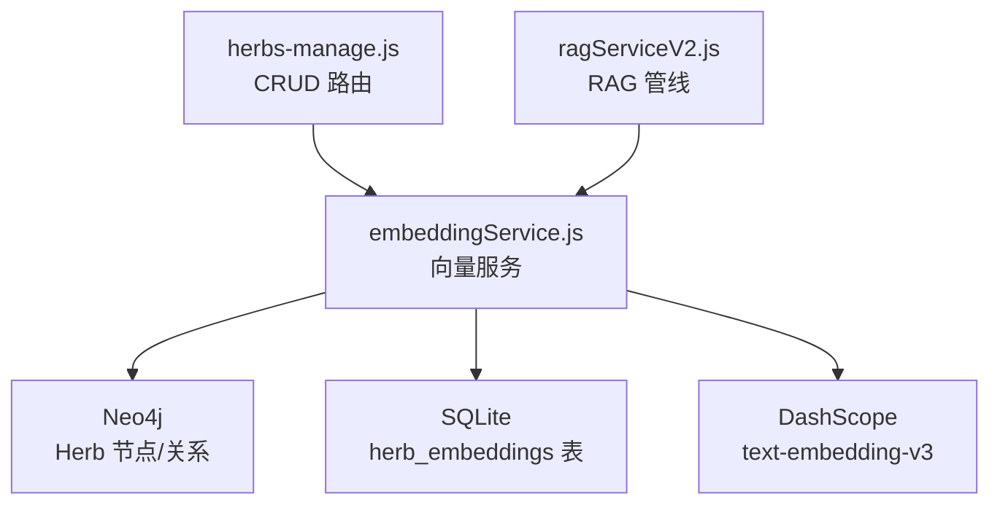
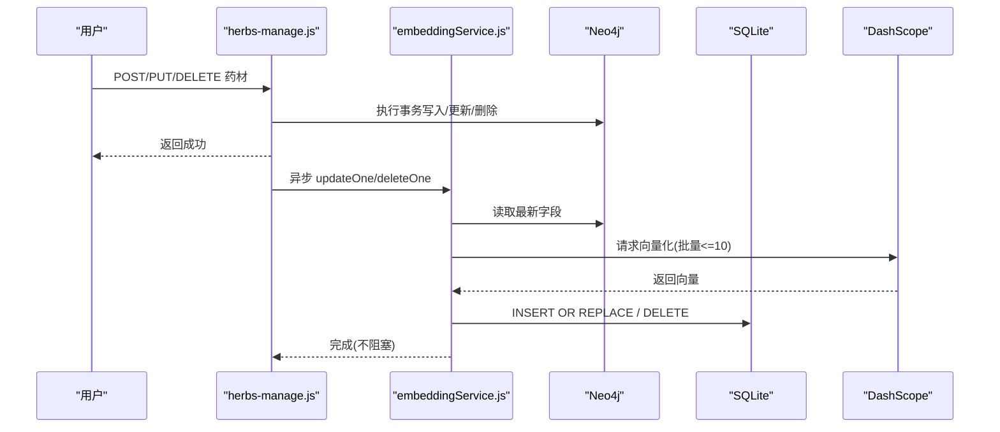
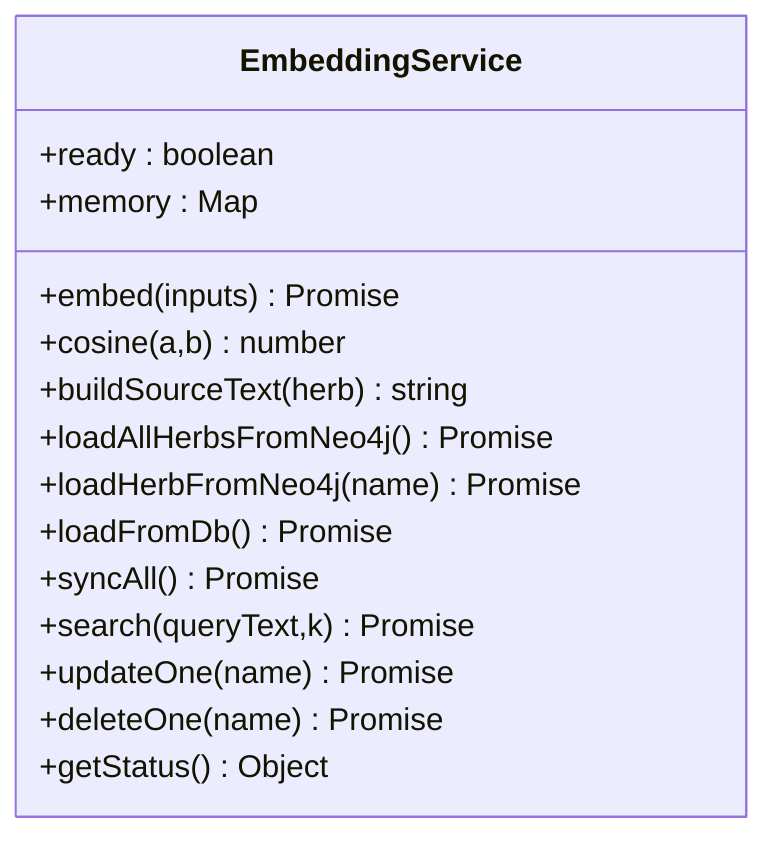
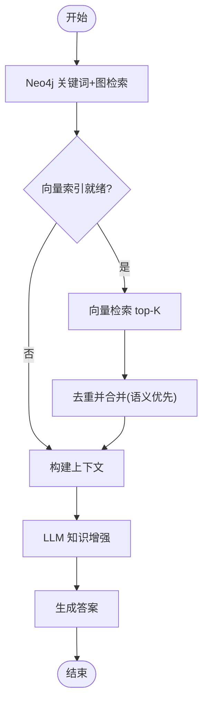
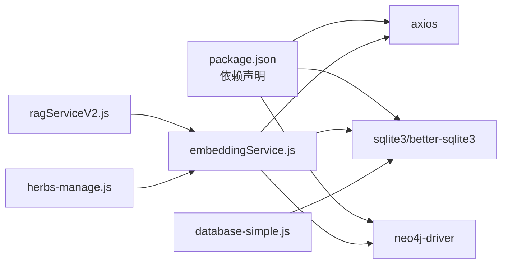

# 嵌入向量搜索

<cite>
**本文引用的文件**
- [backend/src/services/embeddingService.js](file://backend/src/services/embeddingService.js)
- [backend/src/services/ragServiceV2.js](file://backend/src/services/ragServiceV2.js)
- [backend/src/routes/herbs-manage.js](file://backend/src/routes/herbs-manage.js)
- [backend/src/config/database-simple.js](file://backend/src/config/database-simple.js)
- [backend/src/config/index.js](file://backend/src/config/index.js)
- [backend/package.json](file://backend/package.json)
- [docs/EMBEDDING_VECTOR_SEARCH.md](file://docs/EMBEDDING_VECTOR_SEARCH.md)
</cite>

## 目录
1. [简介](#简介)
2. [项目结构](#项目结构)
3. [核心组件](#核心组件)
4. [架构总览](#架构总览)
5. [详细组件分析](#详细组件分析)
6. [依赖关系分析](#依赖关系分析)
7. [性能考量](#性能考量)
8. [故障排查指南](#故障排查指南)
9. [结论](#结论)
10. [附录](#附录)

## 简介
本系统为中医药知识图谱问答提供“嵌入向量检索”能力，用于弥补传统字面匹配（CONTAINS）在“证型 ↔ 功效”语义对齐上的不足。通过调用阿里云百炼 text-embedding-v3 将药材与用户问题映射到同一高维空间，使用余弦相似度进行语义检索，并将向量持久化至本地 SQLite，启动时增量同步，最终在 RAG 管线中作为“步骤 1.5”补充命中结果。

## 项目结构
围绕嵌入向量搜索的关键文件与职责：
- embeddingService.js：向量化、相似度计算、增量同步、持久化、单条更新/删除、语义检索入口
- ragServiceV2.js：RAG 管线，集成关键词检索 + 图遍历 + LLM 增强，并在其中插入向量检索补充
- herbs-manage.js：药材 CRUD 路由，增删改后异步触发向量索引更新
- database-simple.js：SQLite 初始化与 herb_embeddings 表定义
- index.js：环境变量与配置加载（含数据库路径等）
- package.json：后端依赖（axios、better-sqlite3、neo4j-driver 等）
- docs/EMBEDDING_VECTOR_SEARCH.md：实现说明与最佳实践文档

图表来源
- [backend/src/routes/herbs-manage.js:200-312](file://backend/src/routes/herbs-manage.js#L200-L312)
- [backend/src/services/embeddingService.js:17-314](file://backend/src/services/embeddingService.js#L17-L314)
- [backend/src/services/ragServiceV2.js:113-268](file://backend/src/services/ragServiceV2.js#L113-L268)
- [backend/src/config/database-simple.js:307-315](file://backend/src/config/database-simple.js#L307-L315)

章节来源
- [backend/src/services/embeddingService.js:17-314](file://backend/src/services/embeddingService.js#L17-L314)
- [backend/src/services/ragServiceV2.js:113-268](file://backend/src/services/ragServiceV2.js#L113-L268)
- [backend/src/routes/herbs-manage.js:200-312](file://backend/src/routes/herbs-manage.js#L200-L312)
- [backend/src/config/database-simple.js:307-315](file://backend/src/config/database-simple.js#L307-L315)

## 核心组件
- 向量服务（EmbeddingService）
  - 负责调用百炼 OpenAI 兼容端点生成向量；构建源文本（名称、拼音、描述、性味、归经、功效）；计算余弦相似度；从 Neo4j 拉取药材字段；增量同步；持久化到 SQLite；提供 top-K 语义检索；支持单条更新/删除。
- RAG 管线（RAGServiceV2）
  - 关键词提取 → Neo4j 精确/模糊检索 → 向量检索补充（步骤 1.5）→ 图遍历扩展上下文 → LLM 知识增强 → 生成答案。
- 数据持久化（database-simple）
  - 维护 herb_embeddings 表（name 主键、vector JSON、source_text、model、updated_at），供启动时加载与增量 diff。
- 管理接口（herbs-manage）
  - 在事务提交后异步调用 updateOne/deleteOne，保证向量与图数据一致且不阻塞响应。

章节来源
- [backend/src/services/embeddingService.js:26-314](file://backend/src/services/embeddingService.js#L26-L314)
- [backend/src/services/ragServiceV2.js:113-268](file://backend/src/services/ragServiceV2.js#L113-L268)
- [backend/src/config/database-simple.js:307-315](file://backend/src/config/database-simple.js#L307-L315)
- [backend/src/routes/herbs-manage.js:200-312](file://backend/src/routes/herbs-manage.js#L200-L312)

## 架构总览
整体数据流：
- 启动预热：读取 SQLite 已有向量 → 对比 Neo4j 清单 → 仅对新增/变更的药材调用百炼生成向量并落库 → 内存 Map 就绪。
- 查询链路：RAG 先做关键词+图检索，再调用向量检索补充新命中药材，合并去重并按语义相关度优先排序。
- 数据变更：CRUD 成功后异步更新向量索引，改名场景需先删旧再插新。

图表来源
- [backend/src/routes/herbs-manage.js:200-312](file://backend/src/routes/herbs-manage.js#L200-L312)
- [backend/src/services/embeddingService.js:198-251](file://backend/src/services/embeddingService.js#L198-L251)
- [backend/src/config/database-simple.js:307-315](file://backend/src/config/database-simple.js#L307-L315)

章节来源
- [backend/src/routes/herbs-manage.js:200-312](file://backend/src/routes/herbs-manage.js#L200-L312)
- [backend/src/services/embeddingService.js:198-251](file://backend/src/services/embeddingService.js#L198-L251)

## 详细组件分析

### 向量服务（EmbeddingService）
- 关键方法
  - embed(inputs)：调用 DashScope OpenAI 兼容端点，按 index 排序输出，支持字符串或数组输入。
  - cosine(a, b)：余弦相似度，结果范围 [-1,1]，越接近 1 越相似。
  - buildSourceText(herb)：拼接 name/pinyin/description/properties/meridians/efficacies，作为向量化输入与 source_text 判据。
  - loadAllHerbsFromNeo4j() / loadHerbFromNeo4j(name)：从 Neo4j 拉取全部或单味药材字段。
  - loadFromDb()：启动时从 SQLite 恢复向量到内存 Map。
  - syncAll()/_doSync()：增量同步，比较 source_text 差异，批量向量化并落库。
  - search(queryText, k)：将问题向量化，与内存中所有向量计算余弦相似度，返回 top-K。
  - updateOne(name)/deleteOne(name)：单条更新/删除，供 CRUD 调用。
- 设计要点
  - 单例模式，全局共享内存缓存。
  - 增量 diff 基于 source_text，避免全量重算。
  - 批量上限 10 条，适配模型限制。
  - 错误处理：缺失 API Key、网络异常、解析失败均记录日志并降级。

图表来源
- [backend/src/services/embeddingService.js:26-314](file://backend/src/services/embeddingService.js#L26-L314)

章节来源
- [backend/src/services/embeddingService.js:26-314](file://backend/src/services/embeddingService.js#L26-L314)

### RAG 管线中的向量检索（步骤 1.5）
- 流程位置：在 Neo4j 关键词+图检索之后，插入向量检索补充。
- 行为：
  - 若向量服务就绪，调用 search(question, 10) 获取 top-10 语义命中。
  - 过滤掉已被 CONTAINS 命中的药材，将新命中的药材补齐详情字段后前置合并。
  - 记录 pipelineSteps，便于前端展示检索过程。
- 回退策略：向量检索失败或未就绪时，继续走原有流程，不影响回答。

图表来源
- [backend/src/services/ragServiceV2.js:113-268](file://backend/src/services/ragServiceV2.js#L113-L268)

章节来源
- [backend/src/services/ragServiceV2.js:113-268](file://backend/src/services/ragServiceV2.js#L113-L268)

### 数据持久化与表设计
- 表名：herb_embeddings
- 字段：
  - name：TEXT 主键（药材名）
  - vector：TEXT（JSON 序列化的 1024 维浮点数组）
  - source_text：TEXT（用于增量 diff 的源文本）
  - model：TEXT（向量模型名）
  - updated_at：DATETIME（更新时间）
- 初始化：database-simple 在启动时创建表（幂等）。

章节来源
- [backend/src/config/database-simple.js:307-315](file://backend/src/config/database-simple.js#L307-L315)

### 管理接口与向量同步
- 新增（POST）：事务提交后，异步调用 updateOne(trimmedName)。
- 更新（PUT）：若改名，先 deleteOne(oldName)，再 updateOne(targetName)；否则直接 updateOne(targetName)。
- 删除（DELETE）：删除图数据后，异步调用 deleteOne(herbName)。
- 特点：不阻塞接口响应，保证一致性且提升用户体验。

章节来源
- [backend/src/routes/herbs-manage.js:200-312](file://backend/src/routes/herbs-manage.js#L200-L312)
- [backend/src/routes/herbs-manage.js:314-442](file://backend/src/routes/herbs-manage.js#L314-L442)
- [backend/src/routes/herbs-manage.js:444-497](file://backend/src/routes/herbs-manage.js#L444-L497)

## 依赖关系分析
- 外部依赖
  - axios：HTTP 客户端，调用 DashScope embeddings 接口。
  - better-sqlite3/sqlite3：SQLite 驱动，持久化向量。
  - neo4j-driver：连接 Neo4j，拉取药材字段。
- 内部依赖
  - embeddingService 被 ragServiceV2 与 herbs-manage 引用。
  - database-simple 提供数据库实例与表初始化。
  - config/index 加载环境变量（如 SQLITE_PATH）。

图表来源
- [backend/package.json:21-42](file://backend/package.json#L21-L42)
- [backend/src/services/embeddingService.js:17-19](file://backend/src/services/embeddingService.js#L17-L19)
- [backend/src/config/database-simple.js:1-3](file://backend/src/config/database-simple.js#L1-L3)

章节来源
- [backend/package.json:21-42](file://backend/package.json#L21-L42)
- [backend/src/services/embeddingService.js:17-19](file://backend/src/services/embeddingService.js#L17-L19)
- [backend/src/config/database-simple.js:1-3](file://backend/src/config/database-simple.js#L1-L3)

## 性能考量
- 启动预热
  - 首次全量同步约数秒（取决于药材数量与网络），后续启动因增量 diff 通常秒级就绪。
- 检索性能
  - 一次检索 = 1 次百炼调用 + 内存余弦计算（微秒级），top-K 排序开销低。
- 批大小
  - 百炼单次 input 上限 10 条，代码已按 BATCH_SIZE=10 分批处理。
- 内存占用
  - 每味药 1024 维 × 8 字节 ≈ 8KB，1000 味药约 8MB，完全可接受。
- 缓存与降级
  - 向量未就绪时跳过语义检索，不影响主流程；错误统一记录日志并降级。

章节来源
- [docs/EMBEDDING_VECTOR_SEARCH.md:457-488](file://docs/EMBEDDING_VECTOR_SEARCH.md#L457-L488)
- [backend/src/services/embeddingService.js:230-245](file://backend/src/services/embeddingService.js#L230-L245)

## 故障排查指南
- 症状：向量检索未生效
  - 检查是否配置 DASHSCOPE_API_KEY，以及 embeddingService.isReady() 是否为 true。
  - 确认 herb_embeddings 表存在且有数据。
- 症状：启动缓慢或报错
  - 检查网络连接与 DashScope 端点可达性；查看日志中“同步失败”提示。
- 症状：变更后未更新
  - 确认 CRUD 接口是否调用了 updateOne/deleteOne；改名场景需先删旧再插新。
- 症状：换模型后结果异常
  - 更换 EMBEDDING_MODEL 后需清空 herb_embeddings 表并重启，避免新旧向量混用。
- 常见问题参考
  - 详见文档中的 FAQ 部分，涵盖为何持久化、为何用 source_text 做增量判据、BATCH_SIZE 限制、余弦 vs 点积等。

章节来源
- [docs/EMBEDDING_VECTOR_SEARCH.md:504-520](file://docs/EMBEDDING_VECTOR_SEARCH.md#L504-L520)
- [backend/src/services/embeddingService.js:198-251](file://backend/src/services/embeddingService.js#L198-L251)
- [backend/src/routes/herbs-manage.js:200-312](file://backend/src/routes/herbs-manage.js#L200-L312)

## 结论
嵌入向量搜索在本系统中以“轻量、可持久化、增量同步”的方式落地，有效弥补了字面匹配的语义鸿沟。通过 RAG 管线的“步骤 1.5”，语义命中与关键词/图检索互补融合，显著提升“证型↔功效”类问题的召回质量。配合 SQLite 持久化与异步更新机制，系统在可扩展性与性能之间取得良好平衡。

## 附录
- 环境变量与配置
  - SQLITE_PATH：SQLite 数据库路径（默认 data/herb-knowledge.db）
  - DASHSCOPE_API_KEY：百炼 API Key（必需）
  - EMBEDDING_MODEL：向量模型名（默认 text-embedding-v3）
- 参考文档
  - 实现详解与最佳实践参见 docs/EMBEDDING_VECTOR_SEARCH.md

章节来源
- [backend/src/config/index.js:1-80](file://backend/src/config/index.js#L1-L80)
- [docs/EMBEDDING_VECTOR_SEARCH.md:51-88](file://docs/EMBEDDING_VECTOR_SEARCH.md#L51-L88)