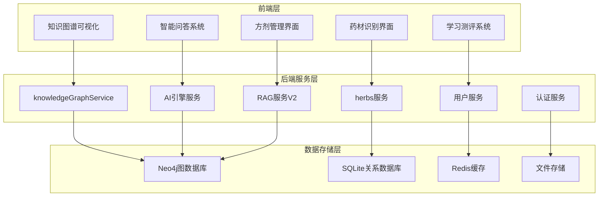
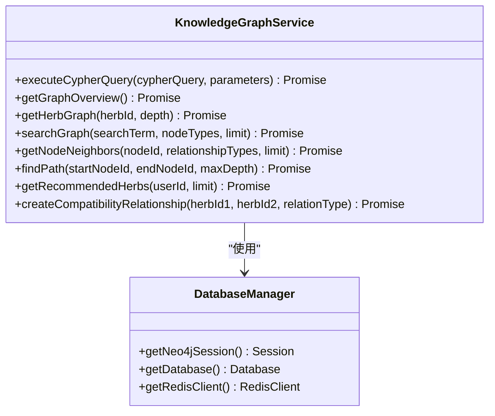
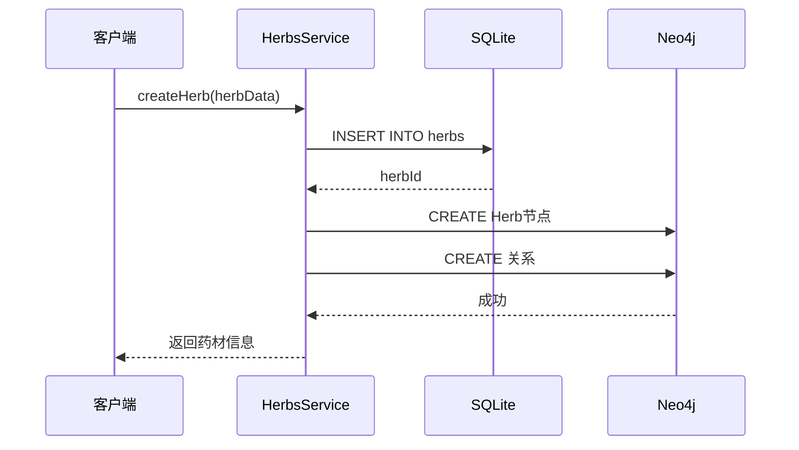
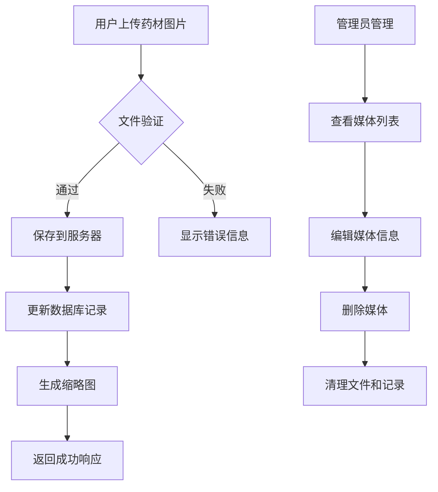
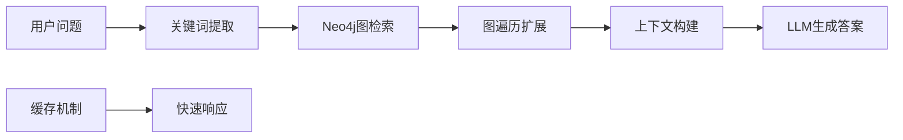
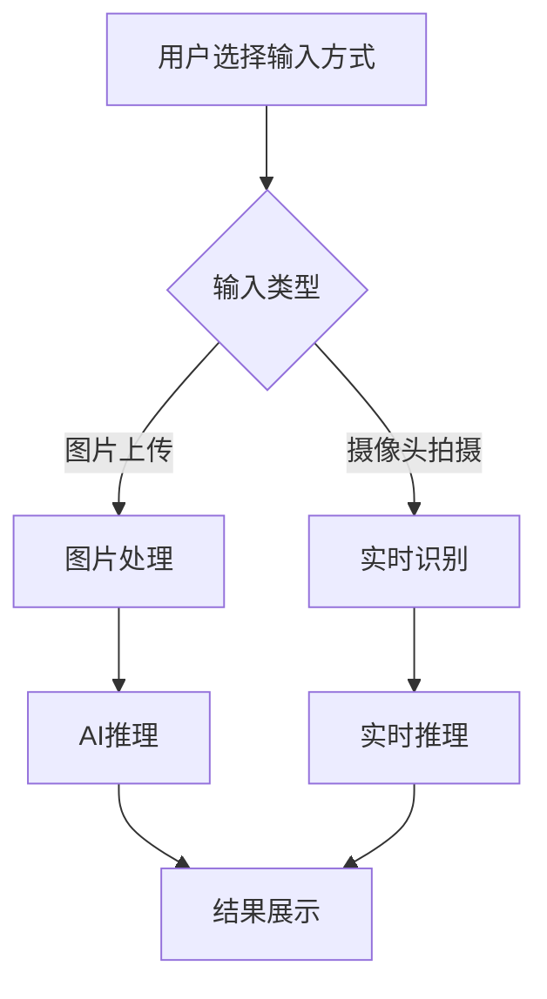
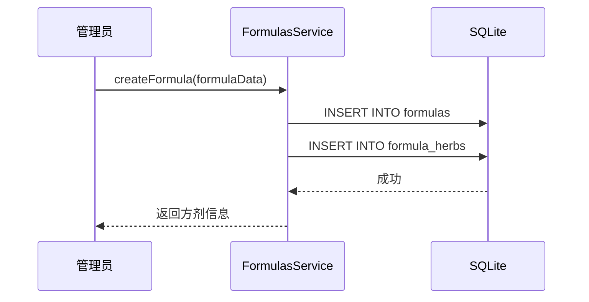
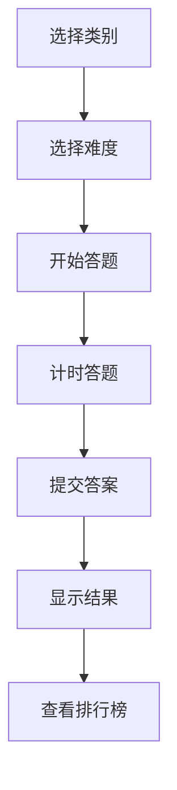
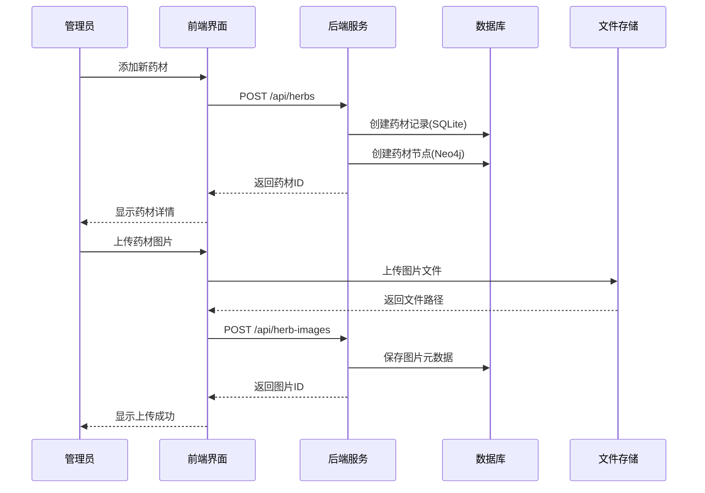

# 核心功能

<cite>
**本文档中引用的文件**
- [knowledgeGraphService.js](file://backend/src/services/knowledgeGraphService.js)
- [herbs.js](file://backend/src/routes/herbs.js)
- [ai-engine.js](file://backend/src/routes/ai-engine.js)
- [ragServiceV2.js](file://backend/src/services/ragServiceV2.js)
- [herb-recognition.js](file://scripts/herb-recognition.js)
- [quiz.js](file://scripts/quiz.js)
- [formulas.js](file://backend/src/routes/formulas.js)
- [database-simple.js](file://backend/src/config/database-simple.js)
- [neo4j-simple.js](file://backend/src/config/neo4j-simple.js)
</cite>

## 更新摘要
**变更内容**
- 将武器管理系统完全转换为中医草药知识系统
- 新增AI驱动的GraphRAG智能问答功能
- 实现药材识别和方剂管理功能
- 添加交互式学习测评系统
- 重构知识图谱为中医药专业知识图谱

## 目录
1. [项目概述](#项目概述)
2. [中医药知识图谱可视化引擎](#中医药知识图谱可视化引擎)
3. [药材全生命周期管理](#药材全生命周期管理)
4. [多媒体资源集成](#多媒体资源集成)
5. [AI驱动的GraphRAG智能问答](#ai驱动的graphrag智能问答)
6. [药材识别功能](#药材识别功能)
7. [方剂管理与配伍检测](#方剂管理与配伍检测)
8. [交互式学习测评系统](#交互式学习测评系统)
9. [功能协同流程](#功能协同流程)
10. [技术架构分析](#技术架构分析)
11. [总结](#总结)

## 项目概述

神农本草是一个综合性的中医草药知识管理平台，采用前后端分离架构，集成了知识图谱可视化、药材全生命周期管理、AI智能问答、药材识别、方剂管理和交互式学习等核心功能模块。系统支持Neo4j图数据库和SQLite关系数据库，为不同场景提供最优的数据存储方案。

### 核心功能架构



**图表来源**
- [knowledgeGraphService.js:1-430](file://backend/src/services/knowledgeGraphService.js#L1-L430)
- [herbs.js:1-800](file://backend/src/routes/herbs.js#L1-L800)
- [ai-engine.js:1-800](file://backend/src/routes/ai-engine.js#L1-L800)
- [ragServiceV2.js:1-200](file://backend/src/services/ragServiceV2.js#L1-L200)

## 中医药知识图谱可视化引擎

中医药知识图谱可视化引擎是系统的核心功能之一，基于Neo4j图数据库构建，提供直观的中药材关系展示和智能分析功能。

### 核心组件

#### 1. 知识图谱服务 (knowledgeGraphService.js)

知识图谱服务提供了完整的图数据库操作接口，支持复杂的中医药知识查询和分析功能：



**图表来源**
- [knowledgeGraphService.js:4-430](file://backend/src/services/knowledgeGraphService.js#L4-L430)
- [neo4j-simple.js:1-140](file://backend/src/config/neo4j-simple.js#L1-L140)

#### 2. 前端可视化 (knowledge-graph.html)

前端知识图谱可视化采用D3.js框架，提供交互式的中医药知识图谱展示和分析功能：

**主要特性：**
- 力导向布局算法，自动优化节点分布
- 支持节点拖拽和缩放操作
- 实时搜索和过滤功能
- 节点详情面板，显示药材详细信息
- 导出SVG格式图谱功能

**交互功能：**
- 节点点击查看详情
- 拖拽节点重新定位
- 缩放和平移操作
- 搜索和过滤节点
- 导出图谱为SVG格式

**章节来源**
- [knowledge-graph.html:1-796](file://knowledge-graph.html#L1-L796)
- [knowledgeGraphService.js:1-430](file://backend/src/services/knowledgeGraphService.js#L1-L430)

### 数据模型

知识图谱采用实体-关系模型，主要包含以下节点类型：

| 节点类型 | 属性 | 关系 |
|---------|------|------|
| Herb | name, pinyin, latin_name, description | BELONGS_TO_CATEGORY, HAS_PROPERTY, MERIDIAN_AFFINITY, HAS_EFFICACY |
| Category | name, description | 分类药材 |
| Property | name, type | 性味属性 |
| Meridian | name, abbreviation | 归经关系 |
| Efficacy | name | 功效关联 |
| Formula | name, category | CONTAINS_HERB |
| Region | name | FROM_REGION |

**章节来源**
- [herbs.js:74-165](file://backend/src/routes/herbs.js#L74-L165)
- [init-herb-data.js:667-1530](file://backend/scripts/init-herb-data.js#L667-L1530)

## 药材全生命周期管理

药材全生命周期管理模块提供完整的中药材信息管理功能，支持CRUD操作和高级查询。

### 核心功能

#### 1. 药材服务 (herbs.js)

药材服务封装了中药材的完整生命周期管理：



**图表来源**
- [herbs.js:600-689](file://backend/src/routes/herbs.js#L600-L689)

#### 2. 数据库架构

系统采用混合数据库架构：

**SQLite存储：**
- 药材基本信息（名称、拼音、拉丁名、别名）
- 分类、产地、来源信息
- 性味、归经、功效关联
- 方剂组成信息

**Neo4j存储：**
- 药材实体关系
- 配伍禁忌关系
- 功效关联关系
- 方剂包含关系

**章节来源**
- [herbs.js:1-800](file://backend/src/routes/herbs.js#L1-L800)
- [database-simple.js:1-323](file://backend/src/config/database-simple.js#L1-L323)
- [neo4j-simple.js:1-140](file://backend/src/config/neo4j-simple.js#L1-L140)

### CRUD操作流程

| 操作类型 | 数据库 | 主要步骤 | 特殊处理 |
|---------|--------|----------|----------|
| 创建药材 | SQLite+Neo4j | 1. 存储基本信息<br>2. 创建图节点<br>3. 建立关系 | 自动同步到图数据库 |
| 查询药材 | SQLite+Neo4j | 1. 查询基本信息<br>2. 获取关系信息 | 合并文档和图数据 |
| 更新药材 | SQLite+Neo4j | 1. 更新基本信息<br>2. 更新图节点属性<br>3. 重建关系 | 保持数据一致性 |
| 删除药材 | SQLite+Neo4j | 1. 删除记录<br>2. 删除图节点及关系 | 级联删除相关数据 |

## 多媒体资源集成

多媒体资源集成模块支持中药材的图片、视频管理，提供完整的媒体资源生命周期管理。

### 图片和视频管理系统

#### 1. 媒体上传与管理

媒体管理系统提供完整的药材媒体处理流程：



**图表来源**
- [herbs.js:27-69](file://backend/src/routes/herbs.js#L27-L69)

#### 2. 媒体资源架构

| 资源类型 | 存储位置 | 处理方式 | 访问控制 |
|---------|----------|----------|----------|
| 图片 | 服务器文件系统 | 自动生成缩略图 | 基于权限验证 |
| 视频 | 服务器文件系统 | 转码和压缩 | 用户认证 |
| 音频 | 服务器文件系统 | 格式转换 | 权限控制 |

**章节来源**
- [herbs.js:27-69](file://backend/src/routes/herbs.js#L27-L69)

## AI驱动的GraphRAG智能问答

AI驱动的GraphRAG智能问答系统基于LangChain.js和DeepSeek大语言模型，提供智能化的中医药知识问答服务。

### 核心功能

#### 1. RAG服务V2 (ragServiceV2.js)

RAG服务实现了两种检索模式：



**图表来源**
- [ragServiceV2.js:113-200](file://backend/src/services/ragServiceV2.js#L113-L200)

#### 2. AI引擎路由 (ai-engine.js)

AI引擎提供统一的API接口：

**支持的端点：**
- `POST /api/ai-engine/rag` - RAG智能问答
- `POST /api/ai-engine/rag-stream` - 流式问答
- `POST /api/ai-engine/compatibility` - 配伍冲突检测
- `POST /api/ai-engine/extract` - 古籍知识抽取
- `GET /api/ai-engine/health` - 引擎健康检查

**章节来源**
- [ai-engine.js:136-174](file://backend/src/routes/ai-engine.js#L136-L174)
- [ragServiceV2.js:1-200](file://backend/src/services/ragServiceV2.js#L1-L200)

### 智能问答流程

#### 1. 关键词提取

系统使用LLM从用户问题中提取中医药相关的关键词：

```javascript
// 示例：提取关键词
const keywords = await extractKeywords("人参有什么功效？");
// 结果：["人参", "功效"]
```

#### 2. 图检索与扩展

在Neo4j中进行多跳图检索，获取丰富的上下文信息：

```cypher
MATCH (h:Herb {name: $keyword})
OPTIONAL MATCH (h)-[:HAS_PROPERTY]->(p:Property)
OPTIONAL MATCH (h)-[:MERIDIAN_AFFINITY]->(m:Meridian)
OPTIONAL MATCH (h)-[:HAS_EFFICACY]->(e:Efficacy)
RETURN h, p, m, e
```

#### 3. 上下文构建与答案生成

构建结构化上下文并调用DeepSeek生成专业回答：

**章节来源**
- [ai-engine.js:136-174](file://backend/src/routes/ai-engine.js#L136-L174)
- [ragServiceV2.js:113-200](file://backend/src/services/ragServiceV2.js#L113-L200)

## 药材识别功能

药材识别功能基于深度学习模型，支持图片和视频中的中药材自动识别。

### 识别流程

#### 1. 前端识别界面

药材识别界面提供多种输入方式：



**图表来源**
- [herb-recognition.js:141-169](file://scripts/herb-recognition.js#L141-L169)

#### 2. 识别技术实现

**支持的识别模式：**
- 单张图片识别
- 实时摄像头识别
- 批量文件处理

**识别精度：**
- 置信度评分系统
- 多药材同时识别
- 实时结果反馈

**章节来源**
- [herb-recognition.js:1-379](file://scripts/herb-recognition.js#L1-L379)

### 识别结果展示

识别结果包含以下信息：
- 药材名称和分类
- 产地和性味归经
- 功效描述
- 相关药材推荐
- 置信度评分

## 方剂管理与配伍检测

方剂管理模块提供完整的中药方剂信息管理，支持配伍禁忌检测和安全性评估。

### 核心功能

#### 1. 方剂服务 (formulas.js)

方剂服务提供方剂的CRUD操作和组成管理：



**图表来源**
- [formulas.js:88-134](file://backend/src/routes/formulas.js#L88-L134)

#### 2. 配伍冲突检测

系统支持传统十八反十九畏的配伍禁忌检测：

**检测规则：**
- 硬编码规则匹配（十八反、十九畏）
- Neo4j图关系查询
- 别名匹配支持

**章节来源**
- [ai-engine.js:318-444](file://backend/src/routes/ai-engine.js#L318-L444)
- [formulas.js:1-200](file://backend/src/routes/formulas.js#L1-L200)

### 方剂数据结构

| 字段 | 类型 | 说明 |
|------|------|------|
| name | string | 方剂名称 |
| pinyin | string | 拼音 |
| category | string | 分类 |
| description | text | 描述 |
| usage | text | 用法 |
| caution | text | 注意事项 |
| source | string | 出处 |

## 交互式学习测评系统

交互式学习测评系统提供中医药知识的在线测试和学习功能，支持多种题型和难度级别。

### 核心功能

#### 1. 测评系统 (quiz.js)

测评系统支持多种类别和难度：



**图表来源**
- [quiz.js:145-177](file://scripts/quiz.js#L145-L177)

#### 2. 测评类别

**支持的类别：**
- 药材分类
- 方剂组成
- 性味归经
- 道地产区

**难度级别：**
- 入门（5题，5分钟）
- 进阶（10题，10分钟）
- 专业（15题，15分钟）

**章节来源**
- [quiz.js:1-387](file://scripts/quiz.js#L1-L387)

### 测评功能特性

- 实时计时功能
- 提示系统（3次机会）
- 答案解析
- 徽章奖励系统
- 排行榜功能
- 历史记录追踪

## 功能协同流程

### 管理员添加药材并上传视频的完整流程



**图表来源**
- [herbs.js:600-689](file://backend/src/routes/herbs.js#L600-L689)
- [herbs.js:27-69](file://backend/src/routes/herbs.js#L27-L69)

### 用户使用体验流程

1. **知识探索阶段**
   - 访问知识图谱页面
   - 浏览药材关系网络
   - 使用搜索功能查找特定药材

2. **深度了解阶段**
   - 点击药材节点查看详细信息
   - 查看相关图片和视频
   - 使用AI问答获取专业解释

3. **互动学习阶段**
   - 使用药材识别功能
   - 参与智能问答
   - 完成学习测评

4. **实践应用阶段**
   - 查看方剂组成
   - 进行配伍检测
   - 分享学习内容

**章节来源**
- [knowledge-graph.html:1-796](file://knowledge-graph.html#L1-L796)
- [herb-recognition.js:141-169](file://scripts/herb-recognition.js#L141-L169)

## 技术架构分析

### 数据库技术栈

| 技术 | 用途 | 优势 | 适用场景 |
|------|------|------|----------|
| Neo4j | 图数据存储 | 强大的关系查询能力 | 药材关系图谱 |
| SQLite | 关系数据库 | 轻量级部署 | 药材基础数据 |
| Redis | 缓存存储 | 高性能读写 | 热点数据缓存 |
| 文件系统 | 媒体存储 | 灵活的文件管理 | 图片和视频 |

### 前端技术栈

| 技术 | 用途 | 特点 |
|------|------|------|
| D3.js | 图形可视化 | 强大的数据可视化能力 |
| Canvas/WebGL | 实时渲染 | 高性能图形处理 |
| WebRTC | 摄像头访问 | 浏览器原生支持 |
| Fetch API | 数据通信 | 现代异步通信 |

### 后端技术栈

| 技术 | 用途 | 特点 |
|------|------|------|
| Node.js | 运行环境 | 高性能异步I/O |
| Express.js | Web框架 | 轻量级Web服务 |
| LangChain.js | AI框架 | 大模型集成 |
| JWT | 认证授权 | 无状态认证 |

**章节来源**
- [database-simple.js:1-323](file://backend/src/config/database-simple.js#L1-L323)
- [neo4j-simple.js:1-140](file://backend/src/config/neo4j-simple.js#L1-L140)

## 总结

神农本草通过七大核心功能模块的有机结合，构建了一个完整的中医草药知识生态系统：

### 核心优势

1. **知识图谱可视化**：提供直观的中药材关系展示，支持复杂查询和智能分析
2. **全生命周期管理**：完整的药材信息管理，支持多种数据库技术
3. **多媒体集成**：丰富的媒体资源管理，支持图片、视频等多格式
4. **AI智能问答**：基于GraphRAG的智能问答系统，提供专业的中医药知识
5. **药材识别**：基于深度学习的药材自动识别功能
6. **方剂管理**：完整的方剂信息管理，支持配伍禁忌检测
7. **学习测评**：交互式的学习测评系统，支持多种题型和难度

### 技术特色

- **混合数据库架构**：根据数据特点选择最适合的存储方案
- **前后端分离**：清晰的职责划分，便于维护和扩展
- **模块化设计**：功能独立，易于测试和部署
- **AI驱动**：集成大语言模型，提供智能化服务
- **可扩展性**：支持功能模块的灵活组合和扩展

### 应用价值

神农本草不仅是一个知识管理平台，更是一个智能化的中医药学习工具，为用户提供：
- 深入的中药材知识
- 直观的关系分析视角
- 个性化的学习体验
- 实时的智能辅助功能

通过这些核心功能的协同工作，系统能够有效支持中医药教育、研究和临床决策等多种应用场景，为用户提供全面、准确、及时的中医药知识服务。