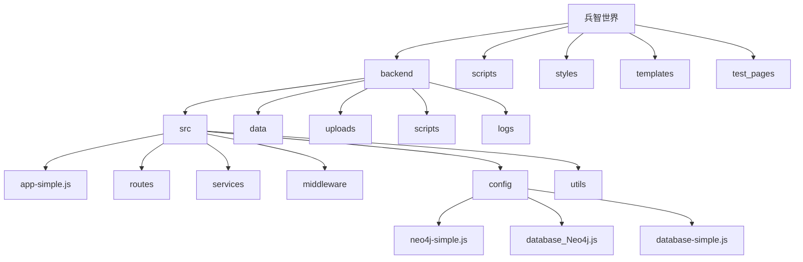
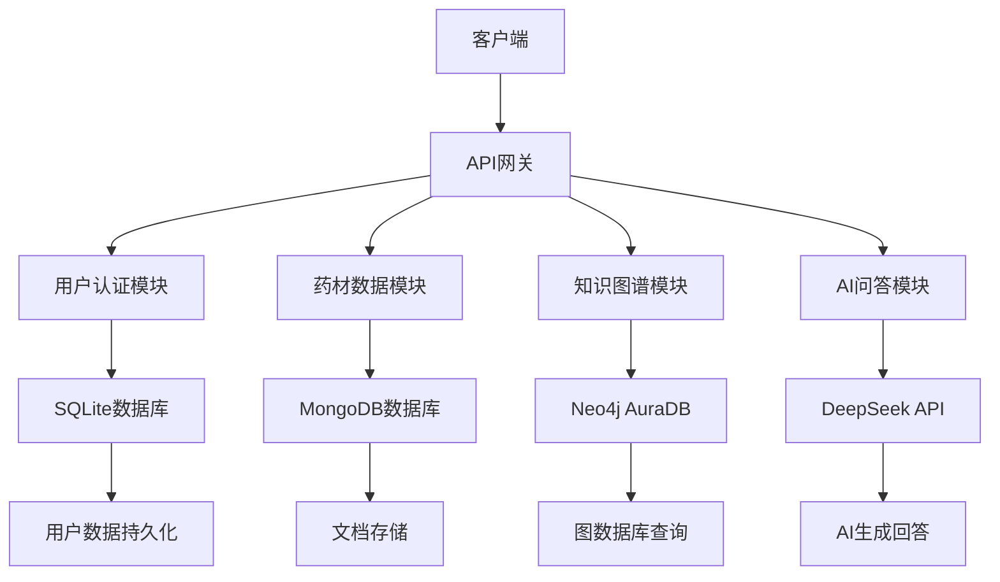
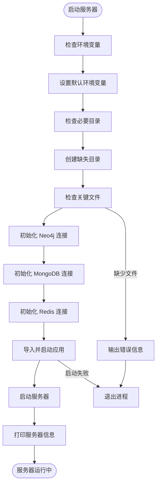
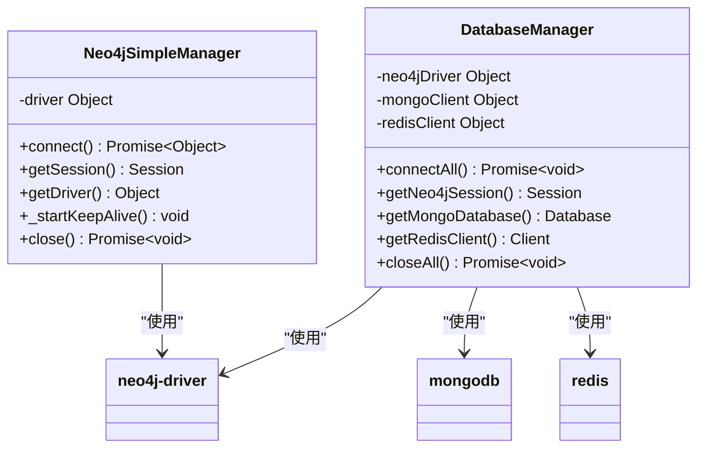
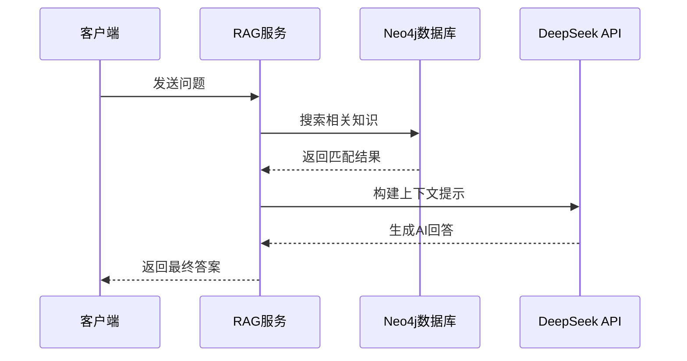
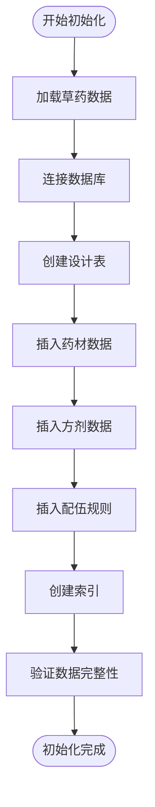
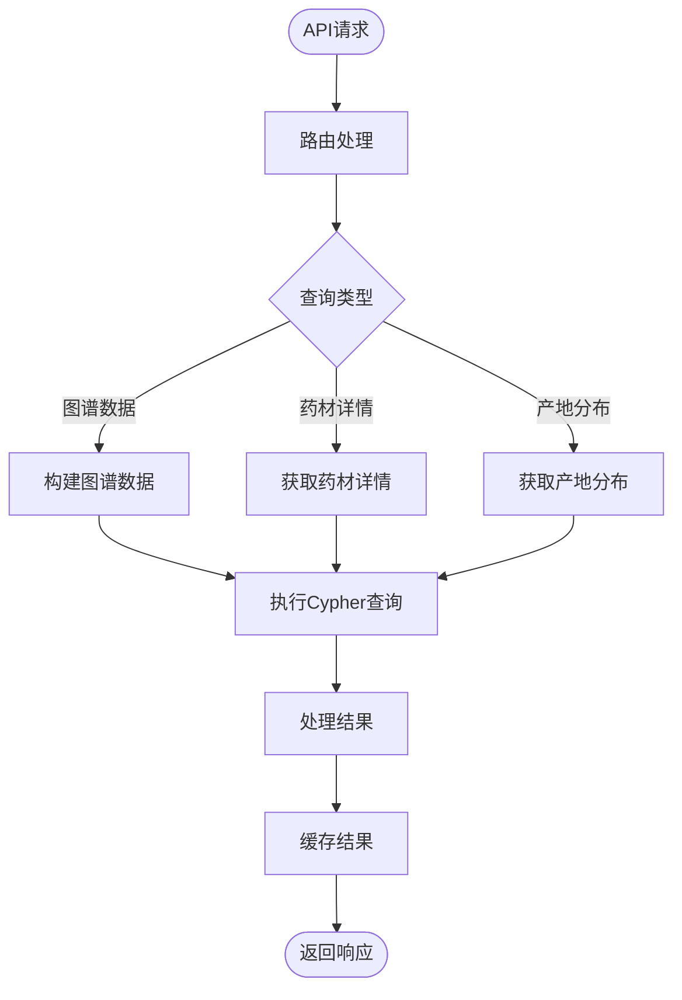
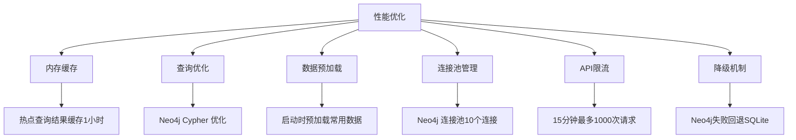
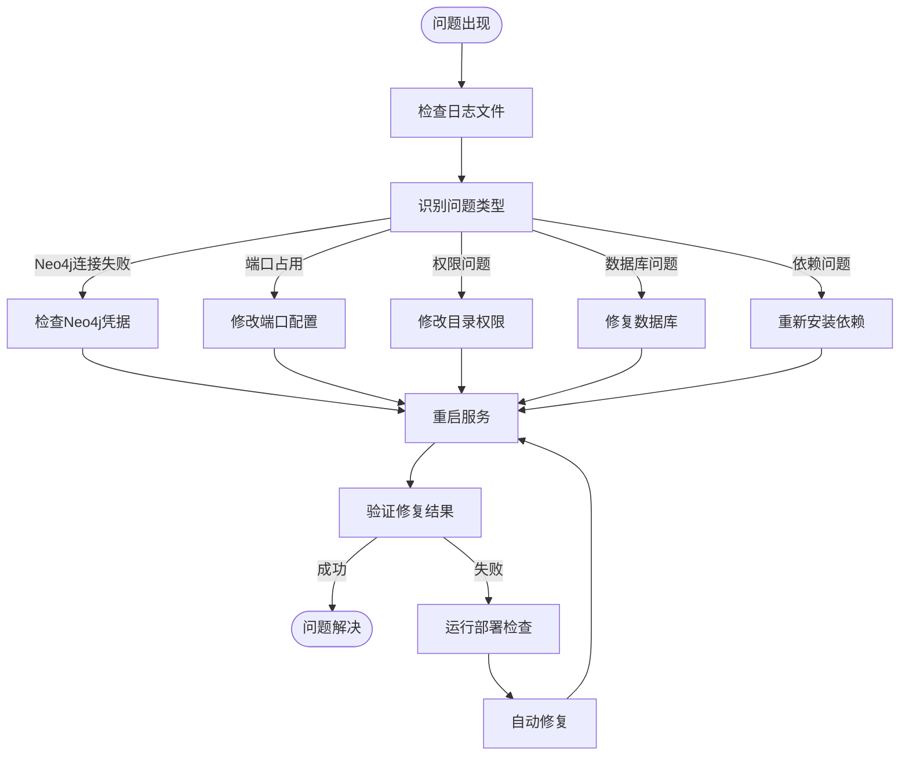

# 部署指南

<cite>
**本文引用的文件**
- [start-simple-server.js](file://start-simple-server.js)
- [app-simple.js](file://backend/src/app-simple.js)
- [neo4j-simple.js](file://backend/src/config/neo4j-simple.js)
- [database_Neo4j.js](file://backend/src/config/database_Neo4j.js)
- [knowledge-graph.js](file://backend/src/routes/knowledge-graph.js)
- [herbs.js](file://backend/src/routes/herbs.js)
- [ragService.js](file://backend/src/services/ragService.js)
- [init-herb-data.js](file://backend/scripts/init-herb-data.js)
- [import-herbs-data.json](file://backend/scripts/import-herbs-data.json)
- [NEO4J_AURADB_MIGRATION.md](file://docs/NEO4J_AURADB_MIGRATION.md)
- [package.json](file://backend/package.json)
</cite>

## 更新摘要
**变更内容**
- 新增 Neo4j AuraDB 集成配置与连接管理
- 添加 GraphRAG 问答服务实现
- 集成 TCM 草药数据库初始化脚本
- 更新环境变量配置和环境准备流程
- 增强容错降级机制（Neo4j → SQLite）

## 目录
1. [简介](#简介)
2. [项目结构](#项目结构)
3. [核心组件](#核心组件)
4. [架构概述](#架构概述)
5. [详细组件分析](#详细组件分析)
6. [依赖分析](#依赖分析)
7. [性能考虑](#性能考虑)
8. [故障排除指南](#故障排除指南)
9. [结论](#结论)

## 简介
兵智世界是一个基于知识图谱的现代化军事武器信息管理与可视化系统，现已升级为支持 Neo4j AuraDB 云数据库、GraphRAG 智能问答和 TCM 草药知识库的综合平台。本部署操作手册详细说明了如何在开发环境、生产环境和Docker容器化三种场景下部署该系统，涵盖了 PM2 进程管理、Nginx 反向代理配置和跨平台（Windows/Linux/macOS）部署的完整步骤。

**Section sources**
- [README.md:1-522](file://README.md#L1-L522)

## 项目结构
兵智世界项目采用前后端分离架构，后端服务位于 `backend` 目录，前端页面和脚本分布在根目录。系统现在支持多种数据库：SQLite 用于用户认证和基础数据管理，Neo4j AuraDB 用于知识图谱和 RAG 功能，MongoDB 用于文档存储，Redis 用于缓存。



**Diagram sources**
- [app-simple.js:1-200](file://backend/src/app-simple.js#L1-L200)
- [neo4j-simple.js:1-97](file://backend/src/config/neo4j-simple.js#L1-L97)
- [database_Neo4j.js:1-141](file://backend/src/config/database_Neo4j.js#L1-L141)

**Section sources**
- [README.md:1-522](file://README.md#L1-L522)

## 核心组件
系统的核心组件包括简化版后端服务器、Neo4j AuraDB 连接管理器、GraphRAG 问答服务、TCM 草药数据库初始化脚本和多数据库配置管理。通过 `start-simple-server.js` 启动服务，使用 `init-herb-data.js` 初始化草药数据库，使用 `check-deployment.js` 验证部署状态并自动修复问题。

**Section sources**
- [start-simple-server.js:1-76](file://start-simple-server.js#L1-L76)
- [neo4j-simple.js:1-97](file://backend/src/config/neo4j-simple.js#L1-L97)
- [ragService.js:1-303](file://backend/src/services/ragService.js#L1-L303)
- [init-herb-data.js:1-800](file://backend/scripts/init-herb-data.js#L1-L800)

## 架构概述
兵智世界现已升级为混合数据库架构，基于 Node.js + Express.js 实现，支持 SQLite、Neo4j AuraDB、MongoDB 和 Redis 多数据库协同工作。系统提供用户认证、药材数据管理、知识图谱可视化、AI 智能问答等核心功能。



**Diagram sources**
- [app-simple.js:1-200](file://backend/src/app-simple.js#L1-L200)
- [database_Neo4j.js:1-141](file://backend/src/config/database_Neo4j.js#L1-L141)
- [ragService.js:1-303](file://backend/src/services/ragService.js#L1-L303)

**Section sources**
- [NEO4J_AURADB_MIGRATION.md:1-338](file://docs/NEO4J_AURADB_MIGRATION.md#L1-L338)

## 详细组件分析

### 启动服务分析
`start-simple-server.js` 脚本用于启动简化版后端服务器，现在支持多数据库环境检测和初始化。



**Diagram sources**
- [start-simple-server.js:1-76](file://start-simple-server.js#L1-L76)
- [app-simple.js:1-200](file://backend/src/app-simple.js#L1-L200)

**Section sources**
- [start-simple-server.js:1-76](file://start-simple-server.js#L1-L76)
- [app-simple.js:1-200](file://backend/src/app-simple.js#L1-L200)

### Neo4j AuraDB 集成分析
Neo4j AuraDB 集成提供了强大的图数据库功能，支持复杂的关系查询和知识图谱构建。



**Diagram sources**
- [neo4j-simple.js:1-97](file://backend/src/config/neo4j-simple.js#L1-L97)
- [database_Neo4j.js:1-141](file://backend/src/config/database_Neo4j.js#L1-L141)

**Section sources**
- [neo4j-simple.js:1-97](file://backend/src/config/neo4j-simple.js#L1-L97)
- [database_Neo4j.js:1-141](file://backend/src/config/database_Neo4j.js#L1-L141)

### GraphRAG 问答服务分析
GraphRAG 服务实现了基于知识图谱的智能问答功能，支持自然语言查询和 AI 生成回答。



**Diagram sources**
- [ragService.js:1-303](file://backend/src/services/ragService.js#L1-L303)

**Section sources**
- [ragService.js:1-303](file://backend/src/services/ragService.js#L1-L303)

### TCM 草药数据库初始化分析
`init-herb-data.js` 脚本用于初始化 TCM 草药数据库，包含 275 味药材的完整信息。



**Diagram sources**
- [init-herb-data.js:1-800](file://backend/scripts/init-herb-data.js#L1-L800)

**Section sources**
- [init-herb-data.js:1-800](file://backend/scripts/init-herb-data.js#L1-L800)

### 知识图谱路由分析
知识图谱路由现在完全基于 Neo4j Cypher 查询，提供更强大的关系数据访问能力。



**Diagram sources**
- [knowledge-graph.js:1-386](file://backend/src/routes/knowledge-graph.js#L1-L386)

**Section sources**
- [knowledge-graph.js:1-386](file://backend/src/routes/knowledge-graph.js#L1-L386)

## 依赖分析
系统依赖主要分为 Node.js 包依赖和运行时依赖。通过 package.json 文件管理 Node.js 包依赖，确保开发和生产环境的一致性。

```mermaid
graph LR
A[兵智世界] --> B[Node.js]
A --> C[npm]
B --> D[Express.js]
B --> E[better-sqlite3]
B --> F[bcryptjs]
B --> G[cors]
B --> H[dotenv]
B --> I[express-rate-limit]
B --> J[helmet]
B --> K[joi]
B --> L[jsonwebtoken]
B --> M[morgan]
B --> N[multer]
B --> O[winston]
B --> P[neo4j-driver]
B --> Q[langchain]
B --> R[@langchain/openai]
```

**Diagram sources**
- [package.json:1-50](file://backend/package.json#L1-L50)

**Section sources**
- [package.json:1-50](file://backend/package.json#L1-L50)

## 性能考虑
系统在性能方面进行了多项优化，包括内存缓存、查询优化和数据预加载，确保在高并发场景下的稳定运行。



**Diagram sources**
- [neo4j-simple.js:1-97](file://backend/src/config/neo4j-simple.js#L1-L97)
- [knowledge-graph.js:1-386](file://backend/src/routes/knowledge-graph.js#L1-L386)

## 故障排除指南
当系统部署或运行出现问题时，可以通过以下步骤进行故障排除和修复。



**Section sources**
- [NEO4J_AURADB_MIGRATION.md:286-338](file://docs/NEO4J_AURADB_MIGRATION.md#L286-L338)

## 结论
兵智世界系统现已升级为支持 Neo4j AuraDB、GraphRAG 和 TCM 草药知识库的综合平台，提供了完整的部署解决方案，支持开发环境、生产环境和 Docker 容器化三种部署场景。通过详细的部署操作手册，用户可以轻松搭建和维护系统，确保其稳定运行。建议在生产环境中使用 PM2 进行进程管理，并配置 Nginx 反向代理以提高系统性能和安全性。

**新增功能特性：**
- Neo4j AuraDB 云数据库集成
- GraphRAG 智能问答系统
- TCM 草药知识库（275味药材）
- 多数据库混合架构
- 自动降级容错机制
- 增强的安全配置和性能优化