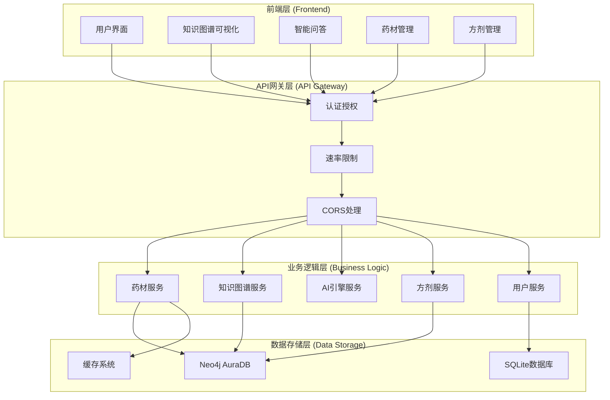
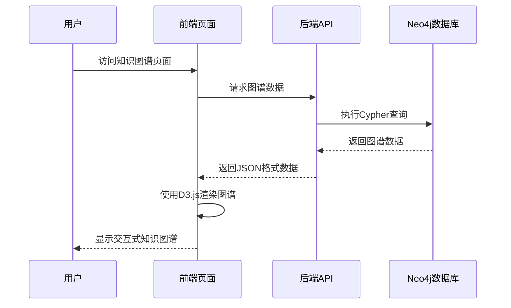
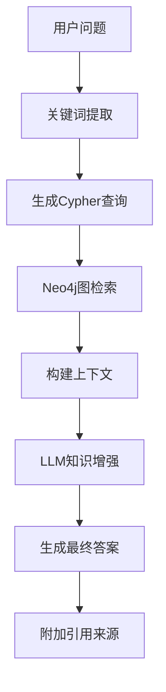
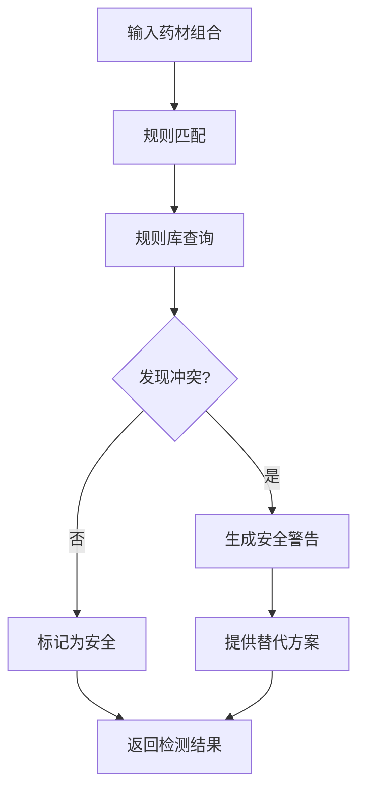
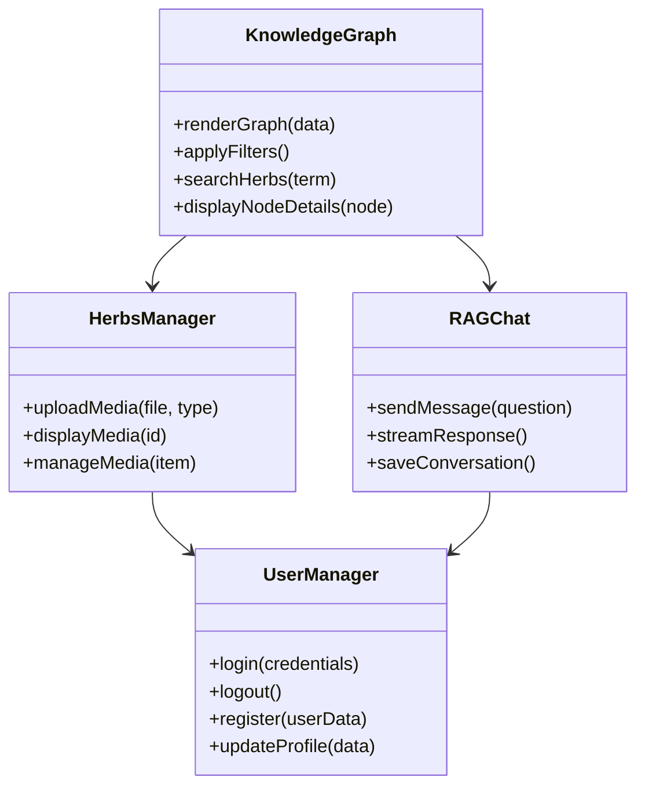
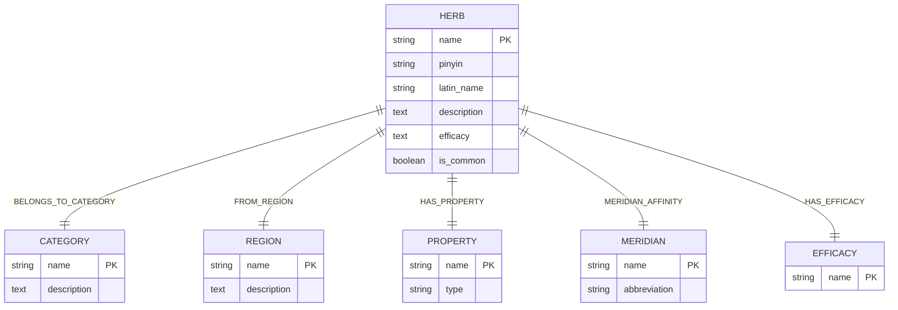
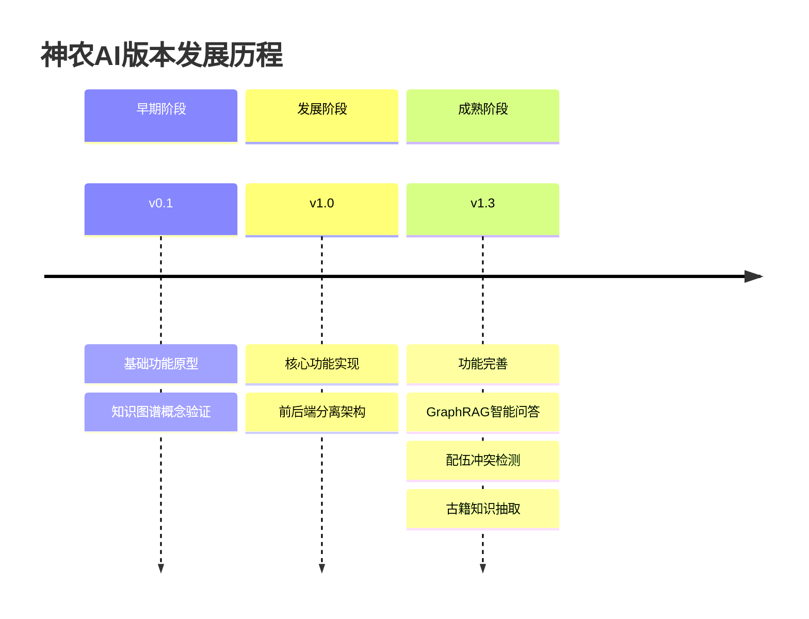

# 神农AI v1.3项目概述

<cite>
**本文引用的文件**
- [README.md](file://README.md)
- [index.html](file://index.html)
- [knowledge-graph.html](file://knowledge-graph.html)
- [qa.html](file://qa.html)
- [package.json](file://package.json)
- [backend/package.json](file://backend/package.json)
- [backend/src/app-simple.js](file://backend/src/app-simple.js)
- [backend/src/routes/herbs.js](file://backend/src/routes/herbs.js)
- [backend/src/routes/herbs-manage.js](file://backend/src/routes/herbs-manage.js)
- [backend/src/routes/knowledge-graph.js](file://backend/src/routes/knowledge-graph.js)
- [scripts/herb-data.js](file://scripts/herb-data.js)
- [scripts/herb-pages.js](file://scripts/herb-pages.js)
</cite>

## 更新摘要
**所做更改**
- 将军事武器知识图谱系统完全转换为传统中医草药知识系统
- 更新了所有功能模块描述以反映中医药领域特性
- 重构了技术架构说明，突出Neo4j图数据库和GraphRAG智能问答
- 重新设计了用户界面和功能导航
- 添加了中医药特有的功能如配伍冲突检测、古籍知识抽取等

## 目录
1. [项目简介](#项目简介)
2. [核心价值与定位](#核心价值与定位)
3. [系统架构](#系统架构)
4. [主要功能模块](#主要功能模块)
5. [技术栈与实现](#技术栈与实现)
6. [项目命名与版本演进](#项目命名与版本演进)
7. [目标用户群体](#目标用户群体)
8. [扩展潜力与未来规划](#扩展潜力与未来规划)
9. [总结](#总结)

## 项目简介

神农AI是一个基于Neo4j AuraDB云图数据库的传统中医药知识管理与智能问答系统。该系统在传统的"知识图谱可视化"基础上，新增了药材管理系统、GraphRAG智能问答、配伍冲突检测、古籍知识自动抽取、对话历史记录等核心功能。

### 项目特色
- **知识图谱可视化**：基于D3.js的中医药知识图谱，展示药材、分类、性味、归经、功效、产地等多维关系
- **智能问答系统**：集成DeepSeek-V3大模型的GraphRAG智能问答，支持自然语言查询
- **药材管理**：完整的药材信息增删查改，支持分类、产地、性味归经等属性管理
- **配伍检测**：十八反十九畏规则检测，确保用药安全
- **古籍知识抽取**：从古籍文本中自动抽取三元组并写入Neo4j
- **多媒体支持**：药材图片、视频、3D模型的全方位展示

**章节来源**
- [README.md:15-29](file://README.md#L15-L29)

## 核心价值与定位

### 系统核心定位
神农AI定位于成为中医药领域的知识图谱平台，通过构建复杂的药材关系网络，为用户提供深入的中医药知识理解和分析能力。

### 核心价值体现

#### 1. 知识图谱可视化价值
- **直观展示药材关系**：通过交互式图谱清晰展现药材、分类、产地、性味、归经之间的复杂关系
- **多维分析能力**：支持按不同维度进行数据筛选和分析
- **实时交互体验**：动态图谱展示和节点详情查看功能

#### 2. GraphRAG智能问答价值
- **精准知识检索**：基于Neo4j图数据库的精确匹配和图遍历
- **智能知识增强**：DeepSeek-V3对检索结果进行深度分析和补充
- **可溯源回答**：答案附带引用来源，提高可信度

#### 3. 药材管理价值
- **完整数据模型**：支持药材的基本信息、性味归经、功效、产地等全方位管理
- **批量操作**：支持数据批量导入导出
- **数据质量**：数据清洗和完整性检查机制

#### 4. 配伍安全价值
- **冲突检测**：基于十八反十九畏规则的配伍冲突检测
- **安全提示**：用药安全预警和替代方案推荐

**章节来源**
- [README.md:32-77](file://README.md#L32-L77)

## 系统架构

### 整体架构设计



**图表来源**
- [backend/src/app-simple.js:1-50](file://backend/src/app-simple.js#L1-L50)
- [backend/package.json:21-43](file://backend/package.json#L21-L43)

### 前后端分离架构

#### 前端架构特点
- **原生JavaScript开发**：不依赖第三方框架，保持轻量化
- **D3.js数据可视化**：专业的知识图谱渲染解决方案
- **响应式设计**：适配移动端和桌面端设备
- **模块化组织**：功能模块独立，便于维护和扩展

#### 后端架构特点
- **Node.js + Express**：高性能的服务器端框架
- **RESTful API设计**：标准化的接口规范
- **中间件系统**：安全、限流、日志等中间件
- **双数据库支持**：Neo4j用于知识图谱，SQLite用于用户数据

**章节来源**
- [backend/src/app-simple.js:15-80](file://backend/src/app-simple.js#L15-L80)
- [README.md:486-498](file://README.md#L486-L498)

## 主要功能模块

### 1. 知识图谱可视化模块

#### 核心功能
- **交互式图谱展示**：基于D3.js的动态知识图谱
- **多维关系网络**：药材-分类-产地-性味-归经-功效多层关系
- **实时筛选功能**：按分类、产地、常用程度等维度筛选
- **节点详情展示**：点击节点查看详细药材信息
- **地图视图**：中国地图显示各地产区药材分布

#### 技术实现


**图表来源**
- [backend/src/routes/knowledge-graph.js:38-221](file://backend/src/routes/knowledge-graph.js#L38-L221)

### 2. 药材管理模块

#### 功能特性
- **药材数据录入**：完整的药材规格和属性信息
- **分类管理体系**：药材分类、产地、性味、归经管理
- **批量数据操作**：支持数据批量导入导出
- **关联关系维护**：自动建立和维护药材间关系

#### 数据模型
| 节点类型 | 字段 | 类型 | 描述 |
|----------|------|------|------|
| Herb | name | String | 药材名称 |
| Herb | pinyin | String | 拼音 |
| Herb | latin_name | String | 拉丁名 |
| Herb | description | Text | 描述 |
| Herb | efficacy | Text | 功效 |
| Category | name | String | 分类名称 |
| Region | name | String | 产地名称 |
| Property | name | String | 性味名称 |
| Meridian | name | String | 归经名称 |
| Efficacy | name | String | 功效名称 |

**章节来源**
- [backend/src/routes/herbs-manage.js:202-309](file://backend/src/routes/herbs-manage.js#L202-L309)

### 3. GraphRAG智能问答模块

#### 核心功能
- **自然语言问答**：支持中文自然语言提问
- **图数据库检索**：基于Neo4j的精确匹配和图遍历
- **知识增强**：DeepSeek-V3对检索结果进行深度分析
- **流式输出**：支持SSE流式返回答案
- **对话历史**：完整的会话记录和上下文管理

#### 技术架构


**图表来源**
- [README.md:104-121](file://README.md#L104-L121)

### 4. 配伍冲突检测模块

#### 功能组成
- **十八反检测**：基于传统中药十八反规则
- **十九畏检测**：基于传统中药十九畏规则
- **自定义规则**：支持用户自定义配伍规则
- **安全提示**：冲突时的安全警告和建议

#### 技术实现


**章节来源**
- [backend/src/routes/ai-engine.js:1-100](file://backend/src/routes/ai-engine.js#L1-L100)

### 5. 古籍知识抽取模块

#### 功能特性
- **文本解析**：从古籍文本中识别药材、功效、配伍等信息
- **三元组抽取**：自动抽取(主体, 关系, 客体)三元组
- **知识入库**：将抽取的知识写入Neo4j数据库
- **质量验证**：抽取结果的准确性和完整性验证

### 6. 多媒体管理模块

#### 功能组成
- **图片管理系统**：药材图片上传、展示、管理
- **视频管理系统**：药材相关视频播放和管理
- **3D模型管理**：药材3D模型展示
- **媒体预览功能**：支持图片灯箱和视频播放器

## 技术栈与实现

### 前端技术栈

#### 核心技术
- **HTML5/CSS3**：现代化网页标准
- **JavaScript ES6+**：原生JavaScript开发
- **D3.js**：数据可视化和图谱渲染
- **ECharts**：统计图表展示
- **Font Awesome**：图标库

#### 前端架构


**图表来源**
- [scripts/herb-pages.js:1-200](file://scripts/herb-pages.js#L1-L200)

### 后端技术栈

#### 核心框架
- **Node.js**：服务器运行环境
- **Express.js**：Web应用框架
- **Neo4j Driver**：图数据库驱动
- **LangChain.js**：AI框架
- **Better-SQLite3**：高性能SQLite驱动

#### 安全与性能
- **CORS**：跨域资源共享
- **Helmet**：安全中间件
- **Rate Limiting**：API限流
- **Compression**：响应压缩

#### 数据库设计


**图表来源**
- [backend/src/routes/knowledge-graph.js:381-422](file://backend/src/routes/knowledge-graph.js#L381-L422)

### API设计规范

#### RESTful API结构
- **基础URL**: `http://localhost:3001/api`
- **认证方式**: JWT令牌认证
- **数据格式**: JSON
- **字符编码**: UTF-8

#### 核心API端点
| 端点 | 方法 | 描述 |
|------|------|------|
| `/api/herbs` | GET | 获取药材列表 |
| `/api/herbs/search?q=` | GET | 搜索药材 |
| `/api/herbs/:id` | GET | 获取药材详情 |
| `/api/herbs-manage` | POST | 新增药材 |
| `/api/knowledge/graph-data` | GET | 获取知识图谱数据 |
| `/api/ai-engine/rag` | POST | GraphRAG智能问答 |
| `/api/formulas` | GET | 获取方剂列表 |

**章节来源**
- [README.md:259-323](file://README.md#L259-L323)

## 项目命名与版本演进

### 项目命名由来

"神农AI"这一名称蕴含深刻含义：

#### 名称寓意
- **神农**：代表中华医药始祖神农氏，象征中医药文化的源远流长
- **AI**：象征人工智能技术的现代应用
- **结合意义**：传统智慧与现代科技的完美融合

#### 设计理念
- **文化传承**：将传统中医药智慧传递给现代用户
- **技术创新**：利用AI技术提升中医药知识的传播效率
- **国际化视野**：面向全球用户的中医药知识平台

### 版本演进线索

#### v1.3版本特性
- **稳定版本**：经过充分测试的成熟版本
- **功能完整**：核心功能均已实现
- **性能优化**：针对性能进行了优化改进
- **用户体验**：界面和交互体验得到提升

#### 版本发展轨迹


### 未来版本规划

#### v1.4版本展望
- **移动端App开发**：开发专用移动应用程序
- **实时协作功能**：支持多人协同编辑药材信息
- **高级数据分析**：更深入的数据分析功能
- **机器学习推荐**：基于用户兴趣的个性化推荐

#### 长期发展规划
- **多语言支持**：支持多种语言的中药材名称和描述
- **云端部署方案**：提供云服务部署选项
- **开放API生态**：为第三方开发者提供API接口
- **社区建设**：建立中医药知识贡献者社区

**章节来源**
- [README.md:472-525](file://README.md#L472-L525)

## 目标用户群体

### 中医药从业者
- **需求特点**：需要准确的药材信息和配伍知识
- **使用场景**：临床用药参考、处方审核
- **功能需求**：详细的药材信息、配伍冲突检测、方剂查询

### 中医药学生
- **需求特点**：学习中医药基础知识
- **使用场景**：课堂学习、课后复习、考试准备
- **功能需求**：系统化的知识体系、互动式学习工具

### 中医药爱好者
- **需求特点**：对中医药文化有浓厚兴趣
- **使用场景**：自我学习、养生保健
- **功能需求**：易于理解的药材介绍、健康知识科普

### 研究人员
- **需求特点**：需要准确、全面的中医药数据
- **使用场景**：学术研究、论文写作、数据分析
- **功能需求**：精确的数据查询、统计分析、数据导出

### 医疗机构
- **需求特点**：需要规范的用药指导
- **使用场景**：临床决策支持、用药安全监控
- **功能需求**：配伍冲突检测、用药建议、不良反应监测

### 系统架构用户画像
```mermaid
mindmap
root((神农AI用户群体))
中医药从业者
专业需求
用药安全
临床参考
学生群体
学习需求
知识体系
互动学习
爱好者
兴趣驱动
养生保健
文化传承
研究人员
学术需求
数据分析
文献研究
医疗机构
安全需求
用药指导
质量控制
```

**章节来源**
- [README.md:500-518](file://README.md#L500-L518)

## 扩展潜力与未来规划

### 技术扩展方向

#### 1. AI智能功能
- **智能诊断辅助**：基于症状的药材推荐
- **语音识别**：支持语音输入的自然语言问答
- **图像识别**：药材图像识别和鉴定
- **知识图谱推理**：基于规则的自动推理和知识发现

#### 2. 多媒体技术
- **3D药材模型**：更真实的药材3D模型展示
- **VR/AR体验**：虚拟现实和增强现实体验
- **视频内容**：药材种植、加工、使用视频
- **音频解说**：药材介绍的语音解说功能

#### 3. 数据集成
- **外部数据源**：整合其他中医药数据库
- **实时数据**：接入实时中医药新闻和动态
- **API开放**：为第三方开发者提供API接口
- **数据共享**：与其他中医药平台的数据共享

### 商业化潜力

#### 1. 企业级应用
- **医疗机构**：医院药房管理系统
- **教育机构**：中医药院校教学平台
- **制药企业**：新药研发辅助工具
- **电商平台**：中药材电商销售平台

#### 2. 内容变现
- **付费内容**：深度中医药分析报告
- **会员服务**：高级功能订阅
- **广告合作**：中医药相关产品推广
- **数据服务**：中医药数据API收费

### 社区建设

#### 1. 用户社区
- **专家入驻**：邀请中医药专家入驻平台
- **用户贡献**：鼓励用户贡献中医药知识
- **讨论论坛**：建立中医药话题讨论社区
- **活动组织**：定期举办中医药知识竞赛

#### 2. 生态合作
- **研究机构**：与中医药研究机构合作
- **教育机构**：与中医药院校建立合作关系
- **科技企业**：与科技公司进行技术合作
- **内容平台**：与中医药媒体平台合作

**章节来源**
- [README.md:472-525](file://README.md#L472-L525)

## 总结

神农AI v1.3作为一个基于Neo4j AuraDB的中医药知识管理与智能问答系统，在以下几个方面展现了其独特的价值和潜力：

### 核心优势
1. **技术创新**：采用GraphRAG技术实现智能问答，结合Neo4j图数据库的优势
2. **功能完整**：涵盖了药材管理、知识图谱可视化、智能问答、配伍检测等核心功能
3. **用户体验**：现代化的界面设计和直观的操作体验
4. **数据安全**：前后端分离架构，敏感数据加密存储

### 应用价值
- **教育价值**：为中医药教育和学习提供了优质的平台资源
- **研究价值**：为中医药研究人员提供了可靠的数据支撑
- **临床价值**：为临床用药提供了安全指导和知识支持
- **文化价值**：促进了中医药文化的传播和普及

### 发展前景
神农AI项目具有广阔的发展空间，通过持续的技术创新和功能完善，有望成为中医药知识领域的重要平台。项目的模块化设计和标准化接口为未来的扩展奠定了良好的基础，而明确的版本规划和技术路线图则为项目的可持续发展提供了保障。

对于初学者而言，神农AI提供了一个学习中医药知识和AI技术的良好起点；对于高级用户和专业研究人员，它则是一个功能强大、扩展性强的专业平台。随着项目的不断发展和完善，相信神农AI将在中医药知识传播和研究领域发挥越来越重要的作用。