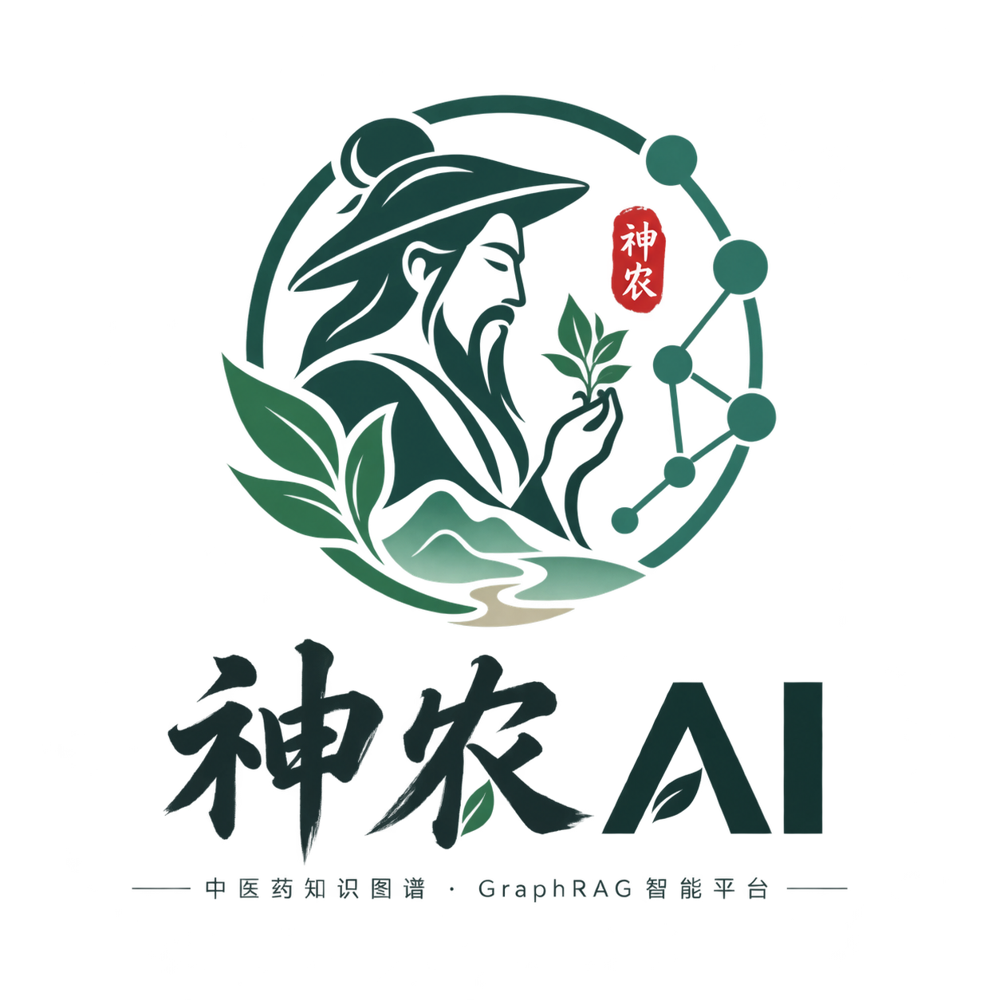

# 神农AI — 中医药知识图谱与 GraphRAG 智能问答系统

<a id="top"></a>

<div align="center">



**基于 Neo4j AuraDB 知识图谱的中医药数据可视化、药材管理与 GraphRAG 智能问答系统**

[项目简介](#-项目简介) · [核心功能](#-核心功能) · [AI 引擎](#-ai-引擎) · [快速开始](#-快速开始) · [环境变量](#-环境变量) · [API 接口](#-api-接口) · [项目结构](#-项目结构) · [Neo4j 数据模型](#-neo4j-数据模型) · [文档索引](#-文档索引)

</div>

---

## 📖 项目简介

神农AI是一个以 **Neo4j AuraDB 云图数据库**为知识底座的中医药系统。它在传统“知识图谱可视化”的基础上，新增了：

- 药材管理系统（增删查改）
- 药材详情与关联图谱展示
- GraphRAG 智能问答（含向量语义检索）
- 向量语义检索：`text-embedding-v3` 语义匹配「证型 ↔ 功效」
- 配伍冲突检测
- 古籍知识自动抽取
- 对话历史记录

系统采用 **Node.js + Express** 后端统一代理数据，前端不直接连接 Neo4j，也不暴露任何密钥。

> 一句话理解：前端负责“看和问”，后端负责“查图 + 调 AI”，Neo4j 负责“真实知识”，DeepSeek 负责“自然语言理解与生成”。

> 前端采用**类 SPA 架构**：各页面共用统一渲染器 `frontend/js/herb-pages.js`，通过 `data-page` 区分页面，集中管理导航、状态与数据缓存，具备基础的前端框架化能力（统一渲染、状态集中、按页面分发）。

---

## ✨ 核心功能

### 1. 知识图谱可视化

- 基于 D3.js 的中医药知识图谱
- 展示药材、分类、性味、归经、功效、产地等多维关系
- 节点点击查看详情
- 分类分布、归经分布、产地药材数量统计
- 中国地图视图：点击省份查看当地药材

### 2. 药材管理

- 顶部 Tab 切换：图谱浏览 / 药材管理
- 搜索、分页、新增、编辑、删除药材
- 表单下拉框数据全部来自 Neo4j
- 新增药材时，不存在的分类/产地等会通过 `MERGE` 自动创建
- 删除前有软确认，并检查是否被方剂引用
- 新增/修改/删除药材后，向量检索自动更新（全文索引自动同步，无需手动重建）

> **新增药材说明**：通过药材管理面板正常新增即可，后端自动完成 Neo4j 写入、全文索引更新、向量更新。若用脚本**批量导入 Neo4j**（不走 herbs-manage API），导入后需手动执行 `embeddingService.syncAll()` 补齐向量。

### 3. GraphRAG 智能问答

- 页面：`qa.html`
- 技术链：Agent + Tool Calling（默认）→ 三路混合检索（BM25 + 向量 + 知识图谱）+ RRF 融合 → 图遍历 → DeepSeek 生成
- 支持药材功效、产地、用法、注意事项、方剂组成等问题
- 答案附带引用来源、可点击药材节点、D3 迷你知识图谱
- 展示完整 GraphRAG 检索过程（含向量检索环节）

### 4. AI 引擎模块

在 `backend/src/routes/ai-engine.js` 中聚合了多个 AI 能力：

| 模块 | 说明 |
| --- | --- |
| RAG 智能问答 | GraphRAG 核心能力 |
| 流式问答 | SSE 流式返回答案 |
| 配伍冲突检测 | 十八反十九畏 + Neo4j 图推理 |
| 古籍知识抽取 | 从古籍文本中抽取三元组并写入 Neo4j |
| 药材知识增强 | 调用 DeepSeek 补全现代药理、临床应用等 |
| 药材详情图谱 | 返回单味药材及其 1-2 跳图关系 | 

### 5. 对话历史

- 对话记录存储在 SQLite
- 支持创建、切换、删除会话
- 一条会话对应一组问答消息

---

## 🧠 AI 引擎

### 整体架构

<div align="center">


</div>

当前 AI 问答采用「**Agent 主路径 + 经典 RAG 兜底**」架构：用户提问后**默认走 Agent**，由大模型自主决定调用哪些工具；仅当 Agent 未能产出答案时，才自动回退到经典 RAG 固定管线。

```
浏览器前端（qa.html）
   │
   │  HTTP POST /api/ai-engine/agent（默认主路径）
   ▼
Node.js + Express 后端
   │
   ├── agentService.js（Agent 编排：ReAct + Tool Calling）
   │     └─ Thought → Action → 执行工具 → Observation → 迭代 → Final Answer
   │
   ├── agentTools.js（可调用工具集）
   │     ├─ search_herbs           三路混合检索 + 1-2 跳图遍历
   │     ├─ search_formulas        方剂检索
   │     ├─ enrich_herb            单味药材 LLM 知识增强
   │     ├─ herb_media             返回药材图片 / 视频
   │     └─ check_compatibility    十八反十九畏配伍检测
   │
   ├── hybridSearchService.js（三路混合检索 + RRF 融合）
   ├── embeddingService.js（向量检索 + SQLite 持久化）
   ├── ragServiceV2.js（经典 RAG 固定管线，Agent 失败时兜底）
   ├── neo4j-simple.js（Neo4j 单例连接）
   │
   ▼
Neo4j AuraDB + SQLite + DeepSeek
```

### 主路径：Agent 模式（ReAct + Tool Calling）

Agent 不再按固定流程执行，而是由大模型「边思考、边调用工具、边观察结果」，多步迭代后生成答案，并在前端展示完整思维链。

```
用户问题
   ↓
① 思考（Thought）：这个问题需要检索什么？
   ↓
② 调用工具（Action）：search_herbs / search_formulas / enrich_herb / herb_media / check_compatibility
   ↓
③ 观察结果（Observation）：把工具返回的图谱证据喂回模型
   ↓
④ 继续思考 → 决定是否再调工具（最多 8 轮）
   ↓
⑤ 最终答案（Final Answer）：基于观察结果生成可溯源回答
```

### 兜底路径：经典 RAG 七步管线

当 Agent 未能得到答案（如模型输出异常、达到最大轮次）时，后端自动调用 `ragServiceV2.answer()` 回退到固定管线：

```
用户问题
   ↓
① 关键词提取：本地 n-gram 切词（不调 LLM），提取药材名、功效、症状等字面词
   ↓
② 三路混合检索（并行）：
     · BM25 全文检索：Neo4j cjk 全文索引，字段加权 name^3 > pinyin^2 > 功效/描述
     · 向量语义检索：text-embedding-v3 语义匹配「证型 ↔ 功效」
     · 知识图谱检索：Cypher CONTAINS 字面匹配
   ↓
③ RRF 融合重排：各路结果按排名取倒数求和，多路命中的药材排前
   ↓
④ 1-2 跳图遍历：沿关系边获取性味归经、功效、方剂、配伍禁忌
   ↓
⑤ LLM 知识增强：DeepSeek 补全前 N 味药材（受控并发，默认 5 味 / 3 并发）
   ↓
⑥ 上下文构建：将图谱数据与增强知识格式化为结构化提示
   ↓
⑦ DeepSeek 生成：基于增强上下文生成带引用来源的答案
```

### 三路混合检索 + RRF

`search_herbs` 工具内部复用了同一套三路混合检索，保证 Agent 模式下回答同样可溯源：

| 检索路 | 技术 | 说明 |
| --- | --- | --- |
| BM25 全文检索 | Neo4j cjk 全文索引 | 字面精确匹配，字段加权 name^3 > pinyin^2 > 功效/描述 |
| 向量语义检索 | text-embedding-v3（1024 维） | 余弦相似度匹配「证型 ↔ 功效」语义 |
| 知识图谱检索 | Cypher CONTAINS | 图谱节点属性字面匹配 |

三路结果经 **RRF（Reciprocal Rank Fusion，倒数排名融合）** 重排：`score = Σ 1/(k + rank)`，多路命中的药材得分更高、排更前。

### GraphCypherQAChain 的角色

项目引入了 LangChain.js 的 `GraphCypherQAChain`，但由于 AuraDB Free 实例的路由表限制以及连接池统一管理需要，当前未作为生产主路径，仅作备用 / 技术展示。

| 模式 | 流程 | 当前状态 |
| --- | --- | --- |
| Agent + Tool Calling | 大模型自主规划 → 调用工具 → 多步推理 → 生成答案 | ✅ 当前主路径 |
| 手动增强检索 | 关键词 → 三路检索 → 图遍历 → 知识增强 → 生成答案 | 兜底路径（agent-fallback） |
| GraphCypherQAChain | LLM 自动生成 Cypher → 执行 → LLM 回答 | 备用 / 技术展示 |

详细教学请阅读：

- `docs/AI_ASSISTANT_AGENT_GUIDE.md`（Agent 编排 + Tool Calling + 工具集 + 三路混合检索全解析）
- `docs/三路混合检索技术方案.md`（三路混合检索 + RRF 融合）
- `docs/EMBEDDING_VECTOR_SEARCH.md`（向量检索专项）
- `docs/RAG_PERFORMANCE_OPTIMIZATION.md`（性能优化专项）

---
## 🚀 快速开始

### 环境要求

- Node.js 18 或更高版本
- npm
- Neo4j AuraDB 云数据库
- DeepSeek API Key

### 1. 配置环境变量

进入 `backend` 目录，复制 `.env.example` 为 `.env`，并填写：

```env
NEO4J_URI=neo4j+s://your-database.databases.neo4j.io
NEO4J_USERNAME=neo4j
NEO4J_PASSWORD=YOUR_NEO4J_PASSWORD_HERE

DEEPSEEK_API_KEY=YOUR_DEEPSEEK_API_KEY_HERE

PORT=3001
NODE_ENV=development
```

> 注意：`.env` 不应提交到 Git，也不要在 README 或前端代码中写真实密码。

### 2. 安装依赖

```bash
cd backend
npm install
```

### 3. 启动后端

```bash
npm run dev
```

或：

```bash
npm start
```

服务默认运行在：

```
http://localhost:3001
```

> 前端无需 Live Server：后端已通过 Express 静态托管项目根目录。`npm run dev` 启动成功后，终端会打印 `前端入口: http://127.0.0.1:3001/index.html`，直接点击即可打开。

### 4. 打开页面

| 页面 | 地址 |
| --- | --- |
| 知识图谱可视化 | `http://localhost:3001/knowledge-graph.html` |
| GraphRAG 智能问答 | `http://localhost:3001/qa.html` |
| 系统首页 | `http://localhost:3001/index.html` |

---

## 🔐 环境变量

后端从 `backend/.env` 读取配置：

| 变量 | 说明 |
| --- | --- |
| `NEO4J_URI` | Neo4j AuraDB 连接地址 |
| `NEO4J_USERNAME` | Neo4j 用户名 |
| `NEO4J_PASSWORD` | Neo4j 密码 |
| `DEEPSEEK_API_KEY` | DeepSeek API Key |
| `DASHSCOPE_API_KEY` | 阿里云百炼 API Key（向量检索） |
| `EMBEDDING_MODEL` | 向量模型，默认 `text-embedding-v3` |
| `PORT` | 后端端口，默认 3001 |
| `NODE_ENV` | 运行环境，`development` 或 `production` |
| `SQLITE_PATH` | SQLite 数据库路径 |

---

## 📡 API 接口

### 核心 API

| 方法 | 接口 | 说明 |
| --- | --- | --- |
| `GET` | `/health` | 健康检查 |
| `GET` | `/api` | API 总览 |
| `POST` | `/api/auth/login` | 用户登录 |
| `POST` | `/api/auth/register` | 用户注册 |
| `GET` | `/api/auth/profile` | 获取个人资料 |
| `GET` | `/api/herbs` | 获取药材列表 |
| `GET` | `/api/herbs/search?q=` | 搜索药材 |
| `GET` | `/api/herbs/:id` | 获取药材详情 |
| `GET` | `/api/herb-categories` | 药材分类 |
| `GET` | `/api/herb-regions` | 药材产地 |
| `GET` | `/api/herb-sources` | 药材来源 |
| `GET` | `/api/formulas` | 方剂列表 |
| `GET` | `/api/formulas/:id` | 方剂详情 |

### 药材管理 API

| 方法 | 接口 | 说明 |
| --- | --- | --- |
| `GET` | `/api/herbs-manage/dropdowns` | 获取下拉框动态选项 |
| `GET` | `/api/herbs-manage` | 药材分页列表 |
| `GET` | `/api/herbs-manage/:name` | 获取单个药材 |
| `POST` | `/api/herbs-manage` | 新增药材 |
| `PUT` | `/api/herbs-manage/:name` | 修改药材 |
| `DELETE` | `/api/herbs-manage/:name` | 删除药材 |
| `GET` | `/api/herbs-manage/:name/graph` | 获取药材关联图谱 |

### 知识图谱 API

| 方法 | 接口 | 说明 |
| --- | --- | --- |
| `GET` | `/api/knowledge/graph-data` | 图谱节点和边数据 |
| `GET` | `/api/knowledge/herb-details/:name` | 单味药材详情 |
| `GET` | `/api/knowledge/region-distribution` | 产地药材数量分布 |

### AI 引擎 API

| 方法 | 接口 | 说明 |
| --- | --- | --- |
| `POST` | `/api/ai-engine/agent` | Agent 智能问答（默认，Tool Calling + 思维链） |
| `POST` | `/api/ai-engine/rag` | GraphRAG 智能问答 |
| `POST` | `/api/ai-engine/rag-stream` | RAG 流式问答 |
| `POST` | `/api/ai-engine/compatibility` | 配伍冲突检测 |
| `POST` | `/api/ai-engine/extract` | 古籍知识抽取 |
| `POST` | `/api/ai-engine/herb-enrich` | 单味药材知识增强 |
| `GET` | `/api/ai-engine/herb-detail/:name` | 药材详情 + 关联图谱 |
| `GET` | `/api/ai-engine/health` | AI 引擎健康检查 |
| `GET` | `/api/ai-engine/status` | AI 引擎状态 |

### 对话历史 API

| 方法 | 接口 | 说明 |
| --- | --- | --- |
| `GET` | `/api/conversations` | 获取会话列表 |
| `POST` | `/api/conversations` | 创建会话 |
| `GET` | `/api/conversations/:id` | 获取单个会话 |
| `POST` | `/api/conversations/:id/messages` | 向会话添加消息 |
| `PUT` | `/api/conversations/:id` | 修改会话 |
| `DELETE` | `/api/conversations/:id` | 删除会话 |

---

## 🗂️ 项目结构

```text
Herb-v1.3（神农AI）
├─ frontend                      # 前端三件套
│  ├─ index.html                 # 系统首页
│  ├─ knowledge-graph.html       # 知识图谱可视化 + 药材管理
│  ├─ qa.html                    # GraphRAG 智能问答
│  ├─ herb-search.html           # 药材查询
│  ├─ formula-library.html       # 方剂库
│  ├─ recommendation.html        # 方剂推荐
│  ├─ herb-recognition.html      # 拍照识药
│  ├─ quiz.html                  # 知识测评
│  ├─ login/register/profile/admin.html
│  ├─ favicon.svg
│  ├─ css/                       # 样式（原 styles/）
│  ├─ js/                        # 脚本（原 scripts/）
│  │  ├─ herb-pages.js           # 核心渲染器
│  │  ├─ qa.js                   # GraphRAG 问答前端
│  │  ├─ herb-manage.js          # 药材管理
│  │  ├─ world-map-visualization.js
│  │  └─ vendor/echarts.min.js
│  └─ assets/                    # 图片资源（含 Alogo.png）
│
├─ backend                       # Node.js 后端
│  ├─ .env                       # 密钥（不提交）
│  ├─ package.json
│  └─ src
│     ├─ app-simple.js           # 启动入口
│     ├─ config/                 # 环境/数据库/Neo4j 配置
│     ├─ routes/                 # API 路由
│     │  ├─ ai-engine.js         # AI 引擎（RAG 等）
│     │  ├─ ai-gateway.js        # AI 网关
│     │  ├─ knowledge-graph.js   # 知识图谱 API
│     │  ├─ herbs.js             # 药材 API
│     │  ├─ herbs-manage.js      # 药材管理 API
│     │  └─ ...
│     └─ services/               # 业务服务
│        ├─ agentService.js      # Agent 编排（ReAct + Tool Calling）
│        ├─ agentTools.js        # 工具集（search_herbs 等 5 个工具）
│        ├─ ragServiceV2.js      # 经典 RAG 管线（Agent 兜底）
│        ├─ hybridSearchService.js # 三路混合检索 + RRF
│        ├─ embeddingService.js  # 向量检索
│        └─ ...
│
├─ docs                          # 项目文档
│  ├─ AI_ENGINE_RAG_TEACHING.md  # AI 引擎教学
│  ├─ EMBEDDING_VECTOR_SEARCH.md # 向量检索详解
│  ├─ RAG_PERFORMANCE_OPTIMIZATION.md
│  ├─ NEO4J_MIGRATION.md         # AuraDB 迁移说明
│  ├─ CHANGELOG.md               # 更新日志
│  └─ function_description/      # 历史功能说明（留档）
│
├─ start-simple-server.js        # 后端启动脚本
└─ README.md                     # 本文档
```

---

## 🧩 Neo4j 数据模型

### 节点类型

| 节点 Label | 说明 |
| --- | --- |
| `Herb` | 药材 |
| `Category` | 分类 |
| `Region` | 产地 |
| `Property` | 性味 |
| `Meridian` | 归经 |
| `Efficacy` | 功效 |
| `Formula` | 方剂 |

### 关系类型

| 关系 | 说明 |
| --- | --- |
| `BELONGS_TO_CATEGORY` | 药材 → 分类 |
| `FROM_REGION` | 药材 → 产地 |
| `HAS_PROPERTY` | 药材 → 性味 |
| `MERIDIAN_AFFINITY` | 药材 → 归经 |
| `HAS_EFFICACY` | 药材 → 功效 |
| `CONTAINS_HERB` | 方剂 → 药材 |
| `COMPATIBILITY` | 药材 → 药材（配伍冲突） |

### 药材节点常用属性

```text
name           药材名
pinyin         拼音
latin_name     拉丁名
description    描述
efficacy       功效
usage_dosage   用法用量
caution        注意事项
is_common      是否常用
alias          别名
quality        品质
```

---

## 🧠 AI 问答示例

### 输入

```json
{
  "question": "人参有什么功效？"
}
```

### 后端处理（默认走 Agent）

1. 前端调用 `POST /api/ai-engine/agent`
2. Agent 思考后调用 `search_herbs` 工具
3. 工具内部执行「三路混合检索 + 1-2 跳图遍历」，返回完整图谱上下文
4. Agent 观察结果后，可能继续调用 `enrich_herb` / `herb_media` 等工具
5. 生成最终答案，前端展示思维链 + 参考药材 + 方剂 + 图片视频

### 返回结构

```json
{
  "success": true,
  "data": {
    "question": "人参有什么功效？",
    "answer": "……",
    "mode": "agent",
    "steps": [
      { "type": "thought", "content": "需要检索人参" },
      { "type": "tool_call", "tool": "search_herbs", "args": { "question": "人参有什么功效？" } },
      { "type": "tool_result", "content": "检索到人参..." }
    ],
    "sources": ["人参"],
    "formulas": ["四君子汤"],
    "media": [ { "type": "image", "url": "/uploads/herbs/人参.png" } ]
  }
}
```

---
## 🔒 安全设计

- Neo4j 密码、DeepSeek API Key 只存在于 `backend/.env`
- 前端只通过 Express API 访问数据
- 所有 Cypher 查询均使用参数化，防止注入
- 删除药材前进行前端确认和后端引用检查
- AuraDB Free 版每 30 分钟自动 ping，防止 3 天无活动休眠

---

## 📚 文档索引

| 文档 | 说明 |
| --- | --- |
| `README.md` | 项目总览 |
| `docs/AI_ENGINE_RAG_TEACHING.md` | GraphRAG 智能问答改造教学 |
| `docs/AI_ASSISTANT_AGENT_GUIDE.md` | Agent 编排 + Tool Calling + 工具集 + 三路混合检索全解析 |
| `docs/EMBEDDING_VECTOR_SEARCH.md` | 向量检索（Embedding 语义检索）实现详解 |
| `docs/RAG_PERFORMANCE_OPTIMIZATION.md` | 问答性能优化详解 |
| `backend/API.md` | 后端 API 详细说明 |
| `docs/NEO4J_MIGRATION.md` | Neo4j AuraDB 迁移说明 |
| `docs/NEO4J_AURADB_MIGRATION.md` | AuraDB 迁移补充说明 |
| `docs/AI-ENGINE-ARCHITECTURE.md` | AI 引擎架构说明 |
| `docs/CHANGELOG.md` | 更新日志 |

---

## 📝 技术栈

| 层 | 技术 |
| --- | --- |
| 前端 | HTML、CSS、JavaScript、D3.js、ECharts |
| 后端 | Node.js、Express |
| 图数据库 | Neo4j AuraDB |
| 图驱动 | `neo4j-driver` |
| AI 框架 | LangChain.js |
| LLM | DeepSeek（`deepseek-chat`） |
| 向量模型 | 阿里云百炼 `text-embedding-v3`（1024 维） |
| 关系型数据库 | SQLite（用户、认证、对话历史、向量存储） |

---

## 📱 移动端适配

系统采用「桌面优先 + 断点降级」的响应式策略，通过 CSS 媒体查询（`@media`）针对不同屏幕宽度调整布局：

| 断点 | 目标设备 |
| --- | --- |
| `max-width: 980px` | 平板 / 窄屏 |
| `max-width: 768px` | 手机 |
| `max-width: 720px` | 小屏手机 |

### 核心适配项

1. **导航汉堡菜单**：手机端导航收起为左侧抽屉，点击汉堡按钮滑出，配半透明遮罩，点导航项或遮罩自动关闭；抽屉底部展示品牌信息（logo + 名称 + 副标题）。
2. **历史对话侧边栏**：AI 问答页历史对话常驻左侧，手机端变为可滑出的抽屉。
3. **药材详情面板**：点击药材节点后，药材详情从右侧平滑滑入（桌面端挤压式、手机端覆盖式），面板样式与整体医药主题一致。
4. **AI 问答手机端布局**：问答窗格固定高度、内部滚动翻阅对话；AI 回答消息铺满整行（隐藏头像、无气泡背景），参考主流 AI 助手（ChatGPT）手机端设计，每行显示更多内容。
5. **图谱触屏优化**：移动端图谱节点加大、触屏按压有反馈，支持双指缩放画布。
6. **地图省份详情窗口式**：手机端点击省份后，详情面板以底部抽屉（bottom sheet）形式滑入，占满屏幕宽度；桌面端改为右侧挤压式面板，默认大地图居中，点击省份后地图左移、面板滑出。
7. **地图药材跳转图谱**：省份详情里的药材卡片可点击，跳转到对应药材的知识图谱视图（手机端、桌面端均支持）。
8. **药材查询分页**：手机端每页 5 味、桌面端每页 26 味，统一使用页码分页。
9. **顶部栏紧凑化**：手机端 topbar 改为「汉堡 + 品牌」一行、个人中心一行，紧凑显示。
10. **药材识别移动端适配**：摄像头预览支持 iOS 内联播放（`playsinline` + `muted`），默认调用后置摄像头（`facingMode: environment`），上传图片直接唤起摄像头（`capture`）。

### 触控与可访问性

- 触控目标最小 44px，方便手指点击
- 输入框字号 16px，避免 iOS 聚焦时页面自动放大
- 长文本自动换行，避免溢出
- 移除移动端点击默认高亮底色
- 个人中心按钮左右一行排布，适配窄屏操作

> 注意：摄像头功能在部署到公网时必须使用 HTTPS（浏览器安全策略要求）。

---

## ✅ 常见问题

### 1. 为什么前端不直接连接 Neo4j？

直连会把数据库密码暴露在浏览器里。当前采用后端代理，密码只保存在 `.env`。

### 2. GraphRAG 和普通大模型问答有什么区别？

GraphRAG 会先从 Neo4j 检索真实图数据，再交给 DeepSeek 生成答案，答案可溯源、更可靠。

### 3. 问症状类问题能查图吗？

可以。系统会先用本地 n-gram 提取字面关键词、再用向量检索做「证型 ↔ 功效」语义匹配，然后执行 Cypher 精确/模糊匹配；如果图中无匹配，则降级为 DeepSeek 直接回答。

### 4. 为什么重复提问返回很快？

系统有 5 分钟答案缓存。修改检索逻辑后需要更新 `CACHE_VERSION` 或清除缓存。

### 5. 为什么问答比之前更快了？

做了 P0/P1 性能优化：① 关键词提取改为本地 n-gram（省一次 LLM 调用）；② 知识增强只补全最相关的前 5 味药材，并把串行改成 3 并发。详情见 `docs/RAG_PERFORMANCE_OPTIMIZATION.md`。

---

## 🔭 未来展望

- ✅ **智能体（Agent）化（已上线）**：已落地 Agent / Tool Calling，大模型自主分解问题、按需调用检索 / 方剂 / 增强 / 多媒体 / 配伍检测等工具，并展示思维链；后续继续扩展更多工具与 AI Workflow。
- ✅ **智能推荐与处方审查**：基于用户的浏览与问答历史构建个性化画像，实现方剂智能推荐与处方安全审查。
- ✅ **数据规模扩充**：药材从 275 味扩充至 1000+，补全图片视频等可视化素材，并引入古籍与临床数据。
- ✅ **自研图像识别模型**：训练 YOLO 医药图像模型，支持药材饮片拍照识别并直达知识图谱节点。
- ✅ **用户数据隔离**：实现账号级数据隔离，保障每个账号的个性化推荐、AI 对话历史与用户画像互不冲突。
- ✅ **架构规范化升级**：逐步迁移至 Vue3 + Node.js + MySQL 的标准架构，提升工程规范性与可维护性。
- ✅ **知识图谱推理增强**：引入图算法（如 Neo4j GDS），自动挖掘药材、方剂与证型之间的隐含关联，从“查得到”升级为“推得出”。
- ✅ **辨证论治辅助**：从单味药问答升级为“症状 → 证型 → 方剂”的中医辨证辅助，提供更完整的诊疗建议。
- ✅ **多模态知识库**：整合药材图片、显微图像、饮片视频等多模态数据，构建图文并茂的中医药知识库。
- ✅ **移动端与多语言**：推出移动端或小程序，支持中英双语，让中医药知识更易触达、走向国际。

---


<div align="center">

**神农AI — 让中医药知识可看、可查、可问、可推理**

</div>

<div align="center">

[⬆ 回到开头](#top)

</div>
